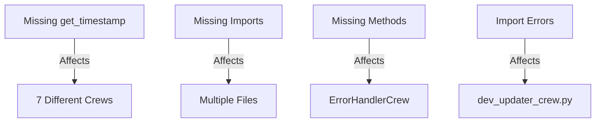
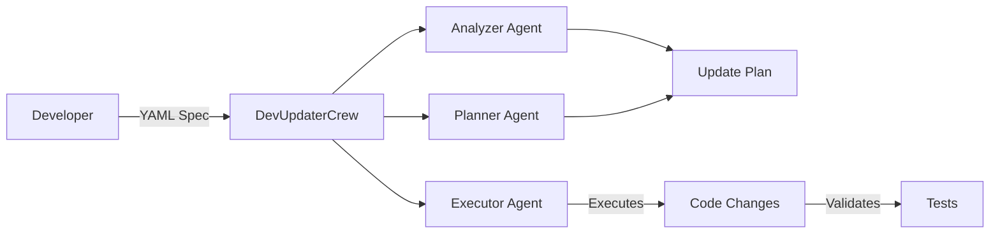
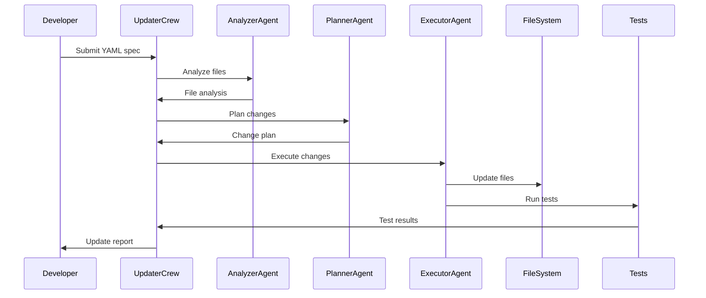
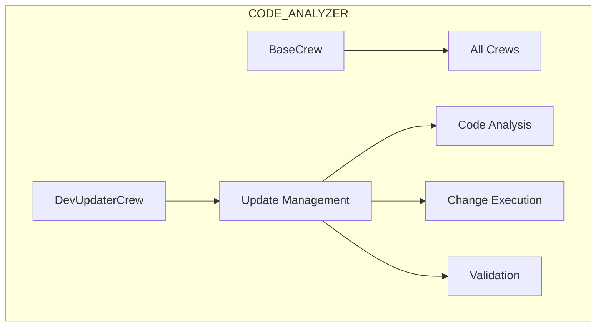
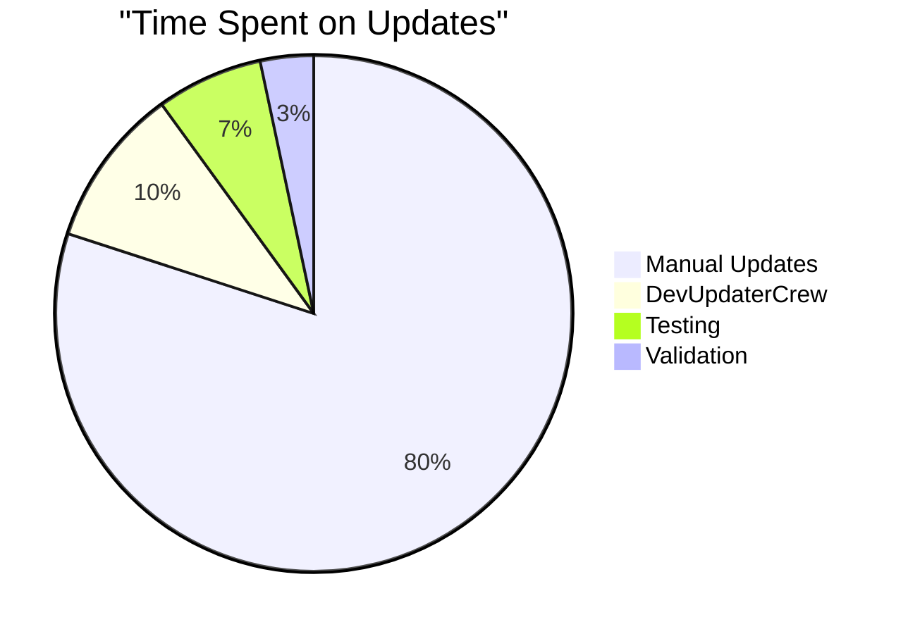
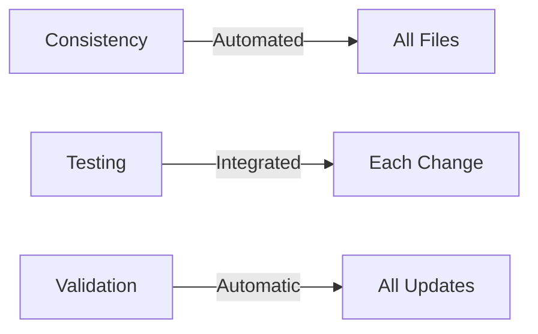

# Advanced Understanding of DevUpdaterCrew System 🎯

## 1. Real-World Context: Our Current Update Problem 🌍

### Current Linter Errors We're Facing:


### Traditional Fix Approach (What We Just Did):
```python
# We manually updated each crew:
class StatusCrew(BaseCrew):
    def get_timestamp(self): ...

class ErrorHandlerCrew(BaseCrew):
    def get_timestamp(self): ...

# And so on for each crew...
```

## 2. How DevUpdaterCrew Changes This 🔄

### Architecture Overview:


### Real Example Using Our Current Issues:

1. **Create Update Specification**:
```yaml
update_plan:
  name: "Fix Missing Methods"
  affected_files:
    - pattern: "code_analyzer/crews/*.py"
    - exclude: ["base_crew.py"]
  
  changes:
    - type: "add_imports"
      imports:
        - "from typing import Dict, Any, List"
        - "import pendulum"
    
    - type: "add_method"
      method:
        name: "get_timestamp"
        code: |
          def get_timestamp(self) -> str:
              """Get standardized timestamp."""
              return pendulum.now('UTC').isoformat()
```

2. **Execute Update**:
```python
from code_analyzer.crews.dev_crews.dev_updater_crew import DevUpdaterCrew

async def fix_missing_methods():
    updater = DevUpdaterCrew("./code_analyzer")
    
    # Load our update spec
    with open('updates/fix_missing_methods.yaml') as f:
        update_spec = yaml.safe_load(f)
    
    # Let DevUpdaterCrew handle it
    results = await updater.execute_updates(update_spec)
```

## 3. Under The Hood: How It Works 🔧

### Update Process Flow:


### Real Example of Analysis:
```python
# Before: StatusCrew missing get_timestamp
class StatusCrew(BaseCrew):
    async def track_status(self):
        return {"timestamp": self.get_timestamp()}  # Error!

# After: DevUpdaterCrew adds method
class StatusCrew(BaseCrew):
    def get_timestamp(self) -> str:
        """Get standardized timestamp."""
        return pendulum.now('UTC').isoformat()
        
    async def track_status(self):
        return {"timestamp": self.get_timestamp()}  # Fixed!
```

## 4. Integration with Our Codebase 🏗️

### Current Project Structure:


### Real Usage in Our Development Flow:

1. **Identify Pattern**:
```python
# We notice multiple crews need the same update
# Instead of manual updates, create update spec
```

2. **Create Update**:
```yaml
# updates/add_resource_management.yaml
update_plan:
  name: "Add Resource Management"
  pattern:
    - find: "async def analyze"
    - wrap_with: "async with self.managed_operation():"
```

3. **Execute & Validate**:
```python
async def apply_updates():
    updater = DevUpdaterCrew("./")
    results = await updater.execute_updates("updates/add_resource_management.yaml")
    
    # DevUpdaterCrew handles:
    # 1. Finding all matching files
    # 2. Applying changes safely
    # 3. Running tests
    # 4. Generating report
```

## 5. Benefits in Our Project 📊

### Time Savings:


### Quality Improvements:


## 6. When to Use DevUpdaterCrew 🎯

### Use Cases in Our Project:
1. **Pattern Updates**:
   - Adding methods to all crews
   - Updating import statements
   - Adding error handling

2. **Resource Management**:
   - Adding context managers
   - Implementing cleanup
   - Adding monitoring

3. **Code Standards**:
   - Updating docstrings
   - Adding type hints
   - Standardizing returns

Would you like me to:
1. Add more examples?
2. Show more integration points?
3. Explain specific components?