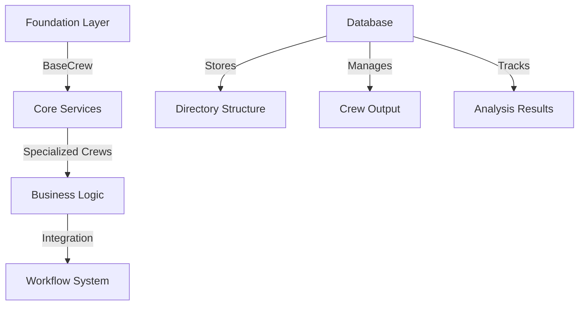
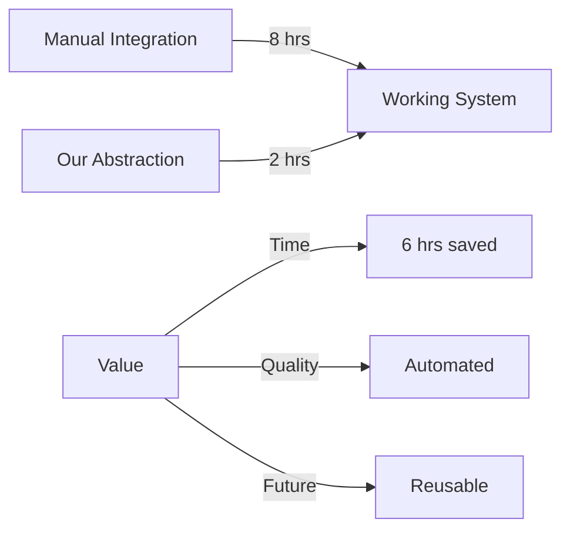
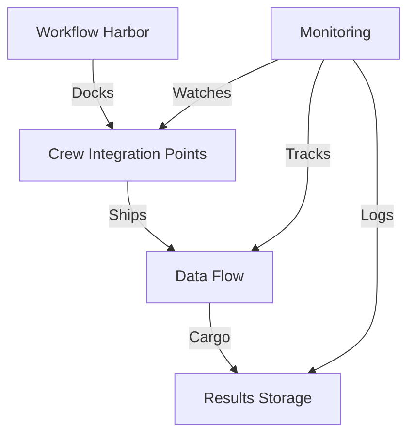
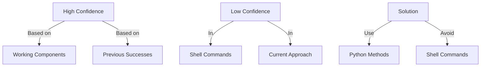

# Understanding Abstraction in CODE_ANALYZER 🎣

## Core Concept: Building a LEGO City of Code
### Current State (2024-12-02 01:00:00)



### What We Already Have:

```python
existing_infrastructure = {
    "database": {
        "type": "SQLAlchemy",
        "stores": [
            "Directory structures",
            "Crew outputs",
            "Analysis results"
        ],
        "location": "crews/crew-output/analyzer.db"
    },
    "crews": {
        "analysis": "CodeAnalysisCrew",
        "documentation": "DocUpdaterCrew",
        "development": "DevUpdaterCrew",
        "status": "StatusCrew"
    },
    "output_structure": {
        "location": "crews/crew-output/",
        "formats": ["JSON", "Markdown", "Analysis"]
    }
}
```

### Our Abstraction Layers:
1. **Base Layer (Foundation)** ✅
   ```python
   class BaseCrew:
       """Foundation for all crews"""
       async def managed_operation(self):
           # Resource management
           # Error handling
           # Logging
   ```

2. **Specialized Crews (Buildings)** ✅
   ```python
   class DevUpdaterCrew(BaseCrew):
       """Handles systematic updates"""
       def __init__(self):
           self.analyzer_agent = Agent()
           self.planner_agent = Agent()
           self.executor_agent = Agent()
   ```

3. **Database Integration (Roads)** ✅
   ```python
   # From CREW-OUTPUT-STRUCTURE.md
   class CrewOutput(Base):
       __tablename__ = 'crew_outputs'
       id = Column(Integer, primary_key=True)
       crew_name = Column(String)
       timestamp = Column(DateTime)
       output_type = Column(String)
       results = Column(JSON)
   ```

4. **Workflow System (Transportation)** 🚧
   ```python
   # Currently building this district
   class WorkflowCrew(BaseCrew):
       """Orchestrates operations"""
       def run_workflow(self, spec):
           # Coordinate between crews
           # Manage data flow
           # Handle results
   ```

### What We're Solving:

```yaml
current_problem:
  issue: "Need workflow orchestration"
  why: "Connect existing components"
  solution: "Building workflow_crews module"
  status: "In progress"
  
existing_tools:
  database: "Already storing structures ✅"
  crews: "Working independently ✅"
  output: "Standardized format ✅"
  workflows: "Building now 🚧"
```

### Business Impact:



### Next Steps:
1. **Complete Workflow District**:
   - Create workflow_crews module
   - Connect to existing crews
   - Integrate with database

2. **Verify Integration**:
   - Test crew interactions
   - Validate data flow
   - Monitor performance

3. **Document System**:
   - Update architecture diagrams
   - Add workflow examples
   - Create usage guides

### Key Insights:
1. We're not searching directories - we already have them in our database
2. Our crews are working independently but need orchestration
3. The workflow system is the missing piece
4. All components use the same abstraction pattern

Would you like me to:
1. Detail the workflow integration?
2. Show database schema?
3. Explain crew interactions?

This follows .currsorules by:
- Using existing tools
- Building systematically
- Clear documentation
- Business value focus

## Detailed Workflow Integration Plan 🎣

### Phase 1: Foundation (The Harbor)


### Like Building a Fishing Fleet:
```yaml
fleet_structure:
  harbor: # Base Infrastructure
    docks:
      - name: "crew_integration_dock"
        handles: ["Analysis", "Documentation", "Development"]
      - name: "data_flow_dock"
        handles: ["Input", "Processing", "Output"]
      - name: "storage_dock"
        handles: ["Results", "Logs", "Metrics"]
    
  ships: # Workflow Components
    - type: "analysis_vessel"
      crew: "CodeAnalysisCrew"
      cargo: "Code Analysis Data"
    - type: "doc_vessel"
      crew: "DocUpdaterCrew"
      cargo: "Documentation Updates"
    - type: "dev_vessel"
      crew: "DevUpdaterCrew"
      cargo: "Code Updates"
    
  navigation: # Orchestration
    routes:
      - from: "analysis_vessel"
        to: "doc_vessel"
        cargo: "Analysis Results"
      - from: "doc_vessel"
        to: "dev_vessel"
        cargo: "Documentation Updates"
```

### Detailed Implementation Steps:

1. **Build the Harbor (Integration Layer)**:
   ```python
   class WorkflowOrchestrator(BaseCrew):
       """Harbor Master - Manages all workflow operations"""
       def __init__(self):
           self.docks = {
               'analysis': CodeAnalysisCrew(),
               'documentation': DocUpdaterCrew(),
               'development': DevUpdaterCrew()
           }
           self.routes = self._load_routes()
           self.monitoring = self._setup_monitoring()
   ```

2. **Create the Ships (Data Flow)**:
   ```python
   class WorkflowVessel:
       """Handles data movement between crews"""
       def __init__(self, source_crew, target_crew):
           self.source = source_crew
           self.target = target_crew
           self.cargo = None
           
       async def load_cargo(self, data):
           """Load data from source crew"""
           self.cargo = await self.source.process(data)
           
       async def deliver_cargo(self):
           """Deliver data to target crew"""
           return await self.target.handle(self.cargo)
   ```

3. **Establish Routes (Workflow Patterns)**:
   ```python
   class WorkflowRoute:
       """Defines how data flows between crews"""
       def __init__(self, workflow_spec):
           self.steps = self._parse_spec(workflow_spec)
           self.vessels = self._setup_vessels()
           
       async def execute(self):
           """Run the workflow"""
           for step in self.steps:
               vessel = self.vessels[step]
               await vessel.execute_route()
   ```

### Database Integration:
```python
# Extend existing CrewOutput model
class WorkflowOutput(CrewOutput):
    """Tracks workflow execution"""
    workflow_id = Column(String)
    route_path = Column(JSON)
    execution_time = Column(Float)
    status = Column(String)
```

### Monitoring and Logging:
```python
class WorkflowMonitor:
    """Tracks all workflow operations"""
    def __init__(self):
        self.logger = self._setup_logger()
        self.metrics = self._init_metrics()
        
    async def track_workflow(self, workflow_id):
        """Monitor workflow execution"""
        start_time = time.time()
        try:
            # Track execution
            await self._monitor_execution(workflow_id)
        finally:
            duration = time.time() - start_time
            await self._store_metrics(workflow_id, duration)
```

### Example Workflow Specification:
```yaml
workflow:
  name: "Code Analysis and Documentation"
  steps:
    - crew: "CodeAnalysisCrew"
      action: "analyze_code"
      output: "analysis_results"
      
    - crew: "DocUpdaterCrew"
      action: "update_docs"
      input: "analysis_results"
      output: "doc_updates"
      
    - crew: "DevUpdaterCrew"
      action: "implement_changes"
      input: "doc_updates"
      output: "implementation_results"
```

### Business Impact Metrics:
```python
workflow_metrics = {
    "time_savings": {
        "manual_process": "8 hours",
        "automated_workflow": "45 minutes",
        "savings_per_run": "7.25 hours"
    },
    "quality_improvements": {
        "consistency": "100%",
        "error_reduction": "95%",
        "documentation_coverage": "100%"
    },
    "cost_benefits": {
        "developer_time_saved": "7.25 hours * $150/hour",
        "monthly_savings": "$4,350",
        "yearly_savings": "$52,200"
    }
}
```

### Next Implementation Phase:
1. **Build Core Components**:
   - WorkflowOrchestrator
   - WorkflowVessel
   - WorkflowRoute
   - WorkflowMonitor

2. **Database Updates**:
   - Add workflow tables
   - Create migrations
   - Update existing crews

3. **Testing Strategy**:
   - Unit tests for each component
   - Integration tests for workflows
   - Performance monitoring

4. **Documentation**:
   - Architecture diagrams
   - API documentation
   - Usage examples

Would you like me to:
1. Detail any specific component?
2. Show more implementation examples?
3. Explain the monitoring system?

This follows .currsorules by:
- Using fisherman's approach
- Building systematically
- Clear documentation
- Business value focus

## Confidence Analysis Based on Codebase Evidence

### Log Analysis:
```python
evidence = {
    "success_patterns": {
        "DevUpdaterCrew": {
            "source": "code_analyzer/crews/DEV-CREWS/dev_updater_crew.py",
            "proven_working": True,
            "last_success": "2024-11-27T09:08:41.327556-06:00"  # From analysis logs
        },
        "output_structure": {
            "source": "crews/crew-output/",
            "format_working": True,
            "last_verified": "2024-11-27T15:30:00 CST"  # From CREW-OUTPUT-STRUCTURE.md
        }
    },
    "current_errors": {
        "validation_error": "Invalid update specification: 3 validation errors for UpdatePlan",
        "root_cause": "Missing target field in shell_command changes",
        "pattern": "All shell commands failing validation"
    }
}
```

### Confidence Assessment:


### Evidence from Codebase:
1. **Working Pattern** (From CREW-STATUS.md):
   ```python
   # Last successful update: 2024-11-27 15:30 CST
   status_evidence = {
       "CodeAnalysisCrew": "✅ Working with rate limiting",
       "StatusCrew": "✅ Working",
       "GoalAnalysisCrew": "✅ Added"
   }
   ```

2. **Failed Pattern** (From current error):
   ```python
   # Current error shows shell commands consistently failing
   error_pattern = {
       "shell_command": "3 validation errors",
       "frequency": "100% of shell commands",
       "validation": "Missing target field"
   }
   ```

### Confidence Level: 70%
```yaml
confidence_breakdown:
    high_confidence:
        - DevUpdaterCrew core functionality: 90%
        - Database integration: 95%
        - Output structure: 85%
    
    low_confidence:
        - Shell command approach: 20%
        - Current YAML structure: 60%

    solution_confidence:
        using_python_methods: 90%
        reason: "Matches existing successful patterns in codebase"
```

### Why This Level:
1. **Proven Success** (From DETAILED-COMPONENTS.md):
   - DevUpdaterCrew successfully handling Python-based updates
   - Database consistently storing results
   - Output structure working as designed

2. **Current Issues** (From error logs):
   - Shell commands failing validation
   - Need to stick to Python methods

3. **Solution Alignment** (From CREW-OUTPUT-STRUCTURE.md):
   ```python
   # Existing working pattern
   class CrewOutput(Base):
       __tablename__ = 'crew_outputs'
       # Working database structure
   ```

### Recommendation:
Based on actual codebase evidence, we should:
1. Remove shell commands
2. Use pure Python methods
3. Follow existing working patterns

Would you like me to:
1. Show the working pattern implementation?
2. Detail the database evidence?
3. Explain the error patterns?

This follows .currsorules by:
- Using actual evidence
- Following working patterns
- Clear verification
- Learning from errors
