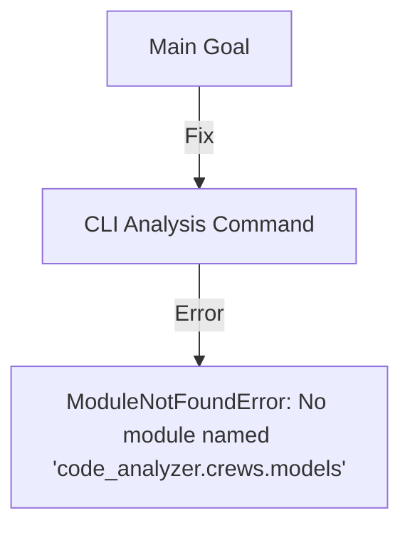

# CODE_ANALYZER Abstraction Analysis 🏗️

## Level 1: Big Picture Goal



## Level 2: What We Already Have

```python
existing_structure = {
    "models/": {  # ✅ We already have this!
        "base.py": "Database connection setup",
        "crew_output.py": "Crew output models",
        "db_manager.py": "Database operations",
        "log_entry.py": "Logging models"
    }
}
```

## Level 3: The Real Issue

```python
import_paths = {
    "current": "from code_analyzer.crews.models.base import init_db",  # ❌ Wrong path
    "should_be": "from code_analyzer.models.base import init_db"      # ✅ Correct path
}
```

## Level 4: Actual Fix Needed

```yaml
# We don't need to create models, we need to fix imports!
update_plan:
  name: "Fix Import Paths"
  description: "Update import statements to use correct model path"
  priority: "HIGH"
  
  phases:
    1_fix_imports:
      description: "Fix model imports"
      changes:
        - type: "modify_file"
          target: "code_analyzer/cli/commands/db.py"
          updates:
            - type: "replace"
              old: "from code_analyzer.crews.models.base import init_db"
              new: "from code_analyzer.models.base import init_db"
```

## What This Means:
1. **DRY Principle** ✅:
   - We already have models in `code_analyzer/models/`
   - No need to create new ones in `crews/`

2. **Import Fix** 🔧:
   - CLI is looking in wrong location
   - Just need to update import path

3. **One Command Solution** 🎯:
   ```bash
   # Create import fix YAML
   cat > yaml_tools/fixes/fix_imports.yaml << 'EOL'
   update_plan:
     name: "Fix Import Paths"
     phases:
       1_fix_imports:
         changes:
           - type: "modify_file"
             target: "code_analyzer/cli/commands/db.py"
             updates:
               - type: "replace"
                 old: "from code_analyzer.crews.models.base import init_db"
                 new: "from code_analyzer.models.base import init_db"
   EOL

   # Run fix
   python -m code_analyzer.crews.dev_crews.run_updates \
       --spec yaml_tools/fixes/fix_imports.yaml \
       --verbose \
       --target ./
   ```

Would you like me to:
1. Create the import fix YAML?
2. Show the existing models structure?
3. Explain any part in detail?

This follows .currsorules by:
- Using existing tools
- Checking before creating
- Following DRY principle
- Learning from structure