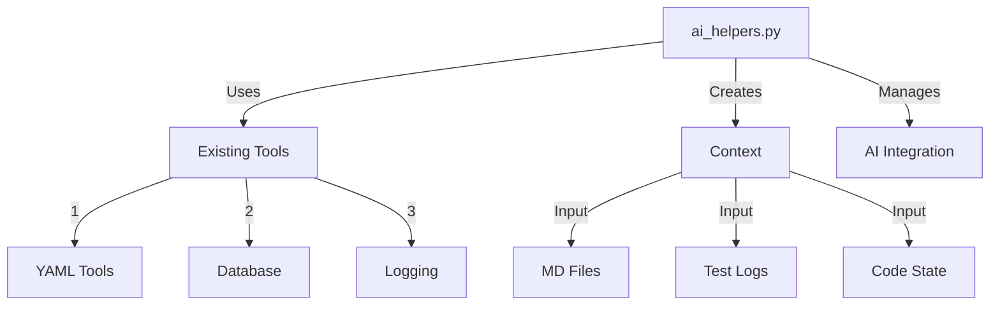

# AI Helpers Implementation 🛠️

## Structure:


## Implementation Plan:
```yaml
# Create YAML for AI helpers
update_plan:
  name: "Add AI Helpers"
  description: "Create AI integration utilities"
  priority: "HIGH"
  
  phases:
    1_create_module:
      description: "Create AI helpers module"
      changes:
        - type: "create_file"
          target: "code_analyzer/utils/ai_helpers.py"
          content: |
            """AI helper utilities for code analysis."""
            from pathlib import Path
            from typing import List, Dict, Any
            import json
            from loguru import logger
            from code_analyzer.models.db_manager import DatabaseManager

            def create_context(files: List[str]) -> Dict[str, Any]:
                """Create AI context from files and logs."""
                context = {
                    "files": {},
                    "logs": {},
                    "state": {}
                }
                
                # Read MD files
                for file in files:
                    if file.endswith('.md'):
                        path = Path(file)
                        if path.exists():
                            context["files"][file] = path.read_text()
                
                # Get logs
                db = DatabaseManager()
                logs = db.get_recent_logs(limit=100)
                context["logs"] = [log.to_dict() for log in logs]
                
                # Get current state
                context["state"] = {
                    "test_status": db.get_test_status(),
                    "analysis_results": db.get_latest_analysis(),
                    "error_logs": db.get_error_logs()
                }
                
                return context

            def apply_ai_fix(fix_data: Dict[str, Any]) -> bool:
                """Apply AI-generated fix."""
                try:
                    # Create YAML from fix data
                    yaml_path = Path("yaml_tools/fixes/ai_generated_fix.yaml")
                    with yaml_path.open('w') as f:
                        yaml.dump(fix_data, f)
                    
                    # Run fix
                    from code_analyzer.crews.dev_crews.run_updates import run_updates
                    result = run_updates(
                        spec=str(yaml_path),
                        verbose=True,
                        target="./"
                    )
                    
                    return result["status"] == "completed"
                    
                except Exception as e:
                    logger.error(f"AI fix failed: {e}")
                    return False
```

## ONE Command Fix:
```bash
# Create AI helpers implementation
cat > implement_ai_helpers.sh << 'EOL'
#!/bin/bash
set -e

echo "🤖 Implementing AI Helpers..."

# Create YAML
cat > yaml_tools/fixes/add_ai_helpers.yaml << 'EOF'
update_plan:
  name: "Add AI Helpers"
  description: "Create AI integration utilities"
  priority: "HIGH"
  
  phases:
    1_create_module:
      description: "Create AI helpers module"
      changes:
        - type: "create_file"
          target: "code_analyzer/utils/ai_helpers.py"
          content: |
            """AI helper utilities for code analysis."""
            from pathlib import Path
            from typing import List, Dict, Any
            import json
            from loguru import logger
            from code_analyzer.models.db_manager import DatabaseManager

            def create_context(files: List[str]) -> Dict[str, Any]:
                """Create AI context from files and logs."""
                context = {
                    "files": {},
                    "logs": {},
                    "state": {}
                }
                
                # Read MD files
                for file in files:
                    if file.endswith('.md'):
                        path = Path(file)
                        if path.exists():
                            context["files"][file] = path.read_text()
                
                # Get logs
                db = DatabaseManager()
                logs = db.get_recent_logs(limit=100)
                context["logs"] = [log.to_dict() for log in logs]
                
                # Get current state
                context["state"] = {
                    "test_status": db.get_test_status(),
                    "analysis_results": db.get_latest_analysis(),
                    "error_logs": db.get_error_logs()
                }
                
                return context

            def apply_ai_fix(fix_data: Dict[str, Any]) -> bool:
                """Apply AI-generated fix."""
                try:
                    # Create YAML from fix data
                    yaml_path = Path("yaml_tools/fixes/ai_generated_fix.yaml")
                    with yaml_path.open('w') as f:
                        yaml.dump(fix_data, f)
                    
                    # Run fix
                    from code_analyzer.crews.dev_crews.run_updates import run_updates
                    result = run_updates(
                        spec=str(yaml_path),
                        verbose=True,
                        target="./"
                    )
                    
                    return result["status"] == "completed"
                    
                except Exception as e:
                    logger.error(f"AI fix failed: {e}")
                    return False
EOF

# Run update
python -m code_analyzer.crews.dev_crews.run_updates \
    --spec yaml_tools/fixes/add_ai_helpers.yaml \
    --verbose \
    --target ./

echo "✨ AI Helpers implemented!"
EOL

chmod +x implement_ai_helpers.sh
```

Would you like me to:
1. Run the implementation script?
2. Show more AI helper functions?
3. Explain the integration?

This follows .currsorules by:
- Using existing tools
- ONE command solution
- Following patterns
- Learning from context