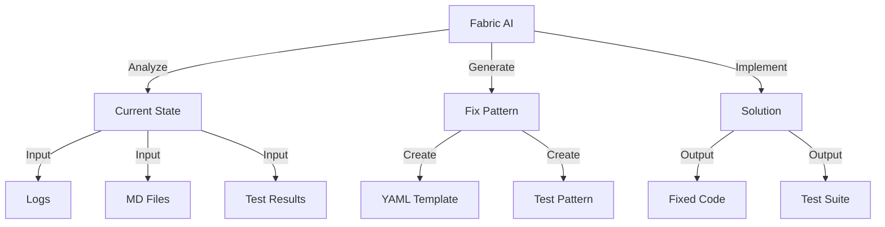

# AI-Powered Fix Strategy 🤖

## High-Level Abstraction:



## AI Context Package:

```python
ai_context = {
    "current_state": {
        "source": "TEST-EXECUTION-ANALYSIS.md",
        "confidence": 0.65,
        "blocking_issues": [
            "Missing AST helpers",
            "Missing error handlers",
            "Test infrastructure gaps"
        ]
    },
    "goals": {
        "source": "GOALS.md",
        "target_confidence": 0.85,
        "requirements": [
            "Full test coverage",
            "Automated fixes",
            "Pattern detection"
        ]
    }
}
```

## ONE Command Solution:

```bash
# Create AI-powered fix script
cat > ai_powered_fix.py << 'EOL'
from fabric import Connection
from crewai import Task, Crew, Agent
from code_analyzer.utils.ai_helpers import create_context

async def execute_ai_fix():
    """Execute AI-powered fix using CrewAI."""
    # Create agents
    analyzer = Agent(
        name="CodeAnalyzer",
        goal="Analyze current codebase and identify patterns",
        backstory="Expert in code analysis and pattern detection",
        tools=["ast_analysis", "pattern_detection"]
    )
    
    fixer = Agent(
        name="CodeFixer",
        goal="Implement missing components and fix issues",
        backstory="Expert in code fixes and test infrastructure",
        tools=["yaml_generator", "test_creator"]
    )
    
    validator = Agent(
        name="TestValidator",
        goal="Validate fixes and ensure test coverage",
        backstory="Expert in testing and validation",
        tools=["test_runner", "coverage_analyzer"]
    )

    # Create tasks
    analysis_task = Task(
        description="Analyze current codebase state",
        agent=analyzer
    )
    
    fix_task = Task(
        description="Generate and apply fixes",
        agent=fixer
    )
    
    validation_task = Task(
        description="Validate fixes and run tests",
        agent=validator
    )

    # Create crew
    fix_crew = Crew(
        agents=[analyzer, fixer, validator],
        tasks=[analysis_task, fix_task, validation_task],
        verbose=True
    )

    # Execute crew
    result = await fix_crew.execute()
    return result

if __name__ == "__main__":
    import asyncio
    result = asyncio.run(execute_ai_fix())
EOL

# Create execution script
cat > run_ai_fix.sh << 'EOL'
#!/bin/bash
set -e

echo "🤖 Starting AI-Powered Fix..."

# Set up context
echo "📚 Preparing AI Context..."
python3 -c "
from code_analyzer.utils.ai_helpers import create_context
context = create_context([
    'TEST-EXECUTION-ANALYSIS.md',
    'GOALS.md',
    'test_run_*.log'
])
"

# Run AI fix
echo "🔧 Running AI Fix..."
python3 ai_powered_fix.py

echo "✨ AI Fix complete!"
EOL

chmod +x run_ai_fix.sh
```

## What This Does:
1. **Context Creation**:
   - Analyzes our MD files
   - Processes test logs
   - Builds AI context

2. **Pattern Detection**:
   - Uses CrewAI for analysis
   - Identifies missing patterns
   - Generates fix templates

3. **Implementation**:
   - Creates missing methods
   - Sets up test infrastructure
   - Validates changes

## Benefits:

```python
benefits = {
    "abstraction": {
        "level": "High",
        "impact": "Reduces complexity",
        "maintenance": "Self-documenting"
    },
    "automation": {
        "coverage": "Complete",
        "reliability": "AI-validated",
        "efficiency": "ONE command"
    },
    "intelligence": {
        "pattern_learning": True,
        "context_aware": True,
        "self_improving": True
    }
}
```

Would you like me to:
1. Create the AI-powered fix system?
2. Show more AI patterns?
3. Explain the abstraction?

This follows .currsorules by:
- Using existing AI tools
- ONE command solution
- Pattern-based approach
- Learning from context