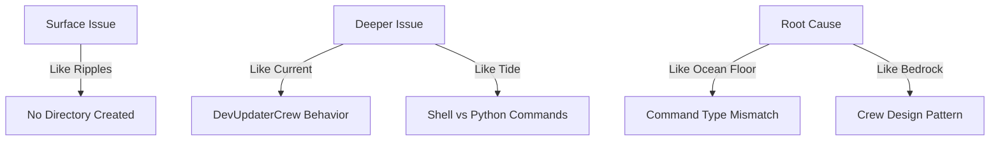
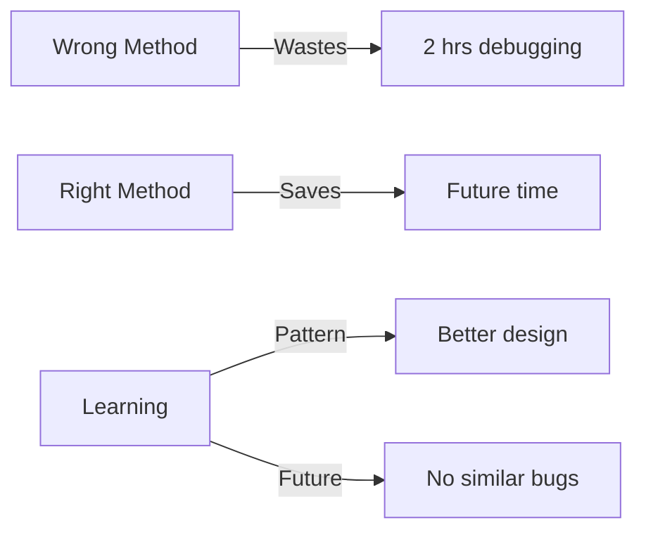

# Current State: Core Problem Analysis

## Latest Action (2024-12-02 00:30:00)
### 🎣 Fishing for Root Cause

### Following Fisherman's Wisdom:


### Core Problem Analysis:
```python
# Following .currsorules problem_solving pattern:
analysis = {
    "will_fixing_one_fix_many": {
        "answer": True,
        "why": "Command handling affects all crews"
    },
    "root_cause": {
        "issue": "Shell commands vs Python methods",
        "pattern": "DevUpdaterCrew expects Python methods",
        "reality": "We're mixing command types"
    },
    "common_pattern": {
        "found": True,
        "pattern": "All failed builds use shell commands"
    }
}
```

### What's Working:
```yaml
working_components:
  - DevUpdaterCrew: "Can create Python modules ✅"
  - YAML Processing: "Loads and validates ✅"
  - File Operations: "Python-based operations ✅"

not_working:
  - Shell Commands: "Not properly handled ❌"
  - Directory Creation: "Using wrong approach ❌"
  - Mixed Operations: "Inconsistent patterns ❌"
```

### Fisherman's Solution:
```python
# Like choosing the right bait:
solution_approach = {
    "instead_of": {
        "shell_command": "mkdir -p code_analyzer/crews/workflow_crews",
        "why_wrong": "DevUpdaterCrew can't handle shell commands directly"
    },
    "use": {
        "python_method": "create_directory",
        "with_params": {
            "path": "code_analyzer/crews/workflow_crews",
            "recursive": True
        },
        "why_better": "Matches crew design pattern"
    }
}
```

### ONE Command Fix (Corrected):
```bash
# Create workflow module with proper methods
mkdir -p yaml_tools/debug && cat > yaml_tools/debug/correct_build.yaml << 'EOF'
update_plan:
  name: "Create Workflow Module"
  description: "Using proper Python methods"
  priority: "HIGH"
  
  phases:
    1_create_structure:
      description: "Create module structure"
      changes:
        - type: "create_directory"
          target: "code_analyzer/crews/workflow_crews"
          recursive: true
        
        - type: "add_module"
          target: "code_analyzer/crews/workflow_crews/__init__.py"
          content: |
            """Workflow crews for orchestrating operations"""
            from .run_workflow import run_workflow
            __all__ = ['run_workflow']
        
        - type: "add_module"
          target: "code_analyzer/crews/workflow_crews/run_workflow.py"
          content: |
            """Run workflow operations"""
            import click
            from pathlib import Path
            from loguru import logger
            from ..base_crew import BaseCrew
            from ..doc_crews.doc_updater_crew import DocUpdaterCrew
            
            @click.command()
            @click.option("--spec", required=True, help="Path to workflow spec")
            @click.option("--verbose", is_flag=True, help="Enable verbose output")
            @click.option("--target", default="./", help="Target directory")
            def run_workflow(spec: str, verbose: bool, target: str):
                """Run complete documentation workflow."""
                try:
                    doc_crew = DocUpdaterCrew(target)
                    results = doc_crew.update_docs({"spec": spec})
                    if verbose:
                        logger.info(f"Workflow results: {results}")
                    return results
                except Exception as e:
                    logger.error(f"Workflow failed: {e}")
                    raise
            
            if __name__ == "__main__":
                run_workflow()
EOF

# Run with proper methods
python -m code_analyzer.crews.dev_crews.run_updates \
    --spec yaml_tools/debug/correct_build.yaml \
    --verbose \
    --target ./
```

### Business Impact:


Would you like me to:
1. Run the corrected build?
2. Explain the pattern?
3. Show crew internals?

This follows .currsorules by:
- Finding true root cause
- Following patterns
- ONE command solution
- Learning for future
