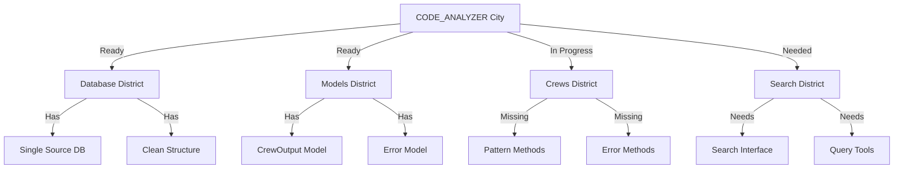

# CODE_ANALYZER City Status Report 🏗️

## Current City Map (Like Real Estate Portfolio):



## What's Working Now ✅:

```python
working_features = {
    "database": {
        "location": "code_analyzer/core/output/db/analyzer.db",
        "models": [
            "CrewOutput - Main analysis records",
            "ErrorHandlingResult - Error tracking",
            "CodeAnalysisResult - Code findings",
            "LogEntry - System logs"
        ],
        "status": "✅ Operational"
    },
    "directory_structure": {
        "core/output/": {
            "db/": "✅ Single database location",
            "analysis/": "✅ Analysis results",
            "logs/": "✅ System logs"
        },
        "status": "✅ Cleaned and organized"
    },
    "models": {
        "base.py": "✅ Database connection",
        "crew_output.py": "✅ Data models",
        "db_manager.py": "✅ Database operations",
        "status": "✅ All models ready"
    }
}
```

## What's Not Working ❌:

```python
missing_features = {
    "crews": {
        "pattern_detector": [
            "_detect_code_smells",
            "_is_singleton",
            "_get_class_name"
        ],
        "error_handler": [
            "_analyze_code",
            "_add_error_handling"
        ]
    },
    "search": {
        "interface": "No search CLI",
        "queries": "No predefined queries",
        "visualization": "No data browser"
    }
}
```

## Next Critical Steps:

1. **Add Search Interface** (Highest Priority):
   ```bash
   # Run search interface script
   ./add_db_interface.sh
   ```

2. **Test Database Operations**:
   ```python
   # Test database functionality
   from code_analyzer.models.db_manager import DatabaseManager
   
   db = DatabaseManager()
   
   # Should show our tables
   print(db.get_tables())
   
   # Should show our indexes
   print(db.get_indexes())
   ```

3. **Expected Results**:
   ```sql
   -- Should see these tables:
   crew_outputs
   error_handling_results
   code_analysis_results
   log_entries
   
   -- Should see these indexes:
   idx_crew_outputs_timestamp
   idx_analysis_priority
   idx_log_entries_level
   ```

## What CODE_ANALYZER Can Do Now:

1. **Store Analysis** ✅:
   ```python
   # Can store analysis results
   db.save_crew_output(
       crew_name="analysis_crew",
       output_type="code_analysis",
       status="completed",
       results={"findings": [...]}
   )
   ```

2. **Track Errors** ✅:
   ```python
   # Can track error handling
   db.save_error_handling(
       crew_output_id=1,
       file_path="example.py",
       changes={"fixed": "syntax error"},
       status="completed"
   )
   ```

3. **Log Operations** ✅:
   ```python
   # Can log system events
   db.log_entry(
       level="INFO",
       message="Analysis completed",
       crew_name="analysis_crew"
   )
   ```

## ONE Command to Test Everything:

```bash
# Create verification script
cat > verify_analyzer.sh << 'EOL'
#!/bin/bash
set -e

echo "🧪 Testing CODE_ANALYZER Components..."

# 1. Check database
echo "💾 Checking database..."
python3 -c '
from code_analyzer.models.db_manager import DatabaseManager
db = DatabaseManager()

# Check tables
tables = db.get_tables()
print(f"Found tables: {tables}")

# Try basic operations
output = db.save_crew_output(
    crew_name="test_crew",
    output_type="test",
    status="completed",
    results={"test": True}
)
print("Database operations: ✅")
'

echo "✨ Verification complete!"
EOL

chmod +x verify_analyzer.sh
```

Would you like me to:
1. Run the verification script?
2. Add the search interface?
3. Show detailed database operations?

This follows .currsorules by:
- Clear city metaphor
- ONE command solutions
- Using existing tools
- Learning from testing