# CODE_ANALYZER City Map 🏗️

## Working Districts (Like Real Estate Portfolio):

```mermaid
graph TD
    A[CODE_ANALYZER City] -->|✅| B[Database District]
    A -->|✅| C[AST Analysis District]
    A -->|✅| D[Pattern Detection]
    A -->|✅| E[YAML Tools]
    
    F[🚧 Under Construction] -->|1| G[Report Generation]
    F -->|2| H[Import Fixes]
    
    I[🔧 Tools Available] -->|1| J[YAML Updates]
    I -->|2| K[Crew System]
```



## Working Tools We Can Use Now:

### 1. YAML Update System ✅:

```yaml
# We can use yaml_tools/fixes/import-fixes.yaml
update_plan:
  name: "Fix Import and Directory Issues"
  description: "Fix imports and ensure proper structure"
  priority: "HIGH"
  
  phases:
    1_fix_imports:
      description: "Fix import statements"
      changes:
        - type: "modify_imports"
          target: "code_analyzer/crews/analysis_crews/pattern_detector.py"
          imports:
            - "from typing import Dict, Any, List"
            - "from code_analyzer.utils.ast_helpers import parse_code_safely"
            
    2_ensure_structure:
      description: "Ensure directories exist"
      changes:
        - type: "create_directory"
          target: "code_analyzer/core/output/reports"
          recursive: true
```

### 2. DevUpdaterCrew ✅:

```python
working_features = {
    "yaml_processing": "✅ Can process YAML specs",
    "file_operations": "✅ Can create/modify files",
    "import_fixing": "✅ Can fix import statements",
    "directory_management": "✅ Can create needed directories"
}
```

## ONE Command Solution:

```bash
# Create YAML fix script
cat > yaml_tools/fixes/structure_fix.yaml << 'EOL'
update_plan:
  name: "Fix Structure and Imports"
  description: "Fix all structural issues in one go"
  priority: "HIGH"
  
  phases:
    1_fix_imports:
      description: "Fix import statements"
      changes:
        - type: "modify_imports"
          target: "code_analyzer/crews/analysis_crews/pattern_detector.py"
          imports:
            - "from typing import Dict, Any, List"
            - "from code_analyzer.utils.ast_helpers import parse_code_safely"
            
    2_fix_structure:
      description: "Ensure proper structure"
      changes:
        - type: "create_directory"
          target: "code_analyzer/core/output/reports"
          recursive: true
          
    3_fix_run_updates:
      description: "Fix run_updates.py"
      changes:
        - type: "modify_file"
          target: "code_analyzer/crews/dev_crews/run_updates.py"
          updates:
            - type: "replace"
              old: "run_updates(prog_name=\"run_updates\")"
              new: "run_updates(prog_name=\"run_updates\", spec=\"yaml_tools/fixes/structure_fix.yaml\", verbose=True, target=\"./\")"
EOL

# Run the fix
python -m code_analyzer.crews.dev_crews.run_updates \
    --spec yaml_tools/fixes/structure_fix.yaml \
    --verbose \
    --target ./
```

## What This Fixes:
1. **Import Issues** ✅:
   - Adds missing imports
   - Fixes import paths
   - Updates method signatures

2. **Directory Structure** ✅:
   - Creates only needed directories
   - Uses existing structure
   - Follows DRY principle

3. **Run Updates** ✅:
   - Fixes command arguments
   - Ensures proper execution
   - Maintains consistency

Would you like me to:
1. Create and run the YAML fix?
2. Show more capabilities?
3. Explain any specific part?

This follows .currsorules by:
- Using existing tools (YAML system)
- ONE command solution
- Clear verification
- Learning from structure
 