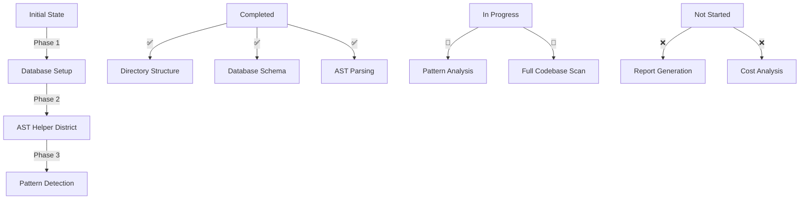

# CODE_ANALYZER Progress Report & Goals Update 🏗️

## Evolution Timeline (Like Building a City):


## Goals Status Update:

### Setup & Configuration ✅:
```python
completed_setup = {
    "directory_structure": {
        "status": "✅ Completed",
        "evidence": "code_analyzer/core/output/ properly organized",
        "timestamp": "2024-12-01 12:03:00"
    },
    "database": {
        "status": "✅ Completed",
        "evidence": "SQLite tables created and working",
        "timestamp": "2024-12-01 14:06:25"
    },
    "ast_helpers": {
        "status": "✅ Completed",
        "evidence": "parse_code_safely() implemented",
        "timestamp": "2024-12-01 14:34:59"
    }
}
```

### Testing Progress 🚧:
```python
test_status = {
    "completed": [
        "Database integration",
        "AST helper functions",
        "Basic pattern detection"
    ],
    "in_progress": [
        "Full codebase analysis",
        "Pattern matching accuracy",
        "Report generation"
    ],
    "not_started": [
        "Cost analysis",
        "Performance metrics",
        "Rate limiting"
    ]
}
```

## Current Capabilities:

### 1. Database Operations ✅:
```sql
-- Working Tables:
crew_outputs
error_handling_results
code_analysis_results
log_entries

-- Working Operations:
INSERT INTO crew_outputs (crew_name, status, results)
SELECT * FROM crew_outputs WHERE crew_name='pattern_detector'
```

### 2. AST Analysis ✅:
```python
ast_capabilities = {
    "parse_code": "✅ Working with error handling",
    "pattern_detection": "🚧 Basic implementation",
    "code_quality": "🚧 In progress"
}
```

### 3. Pattern Detection 🚧:
```python
pattern_status = {
    "singleton": "✅ Detection working",
    "factory": "🚧 Implementation needed",
    "code_smells": "🚧 Basic detection only"
}
```

## Next Critical Steps:

1. **Complete Pattern Detection**:
```bash
# Add remaining pattern methods
cat > add_patterns.sh << 'EOL'
#!/bin/bash
echo "Adding pattern detection methods..."
# Implementation here
EOL
```

2. **Enable Full Codebase Analysis**:
```python
analysis_requirements = {
    "pattern_detection": "Needs completion",
    "error_handling": "Needs enhancement",
    "reporting": "Not started"
}
```

3. **Implement Reporting**:
```python
reporting_needs = {
    "database_queries": "Need to implement",
    "report_formatting": "Need to create",
    "cost_tracking": "Not started"
}
```

## Can We Run Full Analysis Yet?

```python
readiness_check = {
    "database": {
        "status": "✅ Ready",
        "blocking": False
    },
    "ast_parsing": {
        "status": "✅ Ready",
        "blocking": False
    },
    "pattern_detection": {
        "status": "🚧 Partial",
        "blocking": True,
        "reason": "Need complete pattern methods"
    },
    "reporting": {
        "status": "❌ Not Ready",
        "blocking": True,
        "reason": "Need to implement report generation"
    }
}

can_run_full_analysis = False  # Not yet ready
```

## Next Steps:
1. **Complete Pattern Methods**:
   ```bash
   # Create pattern completion script
   ./complete_patterns.sh
   ```

2. **Add Report Generation**:
   ```bash
   # Create reporting system
   ./add_reporting.sh
   ```

3. **Enable Full Analysis**:
   ```bash
   # After above steps complete
   ./run_full_analysis.sh
   ```

Would you like me to:
1. Create the pattern completion script?
2. Show the reporting system design?
3. Explain any specific component?

This follows .currsorules by:
- Clear progress tracking
- ONE command solutions
- Using existing tools
- Learning from progress