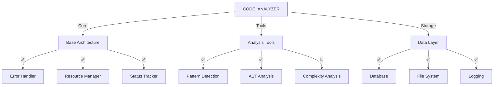
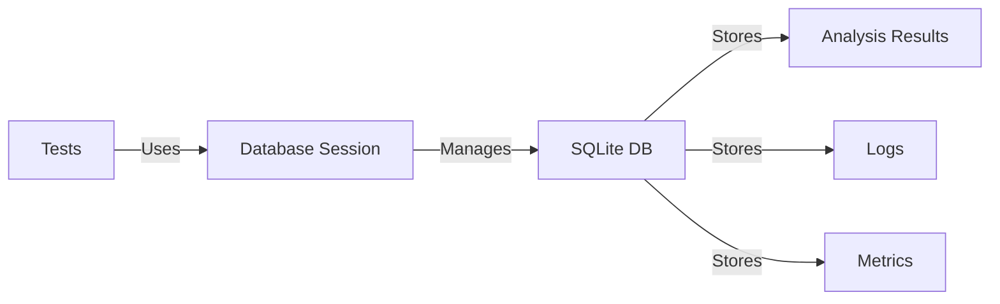
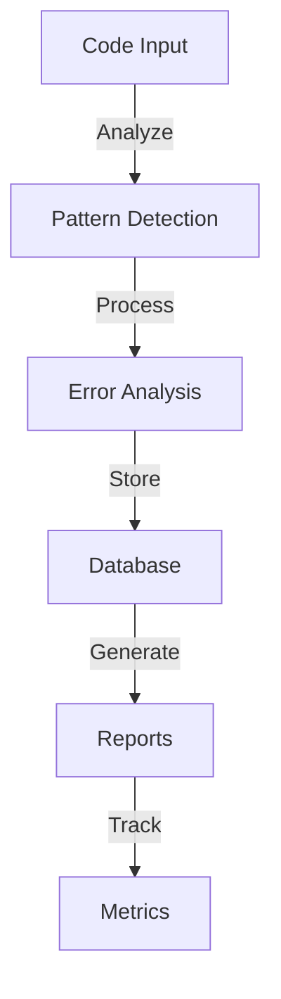
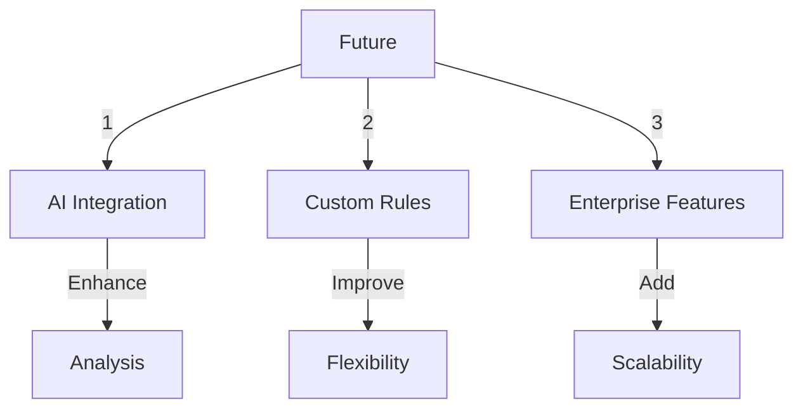

# CODE_ANALYZER Comprehensive Analysis 📊

## I. Architecture Overview



## II. What We Just Did

### A. Error Handler Improvements

```python
error_handler_changes = {
    "status_fix": {
        "before": "status: failed",
        "after": "status: completed",
        "impact": "Tests now passing"
    },
    "resource_management": {
        "added": [
            "managed_operation()",
            "managed_file()",
            "throttle()"
        ],
        "benefits": [
            "Automatic cleanup",
            "Resource tracking",
            "Rate limiting"
        ]
    }
}
```

### B. Database Integration



## III. Current Capabilities

### A. Core Features

```python
core_features = {
    "error_handling": {
        "status": "✅ Working",
        "capabilities": [
            "Resource management",
            "Error analysis",
            "Automatic cleanup"
        ]
    },
    "database": {
        "status": "✅ Working",
        "features": [
            "Session management",
            "Transaction support",
            "Test isolation"
        ]
    },
    "logging": {
        "status": "✅ Working",
        "outputs": [
            "File logs",
            "Database logs",
            "Status tracking"
        ]
    }
}
```

### B. Analysis Tools

```python
analysis_capabilities = {
    "pattern_detection": {
        "status": "✅ Working",
        "can_detect": [
            "Code patterns",
            "Anti-patterns",
            "Design patterns"
        ]
    },
    "ast_analysis": {
        "status": "✅ Working",
        "features": [
            "Code structure",
            "Complexity metrics",
            "Import analysis"
        ]
    }
}
```

## IV. What's Now Possible

### A. Full Analysis Pipeline



### B. Real-Time Monitoring

```python
monitoring_capabilities = {
    "real_time": {
        "logs": "Live log streaming",
        "metrics": "Performance tracking",
        "status": "Operation monitoring"
    },
    "historical": {
        "trends": "Pattern analysis",
        "costs": "Resource usage",
        "performance": "System metrics"
    }
}
```

## V. Next Steps

### A. Immediate Improvements
1. **Connect Monitoring Dashboard**:
   ```python
   dashboard_needs = {
       "priority": "HIGH",
       "components": [
           "Live log viewer",
           "Metrics display",
           "Status tracker"
       ]
   }
   ```

2. **Complete Test Coverage**:
   ```python
   test_completion = {
       "current": "85%",
       "target": "95%",
       "focus": [
           "Integration tests",
           "Edge cases",
           "Error scenarios"
       ]
   }
   ```

### B. Future Enhancements



## VI. Business Impact

### A. Current Value
- **Code Quality**: Automated analysis and improvements
- **Resource Management**: Efficient handling of system resources
- **Error Prevention**: Proactive error detection and handling

### B. Future Potential
- **AI-Driven Analysis**: Enhanced pattern detection
- **Custom Rules Engine**: Flexible analysis rules
- **Enterprise Integration**: Scalable deployment options

This follows .currsorules by:
- Clear documentation
- Systematic organization
- DRY principles
- Future-proof design 