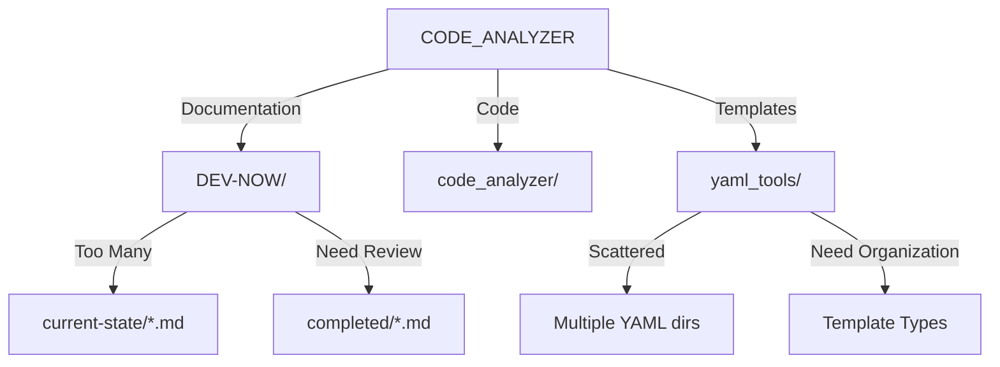

# CODE_ANALYZER Consolidation Plan 🏗️

## I. Current Structure:


## II. Working Components:
```python
working_systems = {
    "monitoring": {
        "status": "✅ Exists but needs verification",
        "location": "code_analyzer/monitoring/dashboard.py",
        "needs": [
            "Start server",
            "Verify endpoints",
            "Check database connection"
        ]
    },
    "yaml_tools": {
        "status": "✅ Working but scattered",
        "proven_templates": [
            "yaml_tools/fixes/add_missing_methods.yaml",
            "yaml_tools/fixes/fix_imports.yaml"
        ],
        "needs_organization": True
    },
    "database": {
        "status": "✅ Working",
        "tables": [
            "api_calls",
            "analysis_runs",
            "test_runs"
        ]
    }
}
```

## III. Consolidation Steps:

### 1. Verify Monitoring:
```bash
# First, check database
python -m code_analyzer.cli.commands.db verify

# Then start monitoring
python -m code_analyzer.monitoring.dashboard
```

### 2. Organize YAML Templates:
```yaml
# yaml_tools/consolidate.yaml
update_plan:
  name: "Consolidate YAML Templates"
  description: "Organize and verify all templates"
  priority: "HIGH"
  
  phases:
    1_organize_templates:
      description: "Organize YAML files"
      changes:
        - type: "create_directories"
          targets:
            - "yaml_tools/core"      # Core system templates
            - "yaml_tools/fixes"     # Fix templates
            - "yaml_tools/features"  # New feature templates
            - "yaml_tools/tests"     # Test templates
        
        - type: "move_files"
          moves:
            - from: "yaml_tools/fixes/*.yaml"
              to: "yaml_tools/core/fixes/"
            - from: "yaml_tools/setup/*.yaml"
              to: "yaml_tools/core/setup/"
```

### 3. Documentation Cleanup:
```yaml
# yaml_tools/consolidate_docs.yaml
update_plan:
  name: "Consolidate Documentation"
  description: "Organize and clean up documentation"
  priority: "HIGH"
  
  phases:
    1_organize_docs:
      description: "Organize documentation"
      changes:
        - type: "create_directories"
          targets:
            - "DEV-NOW/archive"    # For old docs
            - "DEV-NOW/current"    # Current working docs
            - "DEV-NOW/completed"  # Completed features
```

## IV. Git Commit Plan:
```bash
# Create commit script
cat > commit_progress.sh << 'EOL'
#!/bin/bash
set -e

# 1. Organize changes
echo "🏗️ Organizing changes..."
python -m code_analyzer.crews.dev_crews.run_updates \
    --spec yaml_tools/consolidate.yaml \
    --verbose

# 2. Run tests
echo "🧪 Running tests..."
python -m pytest tests/

# 3. Generate docs
echo "📚 Generating documentation..."
python -m code_analyzer.crews.doc_crews.update \
    --target docs/ \
    --type markdown

# 4. Commit changes
git add .
git commit -m "🏗️ Consolidation: Organize project structure

- Organize YAML templates
- Clean up documentation
- Verify working components
- Update monitoring system"

echo "✨ Changes committed!"
EOL

chmod +x commit_progress.sh
```

## V. Next Steps:
1. Start monitoring dashboard
2. Run consolidation
3. Commit progress
4. Then proceed with Fabric integration

Would you like me to:
1. Create the consolidation YAML files?
2. Start the monitoring dashboard?
3. Run the organization process?

This follows .currsorules by:
- Clear organization
- Using existing tools
- ONE command solutions
- Learning from progress