# CODE_ANALYZER Database Next Steps 🏗️

## Current State (Like Real Estate Portfolio):

```mermaid
graph TD
    A[✅ Working] -->|Database| B[Core Models]
    A -->|Structure| C[Directory Layout]
    A -->|Methods| D[Basic Operations]
    
    E[❌ Missing] -->|Critical| F[Pattern Methods]
    E -->|Critical| G[Error Methods]
    E -->|Important| H[Search Interface]
```



## Most Critical Fix (Like Foundation Repair):

```python
critical_needs = {
    "pattern_detector": {
        "priority": "HIGHEST",
        "why": "Core functionality for analysis",
        "missing_methods": [
            "_detect_code_smells",
            "_is_singleton",
            "_get_class_name"
        ]
    }
}
```

## ONE Command Fix:

```bash
# Create pattern detector methods
cat > add_pattern_methods.sh << 'EOL'
#!/bin/bash
set -e

echo "🏗️ Adding Pattern Detection Methods..."

# Add methods to pattern_detector.py
cat >> code_analyzer/crews/analysis_crews/pattern_detector.py << 'EOF'

    async def _detect_code_smells(self, tree: ast.AST) -> List[PatternMatch]:
        """Detect code smells in AST."""
        patterns = []
        
        # Check for long methods
        if isinstance(tree, ast.FunctionDef):
            if len(tree.body) > 20:  # More than 20 lines
                patterns.append(PatternMatch(
                    type="code_smell",
                    name="long_method",
                    location={"function": tree.name},
                    confidence=0.9,
                    description="Method is too long",
                    suggestion="Consider breaking into smaller functions"
                ))
        
        return patterns

    def _is_singleton(self, tree: ast.AST) -> bool:
        """Check if class follows singleton pattern."""
        if not isinstance(tree, ast.ClassDef):
            return False
            
        # Look for private instance variable
        has_private_instance = False
        # Look for getInstance method
        has_get_instance = False
        
        for node in ast.walk(tree):
            if isinstance(node, ast.Name) and node.id.startswith('_instance'):
                has_private_instance = True
            if isinstance(node, ast.FunctionDef) and node.name == 'getInstance':
                has_get_instance = True
                
        return has_private_instance and has_get_instance

    def _get_class_name(self, tree: ast.AST) -> str:
        """Get class name from AST node."""
        if isinstance(tree, ast.ClassDef):
            return tree.name
        return ""

    def _is_factory(self, tree: ast.AST) -> bool:
        """Check if class follows factory pattern."""
        if not isinstance(tree, ast.ClassDef):
            return False
            
        # Look for create methods
        create_methods = 0
        for node in ast.walk(tree):
            if isinstance(node, ast.FunctionDef) and (
                node.name.startswith('create') or 
                node.name.startswith('make') or
                node.name.startswith('build')
            ):
                create_methods += 1
                
        return create_methods > 0

    async def analyze_patterns(self, code: str) -> Dict[str, List[PatternMatch]]:
        """Analyze code for all patterns."""
        tree = ast.parse(code)
        
        # Store results in database
        db = DatabaseManager()
        results = {
            "code_smells": await self._detect_code_smells(tree),
            "design_patterns": []
        }
        
        # Save to database
        db.save_crew_output(
            crew_name="pattern_detector",
            output_type="pattern_analysis",
            status="completed",
            results=results
        )
        
        return results
EOF

# Add imports at top
sed -i '' '1i\
import ast\
from typing import List, Dict\
from code_analyzer.models.db_manager import DatabaseManager\
' code_analyzer/crews/analysis_crews/pattern_detector.py

echo "✨ Pattern detection methods added!"
EOL

chmod +x add_pattern_methods.sh
```

## Why This Fix First:
1. Pattern detection is core functionality
2. Enables code analysis
3. Integrates with database
4. Provides immediate value

## Next Steps:
1. Run pattern methods fix:
   ```bash
   ./add_pattern_methods.sh
   ```

2. Test pattern detection:
   ```python
   # Test pattern detection
   from code_analyzer.crews.analysis_crews.pattern_detector import PatternDetector
   
   detector = PatternDetector()
   results = await detector.analyze_patterns("""
   class Singleton:
       _instance = None
       
       @classmethod
       def getInstance(cls):
           if cls._instance is None:
               cls._instance = cls()
           return cls._instance
   """)
   ```

Would you like me to:
1. Add the pattern detection methods?
2. Show example pattern analysis?
3. Add more patterns to detect?

This follows .currsorules by:
- Using existing tools (AST)
- ONE command solution
- Clear documentation
- Learning from patterns
