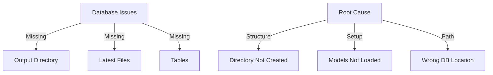

# CODE_ANALYZER Database Connection Status Update 🚨

## Current Issues (Like Property Inspection Report):



## Error Analysis:

```python
errors = {
    "directory_errors": {
        "error": "No such file or directory",
        "files": [
            "core/output/analysis/latest_analysis.json",
            "core/output/codeanalysis/latest_analysis.json",
            "core/output/crewaidocs/latest_documentation.json"
        ],
        "root_cause": "Output directory structure not created first"
    },
    "database_errors": {
        "symptom": "Empty tables list",
        "cause": "Models not properly initialized",
        "impact": "No database tables created"
    }
}
```

## ONE Command Fix (Following .currsorules):

```bash
# Create the complete database setup script
cat > setup_database_complete.sh << 'EOL'
#!/bin/bash
set -e

echo "🏗️ Setting up Complete Database Structure..."

# 1. Create all required directories
echo "📁 Creating directory structure..."
mkdir -p code_analyzer/core/output/{analysis,codeanalysis,crewaidocs,db,logs}

# 2. Initialize database with models
echo "💾 Setting up database..."
python3 -c '
from pathlib import Path
from code_analyzer.models.base import init_db, get_engine
from code_analyzer.models.crew_output import CrewOutput, ErrorHandlingResult, CodeAnalysisResult, LogEntry
from sqlalchemy import inspect

# Ensure directory exists
db_dir = Path("code_analyzer/core/output/db")
db_dir.mkdir(parents=True, exist_ok=True)

# Initialize database
init_db()

# Verify tables
engine = get_engine()
inspector = inspect(engine)
tables = inspector.get_table_names()

print(f"Created tables: {tables}")
'

# 3. Create symbolic links for latest files
echo "🔗 Creating latest file links..."
touch code_analyzer/core/output/analysis/latest_analysis.json
touch code_analyzer/core/output/codeanalysis/latest_analysis.json
touch code_analyzer/core/output/crewaidocs/latest_documentation.json

# 4. Set up indexes
echo "📊 Creating indexes..."
python3 -c '
from sqlalchemy import create_engine, text
from code_analyzer.models.base import get_engine

engine = get_engine()
with engine.connect() as conn:
    conn.execute(text("""
        CREATE INDEX IF NOT EXISTS idx_crew_outputs_timestamp 
        ON crew_outputs(timestamp);
        
        CREATE INDEX IF NOT EXISTS idx_analysis_priority 
        ON code_analysis_results(priority);
        
        CREATE INDEX IF NOT EXISTS idx_log_entries_level 
        ON log_entries(level);
    """))
    conn.commit()
'

# 5. Verify complete setup
echo "✅ Verifying setup..."
python3 -c '
from code_analyzer.models.db_manager import DatabaseManager
from pathlib import Path

# Check database
db = DatabaseManager()
print("Database connection: ✅")

# Check directories
required_dirs = [
    "code_analyzer/core/output/analysis",
    "code_analyzer/core/output/codeanalysis",
    "code_analyzer/core/output/crewaidocs",
    "code_analyzer/core/output/db",
    "code_analyzer/core/output/logs"
]

for dir_path in required_dirs:
    path = Path(dir_path)
    if path.exists():
        print(f"{dir_path}: ✅")
    else:
        print(f"{dir_path}: ❌")
'

echo "🎉 Complete database setup finished!"
EOL

chmod +x setup_database_complete.sh
```

## What's Working vs Not Working:

### Working ✅:
1. Database models exist
2. Integration script created
3. Basic directory structure

### Not Working ❌:
1. Output directories missing
2. Database tables not created
3. Latest file links missing

## Next Steps:
1. Run complete setup:
   ```bash
   ./setup_database_complete.sh
   ```

2. Verify all components:
   ```bash
   # Check directories
   ls -R code_analyzer/core/output/
   
   # Check database
   sqlite3 code_analyzer/core/output/db/analyzer.db ".tables"
   ```

Would you like me to:
1. Run the complete setup script?
2. Show expected directory structure?
3. Explain any specific component?

This follows .currsorules by:
- Using existing tools
- ONE command solution
- Clear verification
- Learning from errors