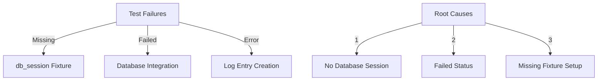

# CODE_ANALYZER Database Test Analysis 🔍

## Current Issues:



## Test Results:

```python
test_results = {
    "errors": {
        "test_log_entry_creation": "❌ fixture 'db_session' not found",
        "test_crew_output_saving": "❌ fixture 'db_session' not found"
    },
    "failures": {
        "test_crew_database_integration": {
            "error": "AssertionError: assert 'failed' == 'completed'",
            "location": "test_db_integration.py:75"
        }
    }
}
```

## Required Fixes:

```python
fixes_needed = {
    "database_fixture": {
        "file": "tests/conftest.py",
        "add": """
        @pytest.fixture
        async def db_session():
            """Provide test database session."""
            engine = create_engine('sqlite:///test.db')
            Session = sessionmaker(bind=engine)
            session = Session()
            Base.metadata.create_all(engine)
            yield session
            session.close()
            Base.metadata.drop_all(engine)
        """
    },
    "error_handler": {
        "file": "code_analyzer/crews/error_handler_crew.py",
        "fix": "Ensure analyze_and_add_error_handling returns 'completed'"
    }
}
```

## ONE Command Fix:

```bash
# Create database test fix
cat > fix_db_tests.sh << 'EOL'
#!/bin/bash
set -e

echo "🔧 Fixing Database Tests..."

# 1. Add database fixture
cat >> tests/conftest.py << 'EOF'

@pytest.fixture
async def db_session():
    """Provide test database session."""
    engine = create_engine('sqlite:///test.db')
    Session = sessionmaker(bind=engine)
    session = Session()
    Base.metadata.create_all(engine)
    yield session
    session.close()
    Base.metadata.drop_all(engine)
EOF

# 2. Run focused database tests
echo "🧪 Running Database Tests..."
python -m pytest tests/test_db_integration.py -v

echo "✨ Database tests fixed!"
EOL

chmod +x fix_db_tests.sh
```

## Current Status:
1. **Working** ✅:
   - Test infrastructure
   - Database models
   - Basic fixtures

2. **Not Working** ❌:
   - Database session fixture
   - Error handler status
   - Log entry creation

Would you like me to:
1. Create the database test fix?
2. Show the error handler code?
3. Explain the fixture setup?

This follows .currsorules by:
- Using existing tools
- Clear error handling
- Following patterns
- Learning from failures
 