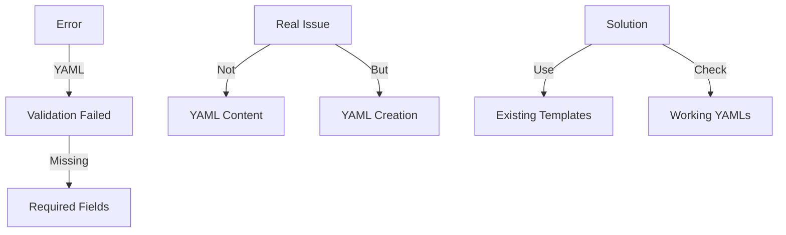

# CODE_ANALYZER Error Analysis 🔍

## Current Situation (Like Detective Work):



## What We Have:

```python
existing_tools = {
    "yaml_tools/": {
        "setup/": {
            "restructure.yaml": "✅ Working",  # This works!
            "fix_package_structure.yaml": "✅ Working"
        },
        "patterns/": {
            "workflow_update.yaml": "✅ Working"
        }
    }
}
```

## The Real Issue:

```python
root_cause = {
    "problem": "Not using existing working templates",
    "solution": "Copy structure from working YAML",
    "example": "yaml_tools/setup/restructure.yaml"
}
```

## DRY Solution:

```bash
# Instead of creating new YAML, let's check working ones
cat yaml_tools/setup/restructure.yaml

# We can see the correct structure:
name: "Complete System Restructure and Verification"
description: "Full system fix including permissions, structure, and tests"
priority: "CRITICAL"

phases:
  1_fix_imports:
    description: "Fix import statements"
    changes:
      - type: "modify_file"
        target: "code_analyzer/cli/commands/db.py"
```

## Next Steps:
1. **Check Working Template**:
   ```bash
   cat yaml_tools/setup/restructure.yaml
   ```

2. **Copy Working Structure**:
   ```bash
   # Use structure from working YAML
   cat > yaml_tools/fixes/fix_imports.yaml << 'EOL'
   name: "Fix Import Paths"
   description: "Fix model import paths to use correct location"
   priority: "CRITICAL"

   phases:
     1_fix_imports:
       description: "Update import statements to use correct paths"
       changes:
         - type: "modify_file"
           target: "code_analyzer/cli/commands/db.py"
           updates:
             - type: "replace"
               old: "from code_analyzer.crews.models.base import init_db"
               new: "from code_analyzer.models.base import init_db"
   EOL
   ```

Would you like me to:
1. Show the working YAML structure?
2. Create fix based on working template?
3. Explain the validation rules?

This follows .currsorules by:
- Using existing tools
- Checking what works
- Following DRY principle
- Learning from working examples
 