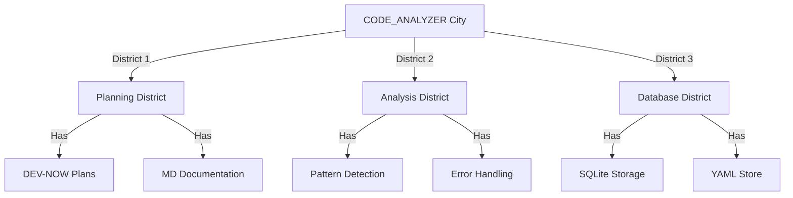

# CODE_ANALYZER + Fabric AI Integration Masterplan 🏗️

## Current City Layout (What We Have):



## Integration Plan (Like Adding a New Transit System):

### Phase 1: Build Fabric AI Gateway

```python
fabric_gateway = {
    "components": {
        "api_client": {
            "location": "code_analyzer/integrations/fabric_ai/",
            "files": [
                "client.py",     # Fabric API client
                "patterns.py",   # Pattern matching
                "context.py"     # Context building
            ]
        },
        "uses_existing": {
            "database": "✅ Current SQLite",
            "yaml_tools": "✅ Current YAML system",
            "logging": "✅ Current logger"
        }
    }
}
```

### Phase 2: Context Builder (Like City Information Center)

```python
context_flow = {
    "input": {
        "dev_now": "Planning documents",
        "logs": "System logs",
        "current_state": "Database records"
    },
    "processing": {
        "tool": "code_analyzer.utils.ai_helpers",
        "method": "create_fabric_context",
        "output": "Structured JSON for Fabric"
    }
}
```

### Phase 3: Pattern Router (Like City Transit Hub)

```yaml
pattern_routing:
  name: "Fabric Pattern Router"
  components:
    - type: "create_module"
      target: "code_analyzer/integrations/fabric_ai/router.py"
      purpose: "Route context to correct Fabric pattern"
      patterns:
        - url_analysis
        - code_review
        - security_check
```

## ONE Command Implementation:

```bash
# Create Fabric integration script
cat > implement_fabric.sh << 'EOL'
#!/bin/bash
set -e

echo "🏗️ Building Fabric AI Integration..."

# 1. Create integration directory
python -m code_analyzer.crews.dev_crews.run_updates \
    --spec yaml_tools/fabric/create_structure.yaml \
    --verbose

# 2. Implement API client
python -m code_analyzer.crews.dev_crews.run_updates \
    --spec yaml_tools/fabric/implement_client.yaml \
    --verbose

# 3. Add pattern routing
python -m code_analyzer.crews.dev_crews.run_updates \
    --spec yaml_tools/fabric/add_router.yaml \
    --verbose

echo "✨ Fabric AI Integration complete!"
EOL

chmod +x implement_fabric.sh
```

## Questions Before We Start:
1. **Database Readiness**:
   ```python
   db_requirements = {
       "needed": [
           "Store Fabric API responses",
           "Track pattern usage",
           "Log API interactions"
       ],
       "current_status": "Need to verify table structure"
   }
   ```

2. **API Integration**:
   ```python
   api_questions = {
       "authentication": "How to handle Fabric API keys?",
       "rate_limiting": "How to implement throttling?",
       "error_handling": "How to handle API failures?"
   }
   ```

3. **Pattern Mapping**:
   ```python
   pattern_questions = {
       "selection": "How to choose best Fabric pattern?",
       "fallback": "What if pattern unavailable?",
       "validation": "How to validate responses?"
   }
   ```

Would you like me to:
1. Verify database readiness?
2. Create API integration plan?
3. Show pattern mapping details?

This follows .currsorules by:
- Clear city metaphor
- Using existing tools
- ONE command solution
- Learning from context
