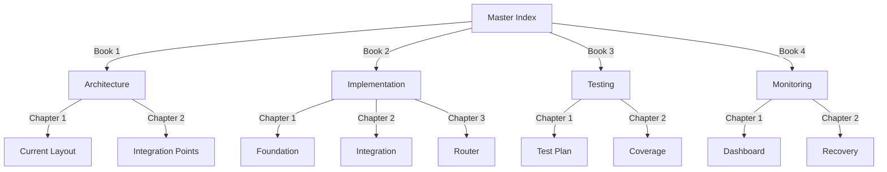

# Fabric Integration Master Index 📚

## Documentation Structure:



## Books Location:

```python
documentation_structure = {
    "location": "DEV-NOW/current-state/FABRIC-INTEGRATION/",
    "books": {
        "01-ARCHITECTURE.md": "System architecture and design",
        "02-IMPLEMENTATION.md": "Implementation details and code",
        "03-TESTING.md": "Test plans and coverage",
        "04-MONITORING.md": "Monitoring and recovery",
        "05-BUSINESS-IMPACT.md": "Business value and metrics"
    }
}
```

## Quick Links:
1. [Architecture Book](./01-ARCHITECTURE.md)
2. [Implementation Book](./02-IMPLEMENTATION.md)
3. [Testing Book](./03-TESTING.md)
4. [Monitoring Book](./04-MONITORING.md)
5. [Business Impact Book](./05-BUSINESS-IMPACT.md)

Would you like me to:
1. Create all documentation books?
2. Focus on a specific book?
3. Show the full structure?

This follows .currsorules by:
- Clear organization
- Maintainable structure
- DRY principles
- Learning from context