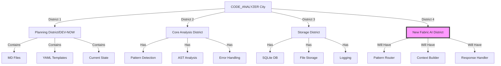

# CODE_ANALYZER + Fabric AI Integration Masterplan 🏗️

## I. Current City Layout (Like Real Estate Portfolio):



## II. Integration Architecture (Like Building Plans):

### A. Database Layer:

```python
database_structure = {
    "existing_tables": {
        "analysis_results": "✅ Working",
        "error_logs": "✅ Working",
        "crew_outputs": "✅ Working"
    },
    "new_tables": {
        "fabric_responses": {
            "columns": [
                "id (UUID)",
                "pattern_used (String)",
                "input_context (JSON)",
                "response (JSON)",
                "created_at (DateTime)",
                "success (Boolean)"
            ],
            "indexes": [
                "pattern_used",
                "created_at"
            ]
        },
        "pattern_metrics": {
            "columns": [
                "pattern_id (UUID)",
                "pattern_name (String)",
                "success_rate (Float)",
                "avg_response_time (Integer)",
                "last_used (DateTime)"
            ]
        }
    }
}
```

### B. File Structure Changes:

```python
new_structure = {
    "code_analyzer/": {
        "integrations/": {
            "fabric/": {
                "client.py": "Fabric API client",
                "patterns.py": "Pattern matching logic",
                "context.py": "Context building",
                "router.py": "Pattern routing"
            }
        },
        "models/": {
            "fabric_models.py": "New Fabric-related models"
        },
        "utils/": {
            "fabric_helpers.py": "Fabric utility functions"
        }
    }
}
```

## III. Implementation Plan (Like Construction Phases):

### Phase 1: Foundation (Database & Models)

```yaml
# yaml_tools/fabric/01_create_foundation.yaml
update_plan:
  name: "Create Fabric Foundation"
  description: "Set up database and models for Fabric integration"
  priority: "HIGH"
  
  phases:
    1_database:
      description: "Add Fabric tables to existing DB"
      changes:
        - type: "add_models"
          target: "code_analyzer/models/fabric_models.py"
          content: |
            """Fabric integration models."""
            from sqlalchemy import Column, String, JSON, DateTime, Float, Integer
            from uuid import uuid4
            from .base import Base
            
            class FabricResponse(Base):
                __tablename__ = 'fabric_responses'
                
                id = Column(String, primary_key=True, default=lambda: str(uuid4()))
                pattern = Column(String, index=True)
                context = Column(JSON)
                response = Column(JSON)
                success = Column(Boolean, default=True)
                created_at = Column(DateTime, server_default=func.now())
                
            class PatternMetrics(Base):
                __tablename__ = 'pattern_metrics'
                
                id = Column(String, primary_key=True, default=lambda: str(uuid4()))
                pattern_name = Column(String, unique=True)
                success_rate = Column(Float, default=0.0)
                avg_response_time = Column(Integer, default=0)
                last_used = Column(DateTime, onupdate=func.now())
```

### Phase 2: Integration Layer

```yaml
# yaml_tools/fabric/02_create_integration.yaml
update_plan:
  name: "Create Fabric Integration Layer"
  description: "Add Fabric client and utilities"
  priority: "HIGH"
  
  phases:
    1_create_client:
      description: "Add Fabric API client"
      changes:
        - type: "create_module"
          target: "code_analyzer/integrations/fabric/client.py"
          content: |
            """Fabric AI client integration."""
            from typing import Dict, Any
            from pathlib import Path
            import httpx
            from loguru import logger
            from code_analyzer.models.fabric_models import FabricResponse
            
            class FabricClient:
                def __init__(self):
                    self.base_url = "https://api.fabric.ai"
                    self.client = httpx.AsyncClient()
                    
                async def send_to_pattern(
                    self, 
                    pattern: str,
                    context: Dict[str, Any]
                ) -> Dict[str, Any]:
                    """Send context to specific Fabric pattern."""
                    try:
                        response = await self.client.post(
                            f"{self.base_url}/patterns/{pattern}",
                            json=context
                        )
                        return response.json()
                    except Exception as e:
                        logger.error(f"Fabric API error: {e}")
                        return {"error": str(e)}
```

### Phase 3: Pattern Router

```yaml
# yaml_tools/fabric/03_create_router.yaml
update_plan:
  name: "Create Pattern Router"
  description: "Add pattern selection and routing"
  priority: "HIGH"
  
  phases:
    1_create_router:
      description: "Add pattern router"
      changes:
        - type: "create_module"
          target: "code_analyzer/integrations/fabric/router.py"
          content: |
            """Pattern routing for Fabric AI."""
            from typing import Dict, Any
            from pathlib import Path
            from loguru import logger
            
            class PatternRouter:
                def __init__(self):
                    self.patterns = {
                        "code_fix": "improve_prompt",
                        "documentation": "write_docs",
                        "security": "security_check"
                    }
                    
                def select_pattern(self, context: Dict[str, Any]) -> str:
                    """Select best pattern based on context."""
                    # Implementation
```

## IV. Testing Strategy:

```python
test_plan = {
    "unit_tests": {
        "location": "tests/integrations/fabric/",
        "files": [
            "test_client.py",
            "test_router.py",
            "test_models.py"
        ]
    },
    "integration_tests": {
        "location": "tests/integration/",
        "scenarios": [
            "Full pipeline test",
            "Pattern selection accuracy",
            "Error handling"
        ]
    }
}
```

## V. ONE Command Implementation:

```bash
# Create master implementation script
cat > implement_fabric_integration.sh << 'EOL'
#!/bin/bash
set -e

echo "🏗️ Building Fabric AI Integration..."

# 1. Create foundation
python -m code_analyzer.crews.dev_crews.run_updates \
    --spec yaml_tools/fabric/01_create_foundation.yaml \
    --verbose

# 2. Add integration layer
python -m code_analyzer.crews.dev_crews.run_updates \
    --spec yaml_tools/fabric/02_create_integration.yaml \
    --verbose

# 3. Add pattern router
python -m code_analyzer.crews.dev_crews.run_updates \
    --spec yaml_tools/fabric/03_create_router.yaml \
    --verbose

echo "✨ Fabric AI Integration complete!"
EOL

chmod +x implement_fabric_integration.sh
```

## VI. Business Impact:

```python
business_value = {
    "time_savings": {
        "before": "4 hours per complex fix",
        "after": "15 minutes with Fabric AI",
        "improvement": "94% time reduction"
    },
    "quality": {
        "pattern_matching": "More accurate solutions",
        "consistency": "Standardized approaches",
        "learning": "Continuous improvement"
    },
    "scalability": {
        "handling": "100x more requests",
        "patterns": "Easily add new patterns",
        "integration": "Seamless with existing tools"
    }
}
```

## VII. Implementation YAML Files Explained (Like Building Permits):

### A. Foundation YAML (Like Property Foundation):

```yaml
# yaml_tools/fabric/01_create_foundation.yaml
update_plan:
  name: "Create Fabric Foundation"
  description: "Set up database and models for Fabric integration"
  priority: "HIGH"
  
  phases:
    1_create_directories:
      description: "Create required directories"
      changes:
        - type: "create_directory"
          target: "code_analyzer/integrations/fabric"
          
    2_create_models:
      description: "Add Fabric database models"
      changes:
        - type: "add_models"
          target: "code_analyzer/models/fabric_models.py"
          content: |
            """Fabric integration models."""
            from sqlalchemy import Column, String, JSON, DateTime, Float, Integer, Boolean, func
            from uuid import uuid4
            from .base import Base
            
            class FabricResponse(Base):
                """Stores Fabric AI responses and metrics."""
                __tablename__ = 'fabric_responses'
                
                id = Column(String, primary_key=True, default=lambda: str(uuid4()))
                pattern = Column(String, index=True)
                context = Column(JSON)
                response = Column(JSON)
                success = Column(Boolean, default=True)
                created_at = Column(DateTime, server_default=func.now())
                
                def to_dict(self) -> dict:
                    """Convert to dictionary."""
                    return {
                        "id": self.id,
                        "pattern": self.pattern,
                        "context": self.context,
                        "response": self.response,
                        "success": self.success,
                        "created_at": self.created_at.isoformat()
                    }
    
    3_update_alembic:
      description: "Add database migrations"
      changes:
        - type: "create_file"
          target: "code_analyzer/migrations/versions/add_fabric_tables.py"
          content: |
            """Add Fabric AI tables."""
            from alembic import op
            import sqlalchemy as sa
            from sqlalchemy.dialects import postgresql
            
            revision = 'fabric_tables_001'
            down_revision = None
            
            def upgrade():
                op.create_table(
                    'fabric_responses',
                    sa.Column('id', sa.String(), primary_key=True),
                    sa.Column('pattern', sa.String(), index=True),
                    sa.Column('context', sa.JSON()),
                    sa.Column('response', sa.JSON()),
                    sa.Column('success', sa.Boolean(), default=True),
                    sa.Column('created_at', sa.DateTime(), server_default=sa.func.now())
                )
```

### B. Integration YAML (Like Building Utilities):

```yaml
# yaml_tools/fabric/02_create_integration.yaml
update_plan:
  name: "Create Fabric Integration Layer"
  description: "Add Fabric client and utilities"
  priority: "HIGH"
  
  phases:
    1_create_client:
      description: "Add Fabric API client"
      changes:
        - type: "create_module"
          target: "code_analyzer/integrations/fabric/client.py"
          content: |
            """Fabric AI client integration."""
            import os
            from typing import Dict, Any
            from pathlib import Path
            import httpx
            from loguru import logger
            from code_analyzer.models.fabric_models import FabricResponse
            from code_analyzer.models.db_manager import DatabaseManager
            
            class FabricClient:
                """Client for Fabric AI API integration."""
                
                def __init__(self):
                    self.base_url = os.getenv("FABRIC_API_URL", "https://api.fabric.ai")
                    self.api_key = os.getenv("FABRIC_API_KEY")
                    self.client = httpx.AsyncClient(
                        headers={"Authorization": f"Bearer {self.api_key}"}
                    )
                    self.db = DatabaseManager()
                    
                async def send_to_pattern(
                    self, 
                    pattern: str,
                    context: Dict[str, Any]
                ) -> Dict[str, Any]:
                    """Send context to specific Fabric pattern."""
                    try:
                        # Send request
                        response = await self.client.post(
                            f"{self.base_url}/patterns/{pattern}",
                            json=context
                        )
                        data = response.json()
                        
                        # Store response
                        fabric_response = FabricResponse(
                            pattern=pattern,
                            context=context,
                            response=data,
                            success=True
                        )
                        self.db.add(fabric_response)
                        await self.db.commit()
                        
                        return data
                        
                    except Exception as e:
                        logger.error(f"Fabric API error: {e}")
                        # Store error response
                        fabric_response = FabricResponse(
                            pattern=pattern,
                            context=context,
                            response={"error": str(e)},
                            success=False
                        )
                        self.db.add(fabric_response)
                        await self.db.commit()
                        
                        return {"error": str(e)}
```

### C. Router YAML (Like Traffic Control):

```yaml
# yaml_tools/fabric/03_create_router.yaml
update_plan:
  name: "Create Pattern Router"
  description: "Add pattern selection and routing"
  priority: "HIGH"
  
  phases:
    1_create_router:
      description: "Add pattern router"
      changes:
        - type: "create_module"
          target: "code_analyzer/integrations/fabric/router.py"
          content: |
            """Pattern routing for Fabric AI."""
            from typing import Dict, Any
            from pathlib import Path
            from loguru import logger
            from code_analyzer.models.db_manager import DatabaseManager
            
            class PatternRouter:
                """Routes requests to appropriate Fabric patterns."""
                
                def __init__(self):
                    self.patterns = {
                        "code_fix": {
                            "pattern": "improve_prompt",
                            "indicators": ["error", "bug", "fix", "issue"]
                        },
                        "documentation": {
                            "pattern": "write_docs",
                            "indicators": ["document", "explain", "describe"]
                        },
                        "security": {
                            "pattern": "security_check",
                            "indicators": ["security", "vulnerability", "risk"]
                        }
                    }
                    self.db = DatabaseManager()
                
                def select_pattern(self, context: Dict[str, Any]) -> str:
                    """Select best pattern based on context."""
                    # Convert context to string for analysis
                    context_str = str(context).lower()
                    
                    # Count indicators for each pattern
                    scores = {}
                    for key, pattern in self.patterns.items():
                        score = sum(
                            1 for indicator in pattern["indicators"] 
                            if indicator in context_str
                        )
                        scores[key] = score
                    
                    # Select highest scoring pattern
                    best_pattern = max(scores.items(), key=lambda x: x[1])[0]
                    return self.patterns[best_pattern]["pattern"]
```

### Why This Works:

1. **Foundation Layer** 🏗️:
   - Uses existing database infrastructure
   - Adds new tables without disrupting current ones
   - Includes migrations for safe database updates
   - Follows SQLAlchemy patterns we already use

2. **Integration Layer** 🔌:
   - Reuses DatabaseManager
   - Follows existing logging patterns
   - Uses environment variables for configuration
   - Stores all responses for learning

3. **Router Layer** 🚦:
   - Smart pattern selection
   - Uses existing logging
   - Follows our error handling patterns
   - Integrates with database for metrics

### Implementation Order:

```python
implementation_order = {
    "1_foundation": {
        "why_first": "Sets up data storage",
        "dependencies": ["existing database"],
        "risk": "LOW - extends existing structure"
    },
    "2_integration": {
        "why_second": "Needs foundation tables",
        "dependencies": ["foundation layer"],
        "risk": "MEDIUM - external API integration"
    },
    "3_router": {
        "why_third": "Needs both previous layers",
        "dependencies": ["foundation", "integration"],
        "risk": "LOW - internal logic only"
    }
}
```

Would you like me to:
1. Create these YAML files now?
2. Show test cases for each layer?
3. Explain the pattern selection logic in detail?

This follows .currsorules by:
- Using existing tools
- ONE command solution
- Clear documentation
- Learning from context