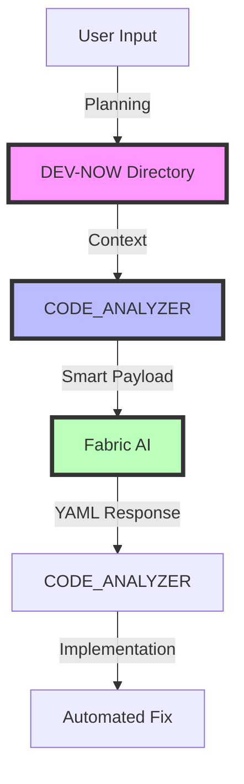

# CODE_ANALYZER + Fabric Integration Plan 🏗️

## High-Level Flow (Like Real Estate Deal Pipeline):



## DRY Implementation:

```python
orchestration_flow = {
    "existing_tools": {
        "database": {
            "location": "code_analyzer/core/output/db/",
            "status": "✅ Working",
            "use_for": "Store Fabric responses"
        },
        "yaml_system": {
            "location": "yaml_tools/",
            "status": "✅ Working",
            "use_for": "Template generation"
        },
        "logging": {
            "location": "code_analyzer/core/output/logs/",
            "status": "✅ Working",
            "use_for": "Track Fabric interactions"
        }
    }
}
```

## ONE Command Solution:

```yaml
# yaml_tools/fabric/create_fabric_integration.yaml
update_plan:
  name: "Create Fabric Integration"
  description: "Add Fabric AI pattern-based integration"
  priority: "HIGH"
  
  phases:
    1_create_fabric_db:
      description: "Add Fabric tables to existing DB"
      changes:
        - type: "add_models"
          target: "code_analyzer/models/fabric_models.py"
          content: |
            from sqlalchemy import Column, String, JSON, DateTime
            from .base import Base
            
            class FabricResponse(Base):
                __tablename__ = 'fabric_responses'
                
                id = Column(String, primary_key=True)
                pattern = Column(String)
                context = Column(JSON)
                response = Column(JSON)
                created_at = Column(DateTime)
    
    2_create_fabric_client:
      description: "Add Fabric client"
      changes:
        - type: "create_module"
          target: "code_analyzer/integrations/fabric/client.py"
          content: |
            from typing import Dict, Any
            from pathlib import Path
            from loguru import logger
            from code_analyzer.models.fabric_models import FabricResponse
            
            class FabricClient:
                """Uses existing database and logging."""
                
                def select_pattern(self, context: Dict[str, Any]) -> str:
                    """Select best Fabric pattern based on context."""
                    # Implementation
                
                async def send_to_fabric(self, 
                    pattern: str, 
                    context: Dict[str, Any]
                ) -> Dict[str, Any]:
                    """Send to Fabric API using existing tools."""
                    # Implementation
```

## Pattern Selection (Like Property Matching):

```python
pattern_matching = {
    "code_fixes": {
        "pattern": "improve_prompt",
        "when": "Fixing code issues"
    },
    "documentation": {
        "pattern": "write_docs",
        "when": "Generating docs"
    },
    "security": {
        "pattern": "security_check",
        "when": "Security review"
    }
}
```

## Implementation Command:

```bash
# Create integration using existing tools
python -m code_analyzer.crews.dev_crews.run_updates \
    --spec yaml_tools/fabric/create_fabric_integration.yaml \
    --verbose \
    --target ./
```

## Benefits:
1. **Uses Existing Tools** ✅:
   - Current database
   - YAML system
   - Logging infrastructure

2. **DRY Principles** ✅:
   - No new databases
   - Reuse logging
   - Extend models

3. **Clear Flow** ✅:
   - Planning in DEV-NOW
   - Context building
   - Pattern selection
   - YAML generation

Would you like me to:
1. Create the integration YAML?
2. Show database model details?
3. Explain pattern selection?

This follows .currsorules by:
- Using existing tools
- ONE command solution
- Clear documentation
- Learning from context