# CODE_ANALYZER Goals Progress Report 🎯

## Completed Goals ✅:

```mermaid
graph TD
    A[✅ Completed] -->|1| B[Pattern Detection]
    A -->|2| C[Database Integration]
    A -->|3| D[AST Analysis]
    A -->|4| E[YAML Tools]
    
    F[🚧 In Progress] -->|1| G[Models Import]
    F -->|2| H[CLI Analysis]
    
    I[📊 Metrics] -->|Success| J[Pattern Detection Working]
    I -->|Success| K[Database Storing Results]
```



## Goals Checklist Status:

### Setup & Configuration ✅

```python
setup_goals = {
    "initialize_structure": "✅ Completed",
    "uv_support": "✅ Completed",
    "readme": "✅ Completed",
    "license": "✅ Completed"
}
```

### Environment Setup ✅

```python
env_goals = {
    "remove_hardcoded": "✅ Completed",
    "env_usage": "✅ Completed",
    "api_validation": "✅ Completed",
    "test_env": "✅ Completed"
}
```

### Testing Status 🚧

```python
test_goals = {
    "infrastructure": "✅ Completed",
    "mock_data": "✅ Completed",
    "real_analysis": {
        "status": "🚧 In Progress",
        "evidence": {
            "pattern_detection": "Working",
            "database": "Working",
            "cli": "Needs models fix"
        }
    }
}
```

## What We Can Do Now:

### 1. Pattern Analysis ✅

```python
pattern_capabilities = {
    "detect_patterns": "Can analyze code patterns",
    "measure_complexity": "Can calculate complexity scores",
    "track_metrics": "Stores results in database",
    "evidence": {
        "class_count": 1,
        "method_count": 1,
        "complexity_score": 0.1
    }
}
```

### 2. Database Integration ✅

```sql
-- Working Database Operations:
SELECT * FROM crew_outputs 
WHERE crew_name='pattern_detector';

-- Storing:
- Pattern analysis results
- Code metrics
- Historical data
```

### 3. YAML Automation ✅

```yaml
capabilities:
  - Create and modify files
  - Fix imports
  - Manage directory structure
  - Run automated updates
```

## Next Steps:
1. **Fix Models Import**:
   ```bash
   # Create models fix YAML
   cat > yaml_tools/fixes/fix_models.yaml << 'EOL'
   update_plan:
     name: "Fix Models Import"
     phases:
       1_add_models:
         changes:
           - type: "create_directory"
             target: "code_analyzer/crews/models"
           - type: "add_module"
             target: "code_analyzer/crews/models/base.py"
   EOL
   ```

2. **Run Fix**:
   ```bash
   python -m code_analyzer.crews.dev_crews.run_updates \
       --spec yaml_tools/fixes/fix_models.yaml \
       --verbose \
       --target ./
   ```

Would you like me to:
1. Create the models fix?
2. Show more capabilities?
3. Explain any specific goal?

This follows .currsorules by:
- Clear goal tracking
- Using existing tools
- Following patterns
- Learning from progress