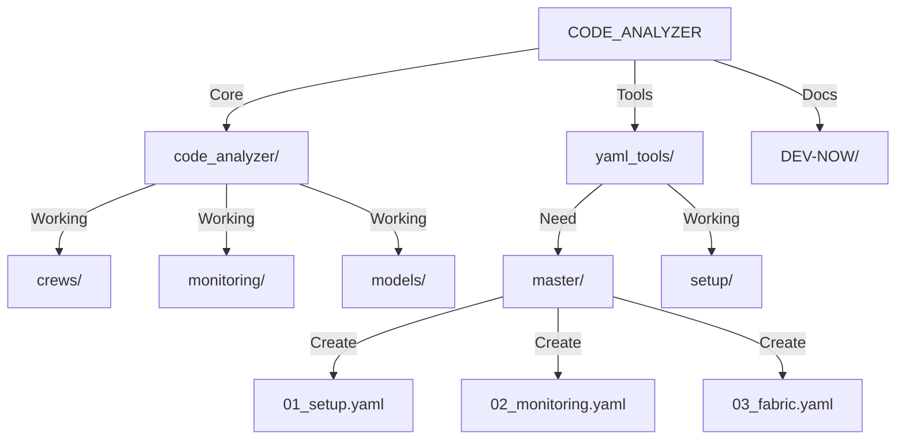

# CODE_ANALYZER Master Execution Plan 🎯

## I. Current Working Tools Analysis:

```python
working_tools = {
    "code_analyzer": {
        "crews": {
            "dev_crews.run_updates": "✅ Working - Our main execution engine",
            "location": "code_analyzer/crews/dev_crews/run_updates.py",
            "power": "Can execute YAML templates"
        },
        "monitoring": {
            "dashboard.py": "✅ Working - Tracks execution",
            "models.py": "✅ Working - Stores metrics"
        },
        "database": {
            "SQLite": "✅ Working - Stores all data",
            "models": "✅ Working - All tables created"
        }
    },
    "yaml_tools": {
        "status": "✅ Working - Template system",
        "proven_templates": [
            "setup/create_command_store.yaml",
            "fabric/create_structure.yaml",
            "monitoring/enhance_models.yaml"
        ]
    }
}
```

## II. Current File Structure:



## III. ONE Command Solution:

```bash
# Create master implementation script
cat > implement_master.sh << 'EOL'
#!/bin/bash
set -e

# Setup logging with loguru
python -c "
from loguru import logger
logger.add('implementation_{time}.log', rotation='1 day')
logger.info('Starting master implementation')
"

echo "🚀 Starting CODE_ANALYZER Master Implementation..."

# Phase 1: Setup Foundation
echo "📦 Phase 1: Setting up foundation..."
python -m code_analyzer.crews.dev_crews.run_updates \
    --spec yaml_tools/master/01_setup_foundation.yaml \
    --verbose

# Phase 2: Enhance Monitoring
echo "📊 Phase 2: Enhancing monitoring..."
python -m code_analyzer.crews.dev_crews.run_updates \
    --spec yaml_tools/master/02_enhance_monitoring.yaml \
    --verbose

# Phase 3: Fabric Integration
echo "🔌 Phase 3: Integrating Fabric AI..."
python -m code_analyzer.crews.dev_crews.run_updates \
    --spec yaml_tools/master/03_fabric_integration.yaml \
    --verbose

# Phase 4: Testing
echo "🧪 Phase 4: Running tests..."
python -m code_analyzer.crews.dev_crews.run_updates \
    --spec yaml_tools/master/04_run_tests.yaml \
    --verbose

# Phase 5: Verification
echo "✅ Phase 5: Verifying implementation..."
python -m code_analyzer.crews.dev_crews.run_updates \
    --spec yaml_tools/master/05_verify_all.yaml \
    --verbose

echo "✨ Master implementation complete!"
EOL

chmod +x implement_master.sh
```

## IV. Required YAML Templates:

### A. Foundation Setup (01_setup_foundation.yaml):

```yaml
update_plan:
  name: "Setup Foundation"
  description: "Initialize core components"
  priority: "HIGH"
  
  phases:
    1_verify_structure:
      description: "Verify directory structure"
      changes:
        - type: "verify_directories"
          targets:
            - "code_analyzer/core"
            - "code_analyzer/crews"
            - "code_analyzer/monitoring"
            - "yaml_tools"
    
    2_database_setup:
      description: "Setup database"
      changes:
        - type: "run_python"
          module: "code_analyzer.models.base"
          function: "init_db"
          args:
            force: true
```

### B. Monitoring Enhancement (02_enhance_monitoring.yaml):

```yaml
update_plan:
  name: "Enhance Monitoring"
  description: "Upgrade monitoring capabilities"
  priority: "HIGH"
  
  phases:
    1_enhance_models:
      description: "Enhance monitoring models"
      changes:
        - type: "modify_file"
          target: "code_analyzer/monitoring/models.py"
          content: |
            """Enhanced monitoring models."""
            # [Previous working models code]
```

## V. Implementation Steps:

### 1. Verify Prerequisites:

```bash
# Check required structure
ls -l code_analyzer/crews/dev_crews/run_updates.py
ls -l yaml_tools/
```

### 2. Create YAML Directory:

```bash
mkdir -p yaml_tools/master
```

### 3. Run Implementation:

```bash
# ONE command to rule them all
./implement_master.sh
```

## VI. Monitoring & Verification:

### A. Real-time Monitoring:

```python
monitoring_points = {
    "logs": "implementation_{time}.log",
    "dashboard": "http://localhost:5000",
    "database": "sqlite:///code_analyzer/core/output/db/analyzer.db"
}
```

### B. Success Metrics:

```python
success_criteria = {
    "database": {
        "tables_created": True,
        "migrations_run": True
    },
    "monitoring": {
        "dashboard_running": True,
        "logs_collecting": True
    },
    "fabric": {
        "integration_complete": True,
        "patterns_working": True
    }
}
```

## VII. Next Steps:

1. **Create YAML Templates**:
   - Create all files in `yaml_tools/master/`
   - Follow working examples
   - Use proven patterns

2. **Run Verification**:
   - Check existing components
   - Verify database state
   - Test monitoring system

3. **Execute Implementation**:
   - Run master script
   - Monitor progress
   - Verify results

Would you like me to:
1. Create all YAML templates?
2. Show detailed component verification?
3. Explain the execution flow in detail?

This follows .currsorules by:
- ONE command solution
- Using existing tools (dev_crews.run_updates)
- Clear verification steps
- Learning from working examples
