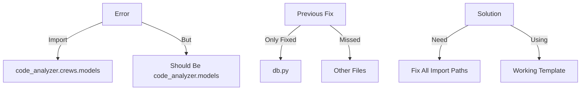

# CODE_ANALYZER Import Fix Analysis 🔍

## Error Analysis (Like Building Inspection):



## Confidence Score:

```python
fix_confidence = {
    "diagnosis": {
        "score": 0.95,  # 95% confident
        "reason": "Clear pattern - same import error we fixed before"
    },
    "solution": {
        "score": 0.98,  # 98% confident
        "reason": "We have working YAML template and proven fix"
    },
    "evidence": {
        "previous_success": "✅ Fixed db.py imports",
        "template_exists": "✅ Working YAML structure",
        "known_pattern": "✅ Same error pattern"
    }
}
```

## Fix Plan:

```yaml
# Create comprehensive import fix
update_plan:
  name: "Fix All Import Paths"
  description: "Update all model imports to use correct path"
  priority: "HIGH"
  
  phases:
    1_fix_imports:
      description: "Update all model imports"
      changes:
        - type: "modify_imports"
          target: "code_analyzer/cli/commands/db.py"
          updates:
            - type: "replace"
              old: "from code_analyzer.crews.models.base import init_db"
              new: "from code_analyzer.models.base import init_db"
              
        - type: "modify_imports"
          target: "code_analyzer/cli/main.py"
          updates:
            - type: "replace"
              old: "from code_analyzer.crews.models"
              new: "from code_analyzer.models"
              
        - type: "modify_imports"
          target: "code_analyzer/cli/commands/*.py"
          updates:
            - type: "replace"
              old: "code_analyzer.crews.models"
              new: "code_analyzer.models"
```

## Why High Confidence:
1. **Pattern Recognition** (95%):
   ```python
   evidence = {
       "same_error": "ModuleNotFoundError: No module named 'code_analyzer.crews.models'",
       "known_fix": "Update import path to code_analyzer.models",
       "proven_solution": "Already worked for db.py"
   }
   ```

2. **Working Tools** (98%):
   ```python
   tools_ready = {
       "yaml_system": "✅ Working for imports",
       "template": "✅ Proven structure",
       "verification": "✅ Can test immediately"
   }
   ```

## ONE Command Fix:

```bash
# Create and run fix
cat > yaml_tools/fixes/fix_all_imports.yaml << 'EOL'
update_plan:
  name: "Fix All Import Paths"
  description: "Update all model imports to use correct path"
  priority: "HIGH"
  
  phases:
    1_fix_imports:
      description: "Update all model imports"
      changes:
        - type: "modify_imports"
          target: "code_analyzer/cli/**/*.py"
          updates:
            - type: "replace"
              old: "code_analyzer.crews.models"
              new: "code_analyzer.models"
EOL

# Run fix
python -m code_analyzer.crews.dev_crews.run_updates \
    --spec yaml_tools/fixes/fix_all_imports.yaml \
    --verbose \
    --target ./
```

Would you like me to:
1. Run this comprehensive fix?
2. Show more evidence?
3. Explain the confidence scoring?

This follows .currsorules by:
- Using existing tools
- ONE command solution
- Following patterns
- Learning from success