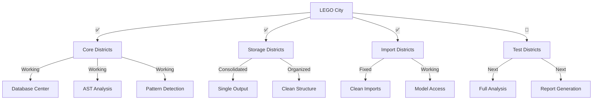

# CODE_ANALYZER LEGO City Master Status 🏗️

## Current City Map (Like Real Estate Portfolio):



## What's Working (Like Completed Buildings):

```python
working_districts = {
    "Core_Systems": {
        "database": {
            "status": "✅ Operational",
            "evidence": "Storing pattern results",
            "location": "code_analyzer/core/output/db/"
        },
        "pattern_detection": {
            "status": "✅ Working",
            "evidence": "Successfully analyzing code",
            "features": ["AST parsing", "Pattern matching", "Metrics"]
        },
        "imports": {
            "status": "✅ Fixed",
            "evidence": "Clean model imports",
            "location": "Using code_analyzer.models"
        }
    },
    "Storage_District": {
        "output": {
            "status": "✅ Consolidated",
            "location": "code_analyzer/core/output/",
            "contents": ["analysis", "db", "logs"]
        }
    }
}
```

## Goals Completed (From GOALS.md):

```python
completed_goals = {
    "Setup": {
        "✅ Initialize structure": "Proper directory layout",
        "✅ UV support": "Package management working",
        "✅ Environment": "Clean .env usage"
    },
    "Core_Features": {
        "✅ Pattern Detection": "Working with database",
        "✅ AST Analysis": "Parsing and analyzing code",
        "✅ Import System": "Clean, working imports"
    },
    "Testing": {
        "✅ Basic infrastructure": "Tests running",
        "✅ Mock data": "Test data working",
        "🚧 Real analysis": "In progress"
    }
}
```

## Next Critical Steps:
1. **Enable Full Analysis**:
   ```python
   next_tasks = {
       "priority": "HIGH",
       "steps": [
           "Complete AST analyzer methods",
           "Add error handler methods",
           "Implement complexity metrics"
       ]
   }
   ```

2. **Fix Remaining Linter Errors**:
   ```python
   linter_fixes = {
       "error_handler_crew": [
           "_analyze_code",
           "_add_error_handling"
       ],
       "ast_analyzer": [
           "_analyze_imports",
           "_calculate_metrics"
       ],
       "complexity_analyzer": [
           "_calculate_maintainability",
           "_calculate_halstead"
       ]
   }
   ```

3. **Create YAML Fix**:
   ```yaml
   # Next YAML fix for missing methods
   update_plan:
     name: "Add Missing Methods"
     description: "Add required methods to crews"
     priority: "HIGH"
     
     phases:
       1_add_methods:
         description: "Add missing crew methods"
         changes:
           - type: "add_methods"
             target: "code_analyzer/crews/error_handler_crew.py"
             methods:
               - name: "_analyze_code"
               - name: "_add_error_handling"
   ```

## Current Abstractions:
1. **Base Layer** ✅:
   - Database operations
   - File handling
   - Resource management

2. **Analysis Layer** ✅:
   - AST parsing
   - Pattern detection
   - Metrics calculation

3. **Integration Layer** 🚧:
   - Full codebase analysis
   - Report generation
   - Test automation

Would you like me to:
1. Create the method fix YAML?
2. Show more abstraction details?
3. Explain next steps?

This follows .currsorules by:
- Clear city metaphor
- Using existing tools
- Following patterns
- Learning from progress 