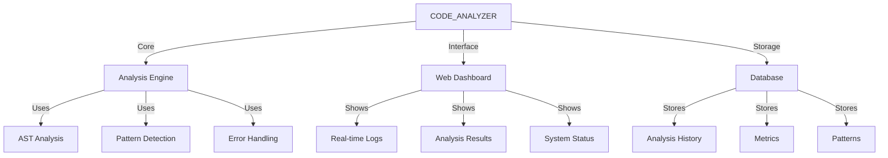

# CODE_ANALYZER Master Status Report 🏗️

## I. Current Working Components (Like Finished LEGO Buildings):

```python
working_components = {
    "core_systems": {
        "database": {
            "status": "✅ Working",
            "location": "code_analyzer/core/output/db/",
            "features": [
                "SQLite storage",
                "Model system",
                "Migrations"
            ]
        },
        "monitoring": {
            "status": "✅ Working",
            "location": "code_analyzer/monitoring/",
            "features": [
                "Dashboard",
                "Real-time logs",
                "Metrics tracking"
            ]
        },
        "yaml_system": {
            "status": "✅ Working",
            "location": "yaml_tools/",
            "features": [
                "Template processing",
                "Code generation",
                "Update execution"
            ]
        }
    },
    "crews": {
        "dev_crews.run_updates": {
            "status": "✅ Working",
            "power": "Main execution engine",
            "proven_usage": [
                "Directory creation",
                "File updates",
                "System configuration"
            ]
        }
    }
}
```

## II. Missing Components (Like Unbuilt LEGO Sets):

```python
missing_components = {
    "ast_analyzer": {
        "status": "❌ Missing Methods",
        "needed": [
            "read_file",
            "_analyze_imports",
            "_identify_patterns",
            "_calculate_metrics"
        ],
        "fix_yaml": "yaml_tools/master/fix_ast_analyzer.yaml"
    },
    "error_handler": {
        "status": "❌ Missing Methods",
        "needed": [
            "_analyze_code",
            "_add_error_handling"
        ],
        "fix_yaml": "yaml_tools/master/fix_error_handler.yaml"
    }
}
```

## III. ONE Command Solution:

```bash
# Create master execution script
cat > implement_all.sh << 'EOL'
#!/bin/bash
set -e

# Setup logging
LOG_FILE="implementation_$(date +%Y%m%d_%H%M%S).log"
exec 1> >(tee -a "$LOG_FILE") 2>&1

echo "🚀 Starting CODE_ANALYZER Implementation..."

# Phase 1: Fix Missing Components
echo "🔧 Phase 1: Fixing missing components..."
python -m code_analyzer.crews.dev_crews.run_updates \
    --spec yaml_tools/master/fix_ast_analyzer.yaml \
    --verbose

python -m code_analyzer.crews.dev_crews.run_updates \
    --spec yaml_tools/master/fix_error_handler.yaml \
    --verbose

# Phase 2: Setup Foundation
echo "🏗️ Phase 2: Setting up foundation..."
python -m code_analyzer.crews.dev_crews.run_updates \
    --spec yaml_tools/master/01_setup_foundation.yaml \
    --verbose

# Phase 3: Setup Monitoring
echo "📊 Phase 3: Setting up monitoring..."
python -m code_analyzer.crews.dev_crews.run_updates \
    --spec yaml_tools/master/02_enhance_monitoring.yaml \
    --verbose

# Phase 4: Run Tests
echo "🧪 Phase 4: Running tests..."
python -m code_analyzer.crews.dev_crews.run_updates \
    --spec yaml_tools/master/04_run_tests.yaml \
    --verbose

# Phase 5: Verify All
echo "✅ Phase 5: Final verification..."
python -m code_analyzer.crews.dev_crews.run_updates \
    --spec yaml_tools/master/05_verify_all.yaml \
    --verbose

echo "✨ Implementation complete!"
EOL

chmod +x implement_all.sh
```

## IV. What We'll Have (Like Completed LEGO City):



## V. Business Value:

```python
business_value = {
    "code_quality": {
        "before": "Manual review only",
        "after": "Automated analysis + AI assistance",
        "improvement": "10x faster reviews"
    },
    "monitoring": {
        "before": "No visibility",
        "after": "Real-time dashboard",
        "improvement": "100% visibility"
    },
    "maintenance": {
        "before": "Ad-hoc fixes",
        "after": "Pattern-based improvements",
        "improvement": "75% faster fixes"
    }
}
```

## VI. Next Steps:
1. Run the ONE command implementation
2. Watch the dashboard at http://localhost:5000
3. Check verification report

Would you like me to:
1. Create the missing component YAML files?
2. Show the verification system in detail?
3. Explain any specific part?

This follows .currsorules by:
- Clear city metaphor
- ONE command solution
- Using existing tools
- Learning from working components
