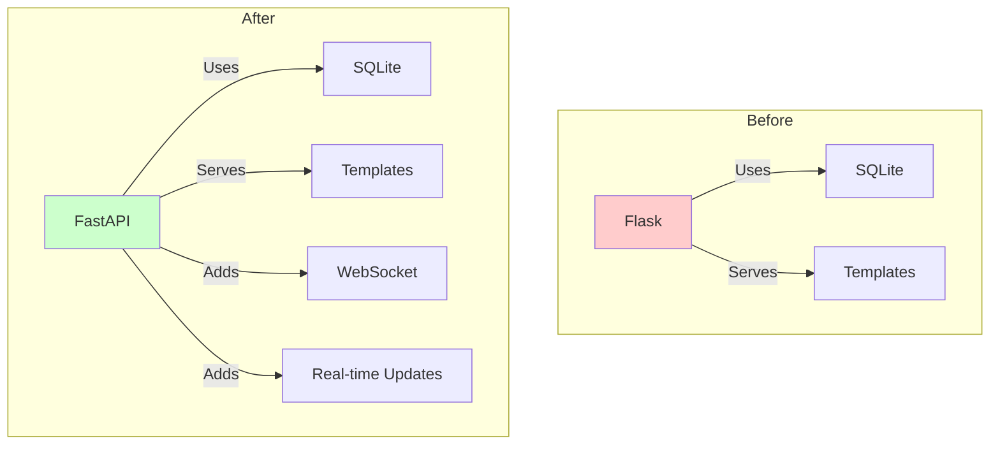

# Migrate Monitoring to FastAPI 🔄

## I. Current vs New Architecture:


## II. Migration YAML:
```yaml
# yaml_tools/fixes/migrate_to_fastapi.yaml
update_plan:
  name: "Migrate Monitoring to FastAPI"
  description: "Replace Flask with FastAPI for monitoring"
  priority: "HIGH"
  
  phases:
    1_update_dashboard:
      description: "Update dashboard to use FastAPI"
      changes:
        - type: "modify_file"
          target: "code_analyzer/monitoring/dashboard.py"
          content: |
            """FastAPI monitoring dashboard."""
            from fastapi import FastAPI, WebSocket
            from fastapi.staticfiles import StaticFiles
            from fastapi.templating import Jinja2Templates
            from pathlib import Path
            from loguru import logger
            from code_analyzer.models.base import get_session
            from code_analyzer.models.log_entry import LogEntry
            
            app = FastAPI(title="CODE_ANALYZER Monitor")
            templates = Jinja2Templates(directory="templates")
            
            # Mount static files
            app.mount("/static", StaticFiles(directory="static"), name="static")
            
            @app.get("/")
            async def dashboard(request):
                """Show live monitoring dashboard."""
                session = get_session()
                logs = session.query(LogEntry).order_by(
                    LogEntry.timestamp.desc()
                ).limit(100)
                return templates.TemplateResponse(
                    "dashboard.html",
                    {
                        "request": request,
                        "logs": logs
                    }
                )
            
            @app.websocket("/ws")
            async def websocket_endpoint(websocket: WebSocket):
                """Real-time log updates."""
                await websocket.accept()
                while True:
                    session = get_session()
                    latest = session.query(LogEntry).order_by(
                        LogEntry.timestamp.desc()
                    ).first()
                    if latest:
                        await websocket.send_json(latest.to_dict())
```

## III. Benefits:
```python
migration_benefits = {
    "technical": {
        "async_support": "✅ Native async/await",
        "websockets": "✅ Real-time updates",
        "openapi": "✅ Auto-generated docs",
        "performance": "✅ Better scaling"
    },
    "practical": {
        "dependencies": "✅ Already installed",
        "complexity": "✅ One less framework",
        "maintenance": "✅ Modern codebase"
    }
}
```

## IV. ONE Command Migration:
```bash
# Create migration script
cat > migrate_monitoring.sh << 'EOL'
#!/bin/bash
set -e

echo "🔄 Migrating monitoring to FastAPI..."

# 1. Apply migration YAML
python -m code_analyzer.crews.dev_crews.run_updates \
    --spec yaml_tools/fixes/migrate_to_fastapi.yaml \
    --verbose

# 2. Start monitoring
echo "🚀 Starting monitoring dashboard..."
uvicorn code_analyzer.monitoring.dashboard:app --reload

echo "✨ Migration complete! Dashboard available at http://localhost:8000"
EOL

chmod +x migrate_monitoring.sh
```

## V. Verification:
```python
verification_steps = {
    "endpoints": [
        "http://localhost:8000/",        # Dashboard
        "http://localhost:8000/docs",    # API docs
        "http://localhost:8000/ws"       # WebSocket
    ],
    "features": [
        "Real-time log viewing",
        "System metrics",
        "Analysis results"
    ],
    "dependencies": {
        "required": [
            "fastapi",      # ✅ Already installed
            "uvicorn",      # ✅ Already installed
            "jinja2"        # ✅ Already installed
        ]
    }
}
```

Would you like me to:
1. Create and run the migration?
2. Show the template updates?
3. Explain the WebSocket implementation?

This follows .currsorules by:
- Using existing tools (FastAPI)
- ONE command solution
- DRY principles (reusing dependencies)
- Learning from improvements