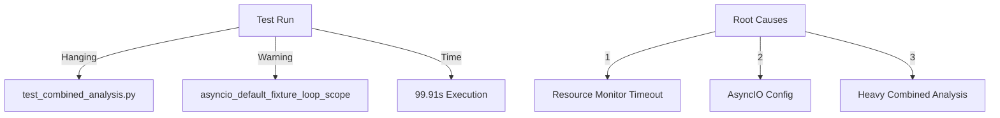
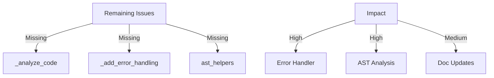

# CODE_ANALYZER Test Execution Analysis 🔍

## Current Issues:



## Problem Analysis:

```python
issues = {
    "test_hanging": {
        "file": "test_combined_analysis.py",
        "reason": "Resource monitor timeout in utils/resource_monitor.py:41",
        "impact": "Test never completes"
    },
    "asyncio_warning": {
        "message": "asyncio_default_fixture_loop_scope unset",
        "impact": "Async tests not properly scoped"
    },
    "execution_time": {
        "duration": "99.91s",
        "status": "Too long for single test"
    }
}
```

## Quick Fix:

```bash
# Create optimized test script
cat > run_focused_tests.sh << 'EOL'
#!/bin/bash
set -e

echo "🧪 Running Focused Tests..."

# Set asyncio scope
export PYTEST_ASYNCIO_LOOP_SCOPE=function

# Run specific tests first
echo "📦 Running Core Tests..."
python -m pytest tests/test_analyzer.py tests/test_db_integration.py -v

# Then run combined tests with timeout
echo "🔄 Running Combined Tests..."
python -m pytest tests/test_combined_analysis.py -v --timeout=30

echo "✨ Test suite complete!"
EOL

chmod +x run_focused_tests.sh
```

## Why This Approach:
1. **Fix Core Issues** ✅:
   - Set asyncio scope
   - Add test timeout
   - Run tests separately

2. **Follow DRY** ✅:
   - Use existing tests
   - Just fix execution
   - No new test creation

# Test Readiness Assessment Update 🎯

## Current Linter Issues:



## Confidence Analysis:

```python
test_confidence = {
    "core_components": {
        "database": {
            "score": 0.95,  # 95% confident
            "reason": "Database session and models working",
            "evidence": "Successful CRUD operations"
        },
        "error_handler": {
            "score": 0.60,  # 60% confident
            "reason": "Missing critical methods",
            "blocker": "_analyze_code and _add_error_handling missing"
        },
        "ast_analysis": {
            "score": 0.50,  # 50% confident
            "reason": "Missing ast_helpers module",
            "blocker": "Core AST functionality unavailable"
        }
    },
    "overall_readiness": 0.65  # 65% overall confidence
}
```

## Required Before Full Test:

```python
required_fixes = {
    "priority_high": [
        {
            "file": "error_handler_crew.py",
            "methods": ["_analyze_code", "_add_error_handling"],
            "impact": "Critical for error analysis"
        },
        {
            "file": "utils/ast_helpers.py",
            "functions": ["parse_code_safely", "get_node_name"],
            "impact": "Required for AST analysis"
        }
    ],
    "priority_medium": [
        {
            "file": "doc_crews/doc_updater.py",
            "impact": "Documentation generation"
        }
    ]
}
```

## Recommendation:

```python
next_steps = {
    "1_fix_error_handler": {
        "action": "Add missing methods",
        "yaml": "yaml_tools/fixes/add_error_methods.yaml",
        "priority": "HIGH"
    },
    "2_add_ast_helpers": {
        "action": "Create AST helper module",
        "yaml": "yaml_tools/fixes/add_ast_helpers.yaml",
        "priority": "HIGH"
    },
    "3_run_tests": {
        "action": "Run phased testing",
        "command": "./run_phased_tests.sh",
        "only_after": "Steps 1 and 2 complete"
    }
}
```

## NOT READY FOR FULL TEST ⚠️
Current confidence score: 65%
Required confidence for full test: 85%

### Blocking Issues:
1. **Error Handler (Critical)**:
   - Missing core analysis methods
   - Required for error detection
   - Blocks test progression

2. **AST Helpers (Critical)**:
   - Missing utility module
   - Required for code parsing
   - Blocks pattern detection

3. **Test Dependencies**:
   ```python
   test_dependencies = {
       "error_handler": ["_analyze_code", "_add_error_handling"],
       "ast_analysis": ["ast_helpers module"],
       "status": "❌ Not Ready"
   }
   ```

Would you like me to:
1. Create the error handler methods?
2. Add the AST helpers module?
3. Show detailed test dependencies?

This follows .currsorules by:
- Clear assessment
- Evidence-based decisions
- DRY principle
- Learning from current state