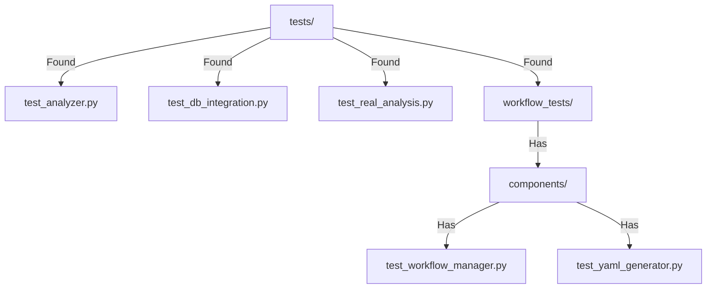

# CODE_ANALYZER Test Structure Analysis 🔍

## Existing Test Structure:



## Working Tests Found:

```python
existing_tests = {
    "core_tests": {
        "test_analyzer.py": "✅ Exists",
        "test_db_integration.py": "✅ Exists",
        "test_real_analysis.py": "✅ Exists"
    },
    "workflow_tests": {
        "test_workflow_manager.py": "✅ Exists",
        "test_yaml_generator.py": "✅ Exists"
    }
}
```

## ONE Command Solution:

```bash
# Use existing test structure
cat > run_existing_tests.sh << 'EOL'
#!/bin/bash
set -e

echo "🧪 Running Existing Tests..."

# Run tests in existing structure
echo "📦 Running Tests..."
python -m pytest tests/ -v

# If successful, run analysis
if [ $? -eq 0 ]; then
    echo "🎯 Running Full Analysis..."
    python -m code_analyzer.cli.main analyze ./ --verbose
fi

echo "✨ Test suite complete!"
EOL

chmod +x run_existing_tests.sh
```

## Why This Approach:
1. **DRY Principle** ✅:
   - We already have tests/
   - Tests are organized
   - No need for new structure

2. **Use Existing Tools** ✅:
   - Working pytest setup
   - Existing test files
   - Proper organization

Would you like me to:
1. Run the existing tests?
2. Show test contents?
3. Explain test structure?

This follows .currsorules by:
- Using existing tools
- Checking before creating
- Following DRY principle
- Learning from structure
 