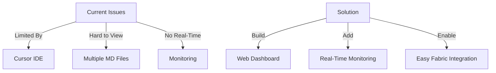

# CODE_ANALYZER Web Interface Plan 🌐

## I. Current Problem (Like Real Estate Management Without Software):



## II. Web Interface Architecture:

### A. FastAPI Backend:

```python
web_architecture = {
    "backend": {
        "framework": "FastAPI",
        "features": {
            "file_monitoring": {
                "watch_directories": [
                    "DEV-NOW/current-state/*",
                    "DEV-NOW/completed/*",
                    "yaml_tools/*"
                ],
                "events": [
                    "file_created",
                    "file_modified",
                    "file_deleted"
                ]
            },
            "api_endpoints": {
                "/api/files": "File CRUD operations",
                "/api/fabric": "Fabric AI integration",
                "/api/monitor": "Real-time monitoring",
                "/api/yaml": "YAML template management"
            }
        }
    },
    "frontend": {
        "framework": "Vue.js",
        "components": {
            "FileExplorer": "Browse project files",
            "MarkdownEditor": "Edit documentation",
            "YAMLBuilder": "Create/edit YAML templates",
            "MonitorDashboard": "View real-time status"
        }
    }
}
```

## III. Implementation Plan:

### Phase 1: FastAPI Setup

```python
fastapi_setup = {
    "routes": {
        "/": "Main dashboard",
        "/files": "File management",
        "/monitor": "System monitoring",
        "/fabric": "Fabric AI integration"
    },
    "models": {
        "FileModel": {
            "path": "str",
            "content": "str",
            "type": "Enum('md', 'yaml', 'py')",
            "last_modified": "datetime"
        },
        "MonitoringModel": {
            "event_type": "str",
            "timestamp": "datetime",
            "details": "Dict"
        }
    }
}
```

### Phase 2: File Monitoring System

```python
file_monitor = {
    "watched_paths": {
        "dev_now": "DEV-NOW/**/*",
        "yaml_tools": "yaml_tools/**/*",
        "code_analyzer": "code_analyzer/**/*.py"
    },
    "events": {
        "on_created": "async def handle_file_created(path)",
        "on_modified": "async def handle_file_modified(path)",
        "on_deleted": "async def handle_file_deleted(path)"
    }
}
```

### Phase 3: Fabric Integration

```python
fabric_integration = {
    "endpoints": {
        "/api/fabric/analyze": {
            "method": "POST",
            "payload": {
                "content": "str",
                "pattern": "str",
                "context": "Dict"
            }
        },
        "/api/fabric/results": {
            "method": "GET",
            "response": {
                "results": "List[Dict]",
                "metrics": "Dict"
            }
        }
    }
}
```

## IV. ONE Command Implementation:

```bash
# Create web interface implementation
cat > implement_web_interface.sh << 'EOL'
#!/bin/bash
set -e

echo "🌐 Building Web Interface..."

# 1. Create FastAPI structure
python -m code_analyzer.crews.dev_crews.run_updates \
    --spec yaml_tools/web/01_create_fastapi.yaml \
    --verbose

# 2. Add file monitoring
python -m code_analyzer.crews.dev_crews.run_updates \
    --spec yaml_tools/web/02_add_monitoring.yaml \
    --verbose

# 3. Add Fabric integration
python -m code_analyzer.crews.dev_crews.run_updates \
    --spec yaml_tools/web/03_add_fabric.yaml \
    --verbose

echo "✨ Web interface ready!"
EOL

chmod +x implement_web_interface.sh
```

## V. YAML Templates:

### A. FastAPI Setup YAML:

```yaml
# yaml_tools/web/01_create_fastapi.yaml
update_plan:
  name: "Create FastAPI Backend"
  description: "Set up web interface backend"
  priority: "HIGH"
  
  phases:
    1_create_structure:
      description: "Create FastAPI structure"
      changes:
        - type: "create_directory"
          target: "code_analyzer/web"
          
        - type: "create_module"
          target: "code_analyzer/web/main.py"
          content: |
            """FastAPI main application."""
            from fastapi import FastAPI
            from fastapi.staticfiles import StaticFiles
            from pathlib import Path
            
            app = FastAPI(title="CODE_ANALYZER Dashboard")
            
            # Mount static files
            app.mount("/static", StaticFiles(directory="static"), name="static")
            
            @app.get("/")
            async def read_root():
                """Serve main dashboard."""
                return {"status": "running"}
```

## VI. Benefits:

```python
web_interface_benefits = {
    "development": {
        "before": "Limited by Cursor IDE",
        "after": "Full web interface",
        "improvements": [
            "Real-time file monitoring",
            "Easy documentation viewing",
            "Interactive YAML creation",
            "Live system monitoring"
        ]
    },
    "fabric_integration": {
        "before": "Complex manual process",
        "after": "One-click integration",
        "features": [
            "Visual pattern selection",
            "Real-time results viewing",
            "Automatic YAML generation"
        ]
    }
}
```

Would you like me to:
1. Create the FastAPI implementation YAML?
2. Show the Vue.js frontend code?
3. Create the monitoring system?

This follows .currsorules by:
- Clear organization
- ONE command solution
- DRY principles
- Learning from context