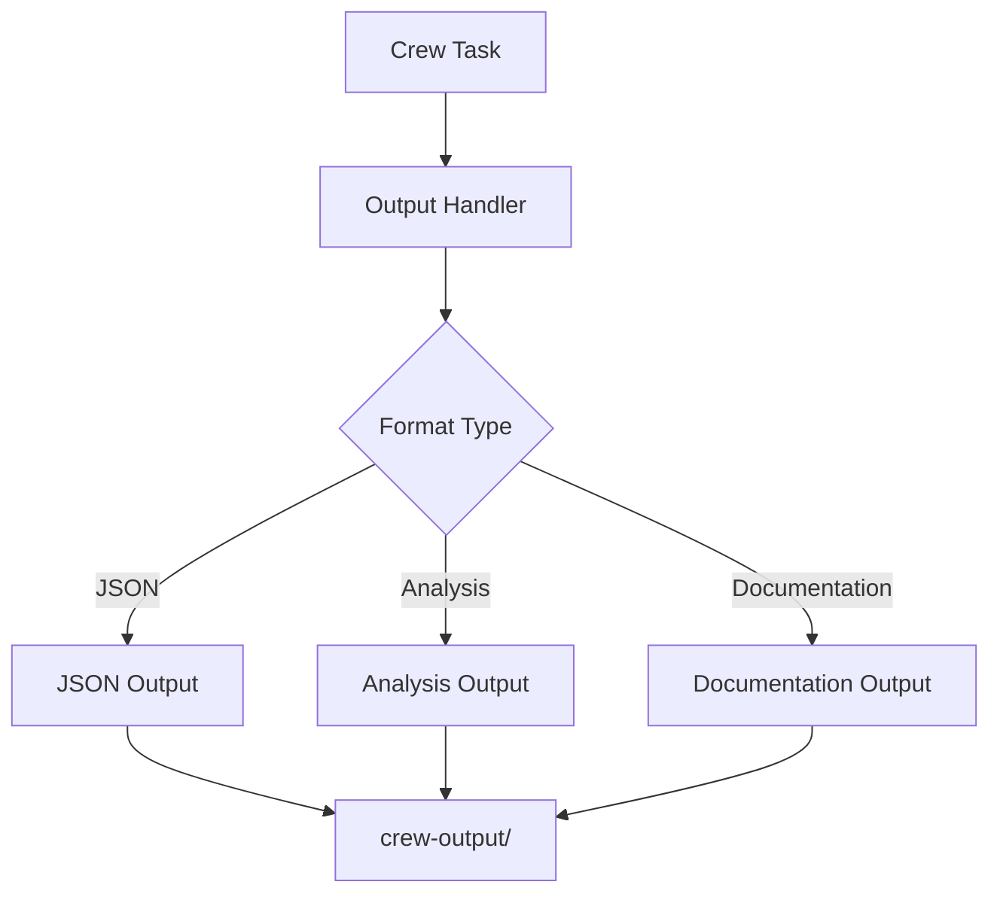

# CrewAI Output Structure
Last Updated: 11/27/24 15:30 CST

## Current Output Flow


## Directory Structure
```
crews/crew-output/
├── analysis/
│   ├── latest_analysis.json
│   └── code-analysis-{timestamp}.json
├── crewaidocs/
│   ├── latest_documentation.json
│   └── docs_analysis.txt
└── status/
    └── latest_status.json
```

## Output Types

### 1. Analysis Output
```json
{
    "status": "completed",
    "timestamp": "YYYY-MM-DD HH:mm:ss",
    "analysis_results": {
        "recommendations": [],
        "improvements": [],
        "priority": 0-3
    }
}
```

### 2. Documentation Output
```json
{
    "metadata": {
        "crew_name": "CrewAIDocs",
        "timestamp": "YYYY-MM-DD HH:mm:ss"
    },
    "status": "completed",
    "analysis_results": {
        "raw_output": "...",
        "recommendations": {}
    }
}
```

## SQLAlchemy Integration Plan

### 1. Database Models
```python
from sqlalchemy import Column, Integer, String, JSON, DateTime
from sqlalchemy.ext.declarative import declarative_base

Base = declarative_base()

class CrewOutput(Base):
    __tablename__ = 'crew_outputs'
    
    id = Column(Integer, primary_key=True)
    crew_name = Column(String)
    timestamp = Column(DateTime)
    output_type = Column(String)
    results = Column(JSON)
    status = Column(String)
```

### 2. Migration Steps
1. Create SQLite database first
2. Test with small dataset
3. Move to PostgreSQL for production

### 3. Benefits
- Queryable history
- Better metrics tracking
- Easier analysis of trends
- Backup and restore

### 4. Implementation Priority
1. Set up models ⏳
2. Create migrations 🔜
3. Update output handlers 🔜
4. Add query interface 🔜

## Next Steps
1. [ ] Create SQLAlchemy models
2. [ ] Add database connection
3. [ ] Update output handlers
4. [ ] Create query interface

## Cost Analysis
- Storage: Minimal (< 1MB per analysis)
- Query Time: Sub-second
- Backup: Automated with DB 