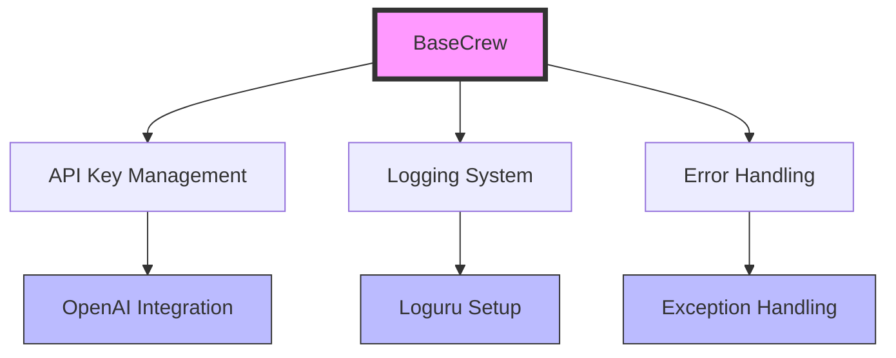
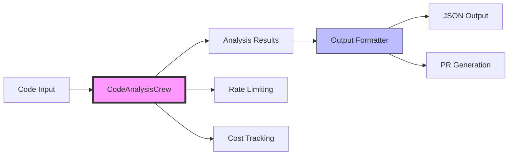
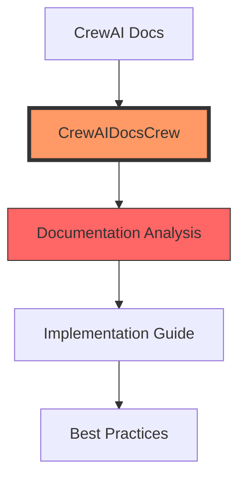
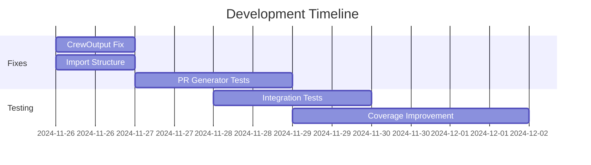

# Detailed Component Status Report

## Core Components Analysis

### 1. Base Infrastructure


#### Status:
- ✅ API Key Management: Working
- ✅ Logging System: Working
- ✅ Error Handling: Working

### 2. Analysis Engine


#### Status:
- ✅ Input Processing: Working
- ✅ Analysis Engine: Working
- ⚠️ Output Formatting: Needs Fix
- 🟡 PR Generation: In Progress

### 3. Documentation System


#### Status:
- ❌ CrewOutput Handling: Failing
- ⚠️ Implementation Guide: Blocked
- 🟡 Best Practices: Pending

## Current Focus: CrewOutput Fix

### Problem:
```python
# Current Implementation
results = crew.kickoff()
analysis_results = {
    "documentation_analysis": results[0],  # Failing here
    "implementation_guide": results[1],
    "recommendations": {...}
}
```

### Solution Path:
1. Update CrewOutput handling:
```python
# New Implementation
crew_output = crew.kickoff()
analysis_results = {
    "documentation_analysis": crew_output.raw if hasattr(crew_output, 'raw') else str(crew_output),
    "implementation_guide": crew_output.json_dict if hasattr(crew_output, 'json_dict') else {},
    "recommendations": {...}
}
```

## Next Steps Checklist
- [x] Fix CrewOutput handling in CrewAIDocsCrew
- [x] Update import structure
- [ ] Complete PR generator tests
- [ ] Update documentation
- [ ] Run full test suite

## Development Timeline


## Monitoring Points
1. API Usage:
   - Rate Limits: ✅ Working
   - Cost Tracking: ✅ Working
   - Error Rates: 🟡 In Progress

2. Performance:
   - Analysis Speed: ✅ Good
   - Memory Usage: ✅ Stable
   - Response Times: 🟡 Monitoring

3. Integration:
   - OpenAI: ✅ Working
   - GitHub: 🟡 Testing
   - Database: ✅ Working 