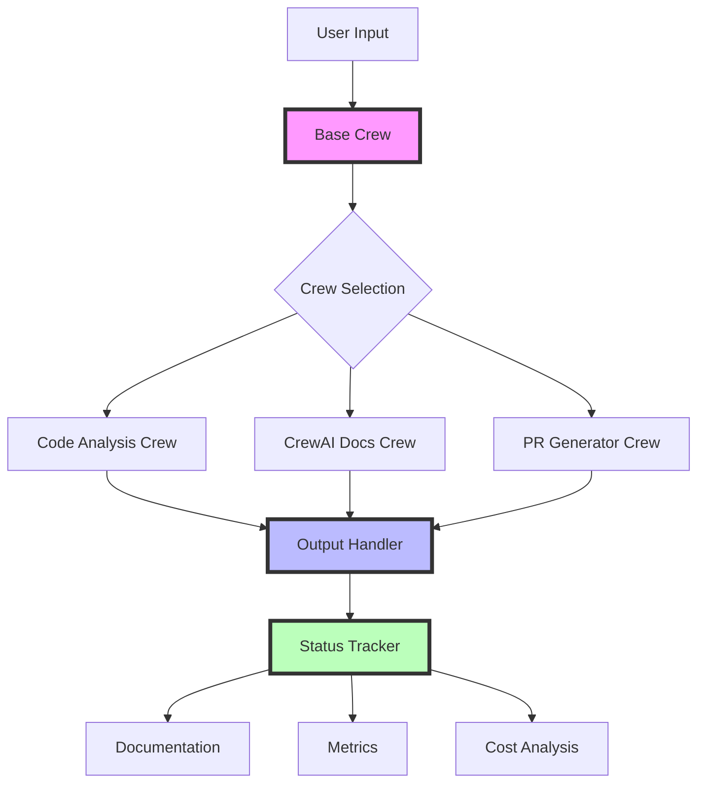
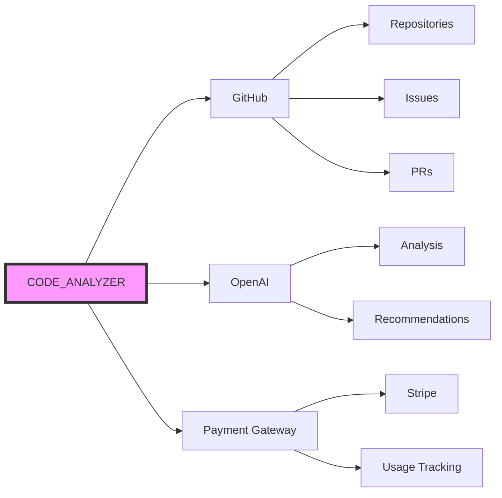
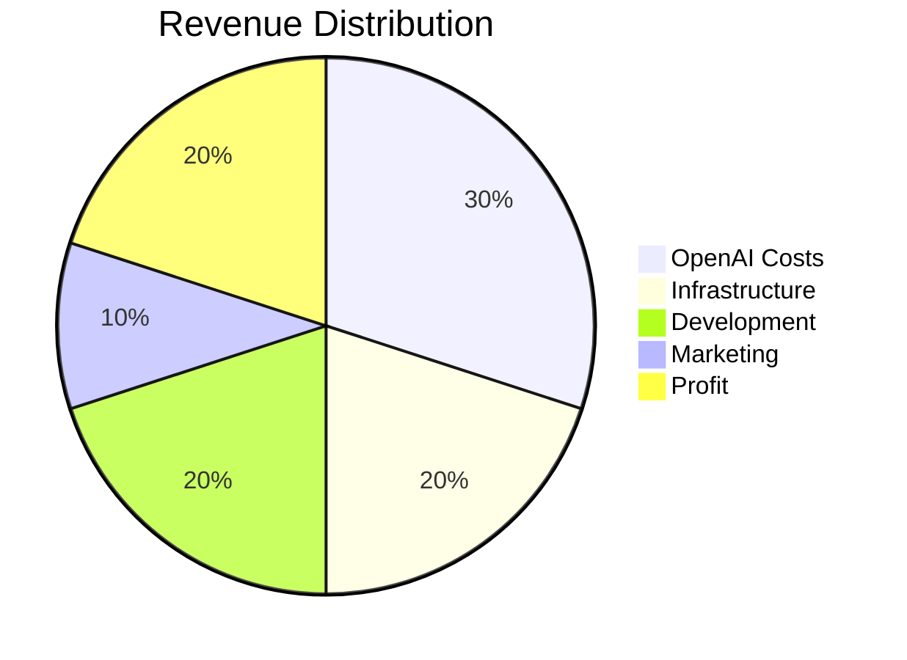

# CODE_ANALYZER Orchestration Overview

## Core Architecture


## How It Works

### 1. Base Architecture
- **BaseCrew**: Central foundation all crews inherit from
- **Status Tracking**: Built into every operation
- **Output Standardization**: Consistent JSON format
- **Cost Tracking**: Per-operation cost analysis

### 2. Current Working Features
✅ Code Analysis:
- Analyzes code quality
- Generates recommendations
- Tracks changes over time

✅ Status Tracking:
- Real-time status updates
- Cost per operation
- Success/failure metrics

✅ Output Management:
- Standardized JSON
- Version history
- Automatic documentation

### 3. Current Issues
❌ File Handling:
```python
Error: [Errno 17] File exists: 'crews/crew-output/crewaidocs/...'
```
- Need to implement proper file overwrite handling
- Add cleanup routines

❌ Test Coverage:
- Currently at 54%
- Need to reach 80%+ coverage
- Missing integration tests

## Business Model

### 1. Free Tier
- 100 analyses per month
- Basic recommendations
- Public repositories only

### 2. Usage-Based Pricing
```
Base Cost: Free
Per Analysis: $0.10
Per PR Generated: $0.25
Monthly Active Users: Revenue Share 70/30
```

### 3. Revenue Streams
1. **Analysis Credits**
   - Pre-purchased credits
   - Bulk discounts
   - Auto-renewal

2. **Custom Crews**
   - User-created crews
   - Marketplace revenue share
   - Custom integrations

3. **Enterprise Features**
   - Private repositories
   - Custom rules
   - Priority support

## Next Steps

### Immediate (Week 1)
1. Fix file handling errors
2. Improve test coverage
3. Add cost tracking

### Short Term (Month 1)
1. Setup payment processing
2. Create user dashboard
3. Implement usage limits

### Long Term (Q1)
1. Launch marketplace
2. Add custom crew builder
3. Implement enterprise features

## Integration Points


## Cost Structure


## MVP Roadmap
1. **Phase 1: Core Features** (Current)
   - Code analysis
   - Basic recommendations
   - Status tracking

2. **Phase 2: Monetization** (Next)
   - Usage tracking
   - Payment integration
   - User dashboard

3. **Phase 3: Scale** (Future)
   - Custom crews
   - Marketplace
   - Enterprise features 