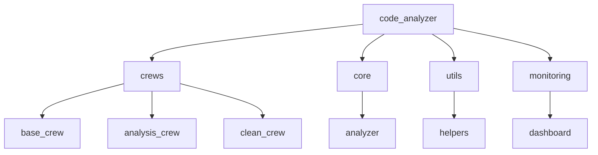

# CODE_ANALYZER Project Structure

## Current Structure (Before Move)
```
CODE_ANALYZER/
├── crews/                    # Scattered crew implementations
├── code_analyzer/           # Main package with utilities
├── scripts/                 # Various scripts
└── tests/                  # Test files
```

## Proposed Structure
```
CODE_ANALYZER/
├── code_analyzer/           # Main package
│   ├── __init__.py         # Package initialization
│   ├── cli/                # Command-line interface
│   │   ├── __init__.py
│   │   └── main.py        # Main CLI entry point
│   ├── crews/             # All AI crews (moved from root)
│   │   ├── __init__.py
│   │   ├── base_crew.py
│   │   ├── clean_dir_crew.py
│   │   ├── code_analysis_crew.py
│   │   └── status_crew.py
│   ├── core/              # Core functionality
│   │   ├── __init__.py
│   │   └── analyzer.py
│   ├── monitoring/        # Monitoring and metrics
│   │   ├── dashboard.py
│   │   └── models.py
│   └── utils/             # Utility functions
│       ├── cost_estimator.py
│       ├── debug.py
│       └── helpers.py
├── tests/                 # Test files
├── docs/                  # Documentation
└── scripts/              # Utility scripts
```

## Why Move Crews?

1. **Package Organization**:
   - All code should live under the main package
   - Makes imports cleaner and more consistent
   - Better Python packaging practices

2. **Import Resolution**:
   - Fixes relative import issues
   - Makes dependencies clearer
   - Easier to manage in virtual environments

3. **Deployment Structure**:
   - Cleaner pip installation
   - Better module resolution
   - Proper package distribution

## Component Relationships



## Key Benefits

1. **Modularity**:
   - Each component has clear responsibility
   - Easy to add new crews
   - Clean separation of concerns

2. **Testing**:
   - Easier to write and organize tests
   - Clear import paths
   - Better coverage tracking

3. **Documentation**:
   - Clear structure for docs
   - Obvious component relationships
   - Better API documentation

## Next Steps

1. Move crews:
```bash
mv crews/* code_analyzer/crews/
```

2. Update imports:
```python
# Old
from crews.base_crew import BaseCrew

# New
from code_analyzer.crews.base_crew import BaseCrew
```

3. Update tests:
```python
# Update test imports
from code_analyzer.crews.clean_dir_crew import CleanDirCrew
```

4. Run tests:
```bash
./run test
``` 