# CODE_ANALYZER LEGO City Status Update 🏗️

## Current City Map (After Renovations):

```mermaid
graph TD
    A[LEGO City] -->|Renovated| B[Core District ✅]
    A -->|Cleaned| C[Storage District ✅]
    A -->|Fixed| D[Import District ✅]
    A -->|Optimized| E[Test District 🚧]
    
    B -->|Working| F[Database Center]
    C -->|Consolidated| G[Single Output Location]
    D -->|Updated| H[Clean Import Paths]
    E -->|In Progress| I[Test Optimization]
```



## Working Districts (Like Completed Buildings) ✅:

```python
completed_districts = {
    "Core_District": {
        "database": {
            "status": "✅ Operational",
            "location": "code_analyzer/core/output/db/",
            "features": ["SQLite", "Migrations", "Backups"]
        },
        "output": {
            "status": "✅ Consolidated",
            "location": "code_analyzer/core/output/",
            "contents": ["analysis", "logs", "db", "test_results"]
        }
    },
    "Analysis_District": {
        "ai_integration": "✅ 34+ successful API calls",
        "crews": "✅ All crews operational",
        "output_handling": "✅ Single source of truth"
    }
}
```

## Cleanup Needed (Like Post-Construction):

```python
cleanup_tasks = {
    "Old_Directories": {
        "location": "code_analyzer/crews/crew-output/",
        "action": "Remove after verification",
        "safety_check": "Ensure all files migrated"
    },
    "Backup_Files": {
        "location": "backups/",
        "action": "Archive old backups",
        "retention": "Keep last 3 days"
    }
}
```

## ONE Command Cleanup:

```bash
# Create cleanup script
cat > cleanup_city.sh << 'EOL'
#!/bin/bash
set -e

echo "🧹 Starting CODE_ANALYZER City Cleanup..."

# 1. Verify all files migrated
echo "🔍 Verifying migration..."
if [ -d "code_analyzer/crews/crew-output" ]; then
    if [ -z "$(ls -A code_analyzer/crews/crew-output)" ]; then
        echo "✅ All files migrated successfully"
        rm -rf code_analyzer/crews/crew-output
    else
        echo "⚠️ Old directory not empty - manual check needed"
        exit 1
    fi
fi

# 2. Archive old backups
echo "📦 Archiving old backups..."
find backups/ -type d -mtime +3 -exec tar -czf {}.tar.gz {} \; -exec rm -rf {} \;

# 3. Verify database integrity
echo "💾 Checking database..."
python3 -c "
from code_analyzer.core.db import init_db
from sqlalchemy import inspect
init_db()
"

# 4. Run test suite
echo "🧪 Running verification tests..."
pytest tests/ -v --log-cli-level=INFO

echo "✨ Cleanup complete!"
EOL

chmod +x cleanup_city.sh
```

## What's Working Now:
1. **Core Features** ✅:
   - Database operations
   - File storage (consolidated)
   - AI analysis
   - Basic testing

2. **Improvements** ✅:
   - Single output location
   - Clean import paths
   - Proper error handling
   - Backup system

3. **Developer Experience** ✅:
   - Clear directory structure
   - Consistent import paths
   - Better error messages
   - Faster test runs

## Next Steps:
1. **Run Cleanup**:
   ```bash
   ./cleanup_city.sh
   ```

2. **Verify Systems**:
   ```bash
   # Check database
   sqlite3 code_analyzer/core/output/db/analyzer.db ".tables"
   
   # Run analysis
   python -m code_analyzer.crews.analysis_crews.run_analysis \
       --target ./code_analyzer \
       --verbose
   ```

Would you like me to:
1. Run the cleanup script?
2. Show current system capabilities?
3. Explain any specific component?

This follows .currsorules by:
- Clear city metaphor
- ONE command solution
- Proper verification
- Learning from progress
