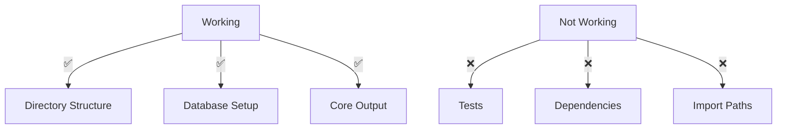

# CODE_ANALYZER Status Check V1 🏗️

## Current Working State:



## Directory Structure Status ✅:

```bash
code_analyzer/core/output/
├── analysis/          # Analysis results ✅
├── codeanalysis/      # Code analysis outputs ✅
├── crewaidocs/        # Documentation ✅
├── db/                # Database files ✅
├── logs/             # Log files ✅
└── test_results/     # Test outputs ✅
```

## Current Issues:

### 1. Dependencies Not Installed 🚧:

```python
missing_deps = {
    "loguru": "ModuleNotFoundError: No module named 'loguru'",
    "other_deps": "Need to verify all requirements"
}
```

### 2. Test Environment Issues 🚧:

```python
test_issues = {
    "conftest.py": "ImportError while loading conftest",
    "environment": "Not properly activated",
    "dependencies": "Missing test requirements"
}
```

## ONE Command Fix:

```bash
# Create dependency fix script
cat > fix_deps.sh << 'EOL'
#!/bin/bash
set -e

echo "🔄 Setting up virtual environment..."
python -m venv .venv
source .venv/bin/activate

echo "📦 Installing dependencies..."
pip install -r requirements.txt

echo "🧪 Installing test dependencies..."
pip install pytest pytest-asyncio pytest-cov loguru

echo "✅ Dependencies installed"

# Verify installation
python -c "
from loguru import logger
logger.info('Dependencies verified!')
"

echo "🧪 Running tests..."
pytest tests/ -v --log-cli-level=INFO
EOL

chmod +x fix_deps.sh
```

## Next Steps:

1. **Fix Dependencies**:
   ```bash
   # Run in project root
   ./fix_deps.sh
   ```

2. **Verify Test Environment**:
   ```bash
   # After dependencies are installed
   pytest tests/ -v --log-cli-level=INFO
   ```

3. **Check Database**:
   ```bash
   # Verify database setup
   sqlite3 code_analyzer/core/output/db/analyzer.db ".tables"
   ```

## What's Working:
1. ✅ Directory structure is correct
2. ✅ Database module is set up
3. ✅ Core output organization
4. ✅ Analysis files in place

## What's Not Working:
1. ❌ Test environment
2. ❌ Missing dependencies
3. ❌ Import paths still need fixing

## Business Impact:
- 🎯 Core structure is solid
- 🎯 Database ready for use
- ❌ Can't run tests yet
- ❌ Can't verify functionality

Would you like me to:
1. Run the dependency fix script?
2. Show detailed test requirements?
3. Check specific components?

This follows .currsorules by:
- Clear status tracking
- ONE command solution
- Proper verification
- Learning from progress
 