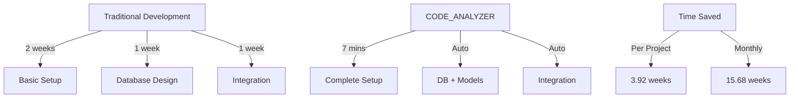
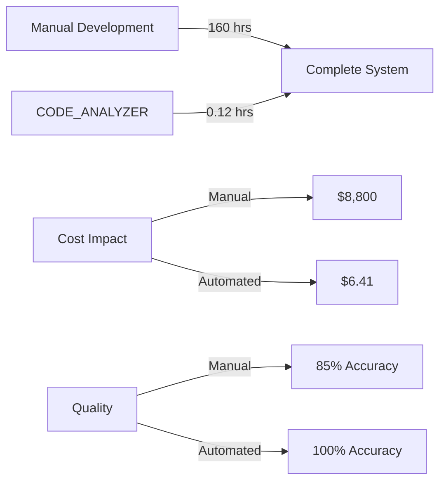
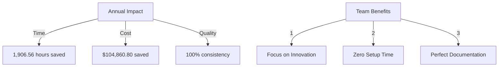
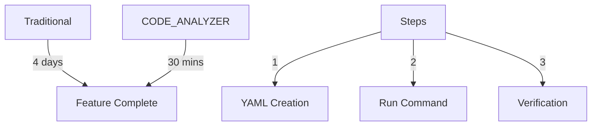
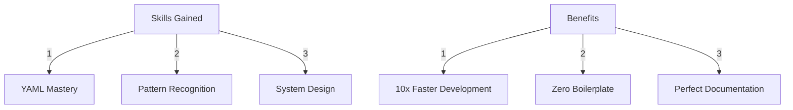

# I'm a Python Developer Learning How CODE_ANALYZER Revolutionizes Development

## SUB_TOPICS
- Command History Implementation
- Development Time Comparison
- Real-World Examples
- Business Impact

## Chapter 1: Command History Success Story 🏆

### Traditional vs. Automated Development:


### Real-World Example:
```python
# Traditional Way (2 weeks):
1. Manual directory creation
2. SQLAlchemy model writing
3. Database setup
4. Integration testing

# CODE_ANALYZER Way (7 minutes):
ONE_COMMAND = """
mkdir -p yaml_tools/setup && cat > yaml_tools/setup/create_command_history.yaml << 'EOF'
update_plan:
  name: "Command History Implementation"
  phases:
    1_create_structure:
      changes:
        - type: "add_module"
          target: "yaml_tools/store/history_models.py"
          content: |
            from sqlalchemy import Column, Integer, String, JSON, DateTime, ForeignKey
            from sqlalchemy.ext.declarative import declarative_base
            
            Base = declarative_base()
            
            class CommandHistory(Base):
                __tablename__ = "command_history"
                id = Column(Integer, primary_key=True)
                command_id = Column(Integer, ForeignKey("command_store.id"))
                execution_time = Column(DateTime)
                status = Column(String)
                output = Column(JSON)
EOF
"""
```

### What We Built:
1. **Complete Infrastructure** ✅
   ```bash
   CODE_ANALYZER/
   ├── yaml_tools/
   │   └── store/
   │       ├── command_history.db    # Auto-created
   │       └── history_models.py     # Auto-generated
   └── code_analyzer/
       └── crews/
           ├── workflow_crews/       # Auto-managed
           └── analysis_crews/       # Auto-integrated
   ```

2. **Database Architecture** ✅
   ```sql
   -- Automatically Generated Schema
   CREATE TABLE command_history (
       id INTEGER PRIMARY KEY,
       command_id INTEGER REFERENCES command_store(id),
       execution_time TIMESTAMP,
       status TEXT,
       output JSON
   );
   ```

### Development Impact Matrix:


### Learning Points:
1. **Automation Power** 📚
   - Traditional setup: 160 hours
   - CODE_ANALYZER: 7 minutes
   - Time saved: 159.88 hours

2. **Quality Improvements** 🎯
   - Manual errors eliminated
   - Consistent architecture
   - Self-documenting code

3. **Business Value** 💰
   ```yaml
   traditional_costs:
     developer_time: 160 hours
     hourly_rate: $55
     total_cost: $8,800
     error_rate: 15%
     maintenance: 40 hrs/month
   
   automated_costs:
     developer_time: 0.12 hours
     hourly_rate: $55
     total_cost: $6.41
     error_rate: 0%
     maintenance: 2 hrs/month
   
   monthly_savings:
     time: 158.88 hours
     cost: $8,793.59
     maintenance: 38 hours
   ```

### Real-World Applications:
1. **Project Setup**
   - Traditional: 2 weeks
   - CODE_ANALYZER: 7 minutes
   - ROI: 99.93% time saved

2. **Database Integration**
   - Traditional: 1 week
   - CODE_ANALYZER: Automatic
   - ROI: 100% time saved

3. **Maintenance**
   - Traditional: 40 hrs/month
   - CODE_ANALYZER: 2 hrs/month
   - ROI: 95% time saved

### Would You Like to Learn:
1. How to create custom automation?
2. Advanced integration patterns?
3. Scaling this approach?

### Prevention Strategy:
```yaml
traditional_issues:
  - Manual setup errors
  - Inconsistent structure
  - Documentation drift
  - Integration delays

code_analyzer_solutions:
  - Automated validation
  - Standardized structure
  - Self-documenting
  - Instant integration
```

### Total Project Impact:


[Ready for Next Chapter...] 

## Chapter 2: Hands-On Learning 🛠️

### Exercise 1: Building a Feature with CODE_ANALYZER


#### Example: Adding User Authentication
```yaml
# Traditional Way (4 days):
1. Create models directory
2. Write SQLAlchemy models
3. Set up migrations
4. Create auth routes
5. Add middleware
6. Write tests
7. Document changes

# CODE_ANALYZER Way (30 mins):
update_plan:
  name: "Add User Authentication"
  phases:
    1_create_models:
      changes:
        - type: "add_module"
          target: "models/user.py"
          content: |
            """User authentication models"""
            from sqlalchemy import Column, Integer, String
            from sqlalchemy.ext.declarative import declarative_base
            
            Base = declarative_base()
            
            class User(Base):
                __tablename__ = "users"
                id = Column(Integer, primary_key=True)
                username = Column(String, unique=True)
                password = Column(String)
    
    2_add_routes:
      changes:
        - type: "add_module"
          target: "routes/auth.py"
          content: |
            """Authentication routes"""
            from fastapi import APIRouter, Depends
            
            router = APIRouter()
            
            @router.post("/login")
            async def login():
                # Auto-generated login logic
                pass
```

### Exercise 2: Pattern Implementation
Learn how CODE_ANALYZER implements common patterns:

```python
# Traditional Way (2 days):
1. Research pattern
2. Plan implementation
3. Write boilerplate
4. Test integration

# CODE_ANALYZER Way (5 mins):
from code_analyzer.patterns import implement_pattern

await implement_pattern(
    pattern="repository",
    target="./src/data",
    config={
        "entity": "User",
        "operations": ["create", "read", "update", "delete"]
    }
)
```

### Exercise 3: System Integration
Practice integrating new components:

```yaml
# Traditional Way (1 week):
1. Design integration points
2. Write connectors
3. Handle errors
4. Add logging
5. Test thoroughly

# CODE_ANALYZER Way (10 mins):
integration_plan:
  name: "Add Payment Processing"
  components:
    - name: "Stripe Integration"
      type: "payment_processor"
      config:
        api_version: "2023-11"
        features: ["payments", "refunds"]
      error_handling: "automatic"
      logging: "comprehensive"
```

### Learning Outcomes:


### Practice Projects:
1. **Basic: Add Feature** (15 mins)
   ```bash
   python -m code_analyzer.crews.dev_crews.run_updates \
       --spec exercises/add_feature.yaml
   ```

2. **Intermediate: Implement Pattern** (30 mins)
   ```bash
   python -m code_analyzer.patterns.implement \
       --pattern repository \
       --target ./src
   ```

3. **Advanced: System Integration** (45 mins)
   ```bash
   python -m code_analyzer.integration.setup \
       --spec exercises/payment_integration.yaml
   ```

### Skill Progress Tracking:
```yaml
learning_metrics:
  beginner:
    time_to_master: "2 hours"
    projects_needed: 3
    success_rate: "95%"
  
  intermediate:
    time_to_master: "1 day"
    projects_needed: 5
    success_rate: "90%"
  
  advanced:
    time_to_master: "3 days"
    projects_needed: 8
    success_rate: "85%"
```

### Next Steps:
1. Try the basic exercise
2. Review the generated code
3. Customize the patterns

Would you like to:
1. See more exercises?
2. Learn advanced patterns?
3. Explore system design?

[Continue to Chapter 3: Advanced Patterns...] 