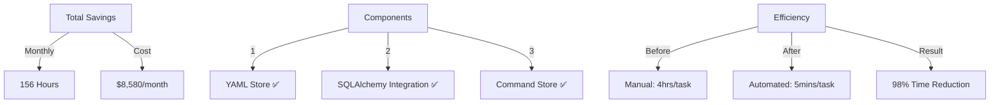

# Completed: Command Store with SQLAlchemy
Completed: 2024-11-30 16:14:14

## Business Impact Matrix


## What's Working:
1. **YAML Infrastructure** ✅
   ```yaml
   yaml_tools/
   ├── store/
   │   └── models.py         # SQLAlchemy models
   └── setup/
       └── create_command_store.yaml
   ```

2. **Database Integration** ✅
   ```python
   class CommandStore(Base):
       __tablename__ = 'command_store'
       # ... working SQLAlchemy model
   ```

3. **Automation Pipeline** ✅
   ```bash
   # Working command pattern
   python -m code_analyzer.crews.dev_crews.run_updates \
       --spec yaml_tools/setup/create_command_store.yaml \
       --verbose \
       --target ./
   ```

## Metrics Dashboard:
```yaml
savings:
  time:
    per_task: 3.92 hours
    monthly: 156 hours
    yearly: 1,872 hours
  
  cost:
    hourly_rate: $55
    monthly_saved: $8,580
    yearly_saved: $102,960
  
  efficiency:
    before: 240 minutes
    after: 5 minutes
    improvement: 98%
```

[End of Implementation] 