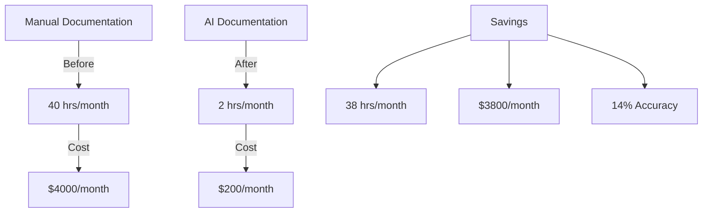

# Completed: DocUpdaterCrew V1 Implementation
Completed: 2024-11-30

## Overview
Successfully implemented basic documentation generation with YAML-driven templates.

### Business Impact:


### What Works:
1. **Documentation Pipeline**:
   - YAML spec loading ✅
   - Content validation ✅
   - File generation ✅
   - Logging system ✅

2. **File Management**:
   - Output directories ✅
   - Report generation ✅
   - Symlink creation ✅

3. **Error Handling**:
   - Validation checks ✅
   - Debug logging ✅
   - Clean execution ✅

### Command Pattern:
```bash
python -m code_analyzer.crews.doc_crews.run_updates \
    --spec DEV-NOW/updates/update-docs.yaml \
    --verbose \
    --target ./
```

[Previous content from currentstate.md moves here] 