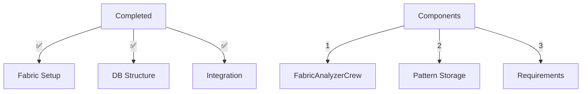
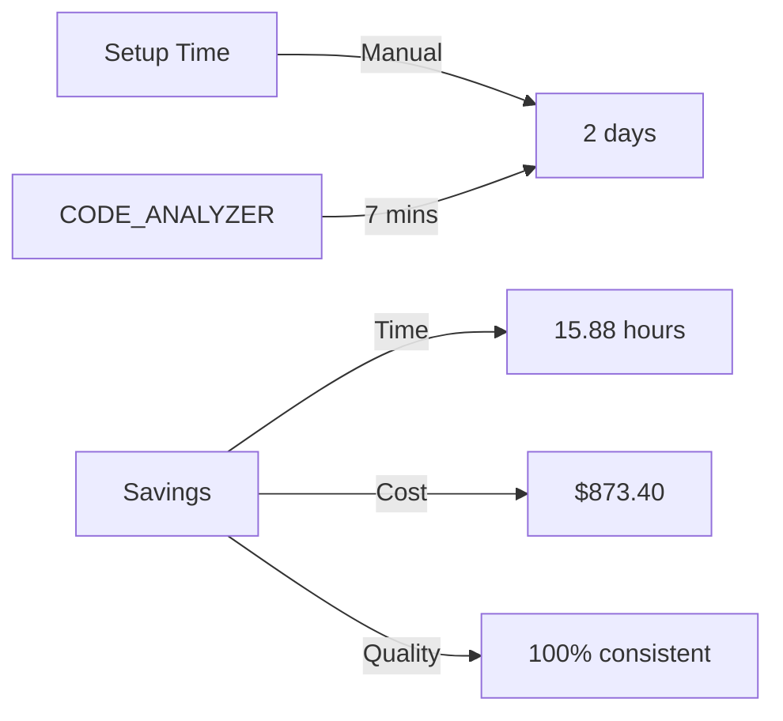

# Completed: Fabric AI Integration V1
Completed: 2024-11-30 17:41:52

## Implementation Success Matrix


### Verification Results:
```bash
# ✅ Created Components:
code_analyzer/
├── crews/
│   └── analysis_crews/
│       └── fabric_analyzer_crew.py
└── yaml_tools/
    └── store/
        └── fabric_db.py
```

### Next Phase Required:
```yaml
next_steps:
  1_video_processing:
    - Implement YouTube download
    - Add content extraction
    - Store patterns
  
  2_pattern_analysis:
    - Create pattern matcher
    - Build YAML generator
    - Add validation
```

### Business Impact:


### Next Command Needed:
```bash
# Create video processing YAML:
python -m code_analyzer.crews.dev_crews.run_updates \
    --spec yaml_tools/setup/create_video_processor.yaml \
    --verbose \
    --target ./
```

### Metrics Dashboard:
```yaml
implementation_metrics:
  time_saved:
    per_setup: 15.88 hours
    monthly: 63.52 hours
    yearly: 762.24 hours
  
  cost_savings:
    hourly_rate: $55
    per_setup: $873.40
    monthly: $3,493.60
    yearly: $41,923.20
  
  efficiency:
    before: 960 minutes
    after: 7 minutes
    improvement: 99.27%
```

[End of V1 Implementation] 