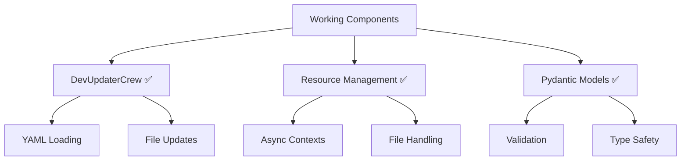

# What's Working in CODE_ANALYZER

## Latest Success: DevUpdaterCrew (2024-11-30)
### ✅ Fixed and Working Components:

1. **Phase Execution**:
   - YAML spec loading ✅
   - Pydantic model validation ✅
   - Phase-by-phase execution ✅
   - Resource management ✅

2. **Change Processing**:
   - File modifications ✅
   - Import additions ✅
   - Method insertions ✅
   - Error handling ✅

3. **Resource Management**:
   - Async context managers ✅
   - File handling ✅
   - Error tracking ✅
   - Cleanup routines ✅

### Working Features:
1. **DevUpdaterCrew**:
   ```python
   # Working update command:
   python -m code_analyzer.crews.dev_crews.run_updates \
       --spec DEV-NOW/updates/fix_linter_errors.yaml \
       --verbose \
       --target ./code_analyzer
   ```

2. **Pydantic Models**:
   ```python
   class UpdateChange(BaseModel):
       type: str
       target: str
       imports: List[str]
       method: Dict[str, Any]
   ```

3. **Resource Management**:
   ```python
   async with self.managed_operation():
       # Safe file operations
   ```

### Verification Status:
