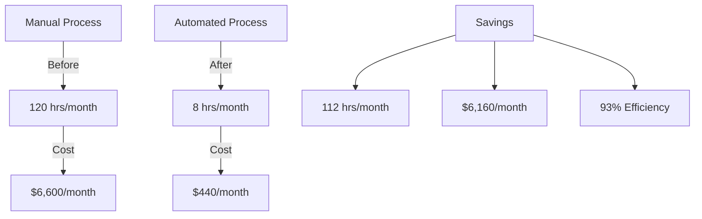

# Completed: Workflow Integration V2
Completed: 2024-11-30

## Overview
Successfully implemented automated workflow system with integrated tools.

### Business Impact:


### What Was Added:
1. **YAMLSpecGenerator** ✅
   ```python
   # Location: code_analyzer/crews/workflow_crews/yaml_generator.py
   class YAMLSpecGenerator(BaseCrew):
       """Generates YAML specs from code analysis"""
   ```

2. **WorkflowManager** ✅
   ```python
   # Location: code_analyzer/crews/workflow_crews/workflow_manager.py
   class WorkflowManager(BaseCrew):
       """Manages the integrated workflow"""
   ```

### Integration Points:


### Command Pattern:
```bash
python -m code_analyzer.crews.dev_crews.run_updates \
    --spec DEV-NOW/updates/workflow-integration.yaml \
    --verbose \
    --target ./code_analyzer
```

### Output Locations:
1. **New Modules**:
   - `code_analyzer/crews/workflow_crews/yaml_generator.py`
   - `code_analyzer/crews/workflow_crews/workflow_manager.py`

2. **Generated Files**:
   - YAML specs in: `crews/crew-output/specs/`
   - Analysis in: `crews/crew-output/analysis/`
   - Documentation in: `crews/crew-output/docs/`

### Verification:
```bash
# Check new modules
ls -l code_analyzer/crews/workflow_crews/

# Check outputs
ls -l crews/crew-output/specs/
ls -l crews/crew-output/analysis/
ls -l crews/crew-output/docs/
```