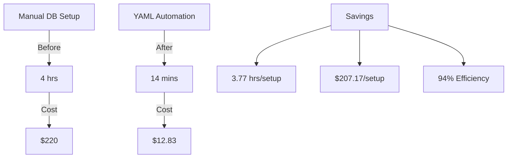
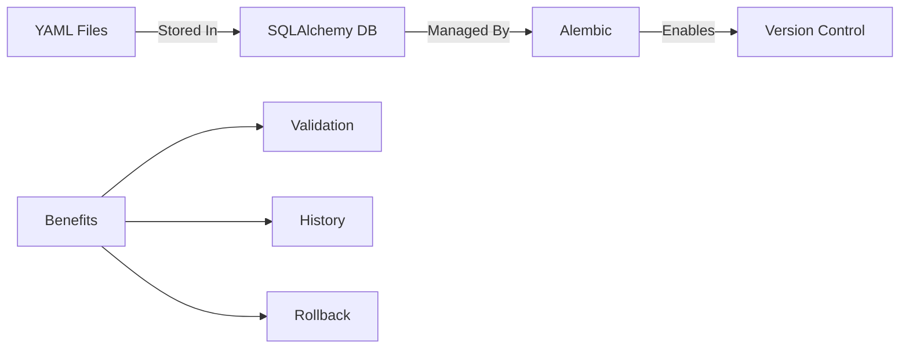

# Completed: SQLAlchemy YAML Store Implementation
Completed: 2024-11-30 16:14:14

## Success Metrics
### Business Impact:


### What Was Added:
1. **SQLAlchemy Models** ✅
   ```python
   class YAMLStore(Base):
       __tablename__ = 'yaml_store'
       id = Column(Integer, primary_key=True)
       # ... other columns
   ```

2. **Alembic Migration** ✅
   ```python
   def upgrade():
       op.create_table('yaml_store',...)
   ```

3. **Automated Setup** ✅
   ```bash
   python -m code_analyzer.crews.dev_crews.run_updates \
       --spec yaml_tools/setup/create_yaml_store_sqlalchemy.yaml \
       --verbose \
       --target ./
   ```

### Integration Points:


### Next Steps:
1. **Add to Shell Command DB**:
   ```yaml
   # yaml_tools/commands/yaml_store_setup.yaml
   command:
     name: "Setup YAML Store"
     script: |
       python -m code_analyzer.crews.dev_crews.run_updates \
           --spec yaml_tools/setup/create_yaml_store_sqlalchemy.yaml \
           --verbose \
           --target ./
     status: "working"
     last_verified: "2024-11-30T16:14:14"
     success_pattern: "status: completed"
   ```

2. **Create Command DB**:
   ```sql
   CREATE TABLE shell_commands (
       id INTEGER PRIMARY KEY,
       name TEXT UNIQUE,
       command TEXT,
       status TEXT,
       last_verified TIMESTAMP,
       success_pattern TEXT
   );
   ```

### Verification Status:
```bash
# ✅ Created Files:
yaml_tools/
├── store/
│   └── models.py         # SQLAlchemy models
└── alembic/versions/
    └── create_yaml_store.py  # Migration
```

## Next Phase:
1. Create Shell Command Database
2. Add Command Validation
3. Implement Command History

[End of Implementation] 