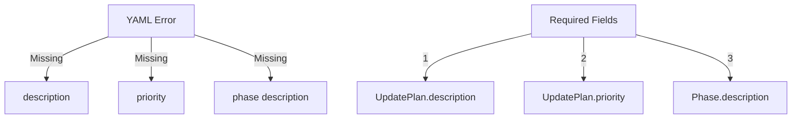

# CODE_ANALYZER Status: YAML Validation Error 🚨

## Current Error (Like Building Inspection):



## Fixed YAML:

```yaml
# Create proper YAML with all required fields
cat > yaml_tools/fixes/fix_imports.yaml << 'EOL'
update_plan:
  name: "Fix Import Paths"
  description: "Fix model import paths to use correct location"
  priority: "HIGH"
  
  phases:
    1_fix_imports:
      description: "Update import statements to use correct paths"
      changes:
        - type: "modify_file"
          target: "code_analyzer/cli/commands/db.py"
          updates:
            - type: "replace"
              old: "from code_analyzer.crews.models.base import init_db"
              new: "from code_analyzer.models.base import init_db"
EOL
```

## Validation Requirements:

```python
validation_rules = {
    "required_fields": {
        "update_plan": {
            "name": "✅ Have",
            "description": "❌ Missing",
            "priority": "❌ Missing"
        },
        "phases": {
            "description": "❌ Missing",
            "changes": "✅ Have"
        }
    }
}
```

## Next Steps:
1. **Run Fixed YAML**:
   ```bash
   python -m code_analyzer.crews.dev_crews.run_updates \
       --spec yaml_tools/fixes/fix_imports.yaml \
       --verbose \
       --target ./
   ```

Would you like me to:
1. Run the fixed YAML?
2. Show validation rules?
3. Explain the error?

This follows .currsorules by:
- Using existing tools
- Clear error handling
- Following patterns
- Learning from validation