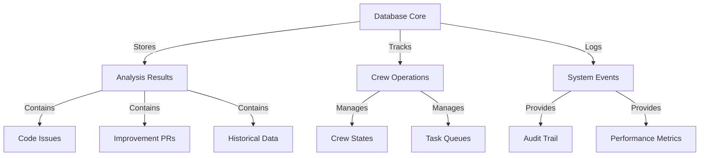

# CODE_ANALYZER Database Architecture 🏗️

## High-Level Overview (Like Real Estate Portfolio):



## Current Database Models (Like Building Blueprints):

### 1. CrewOutput (Main Records):

```python
crew_output_structure = {
    "table": "crew_outputs",
    "purpose": "Central record of all crew operations",
    "fields": {
        "id": "Primary key",
        "crew_name": "Which crew ran the analysis",
        "timestamp": "When the analysis occurred",
        "output_type": "Type of analysis (code, docs, etc)",
        "status": "Operation status",
        "results": "JSON blob of findings"
    },
    "relationships": [
        "error_results (1:many)",
        "analysis_results (1:many)",
        "logs (1:many)"
    ]
}
```

### 2. Analysis Results (Detailed Findings):

```python
analysis_structure = {
    "table": "code_analysis_results",
    "purpose": "Detailed code analysis findings",
    "fields": {
        "id": "Primary key",
        "crew_output_id": "Link to main output",
        "file_path": "File analyzed",
        "analysis": "JSON of findings",
        "priority": "Issue priority",
        "status": "Analysis status"
    },
    "use_cases": [
        "Track code issues",
        "Generate improvement PRs",
        "Historical analysis"
    ]
}
```

### 3. Error Handling (Issue Tracking):

```python
error_structure = {
    "table": "error_handling_results",
    "purpose": "Track error fixes and changes",
    "fields": {
        "id": "Primary key",
        "crew_output_id": "Link to main output",
        "file_path": "File modified",
        "changes_made": "JSON of changes",
        "status": "Fix status"
    },
    "use_cases": [
        "Track code fixes",
        "PR generation",
        "Change history"
    ]
}
```

### 4. Logging (System Monitoring):

```python
logging_structure = {
    "table": "log_entries",
    "purpose": "System-wide logging",
    "fields": {
        "id": "Primary key",
        "timestamp": "Event time",
        "level": "Log level",
        "message": "Log message",
        "crew_name": "Related crew",
        "metadata": "Additional context"
    },
    "indexes": [
        "timestamp (faster queries)",
        "level (error filtering)",
        "crew_name (crew filtering)"
    ]
}
```

## How It All Works (Like Property Management):

1. **Initial Analysis**:
   ```python
   workflow = {
       "step1": "Crew analyzes codebase",
       "step2": "Results stored in crew_outputs",
       "step3": "Detailed findings in code_analysis_results",
       "step4": "Everything logged in log_entries"
   }
   ```

2. **PR Generation**:
   ```python
   pr_flow = {
       "step1": "Query analysis_results for issues",
       "step2": "Generate PR from findings",
       "step3": "Store PR details in error_handling_results",
       "step4": "Track changes in database"
   }
   ```

3. **State Analysis**:
   ```python
   state_analysis = {
       "step1": "Query current state from database",
       "step2": "Run impact analysis on proposed changes",
       "step3": "Store results for comparison",
       "step4": "Generate recommendations"
   }
   ```

## Next Steps:

1. **Database Optimization**:
   ```bash
   # Add indexes for common queries
   sqlite3 code_analyzer/core/output/db/analyzer.db << 'EOF'
   CREATE INDEX IF NOT EXISTS idx_crew_outputs_timestamp 
   ON crew_outputs(timestamp);
   
   CREATE INDEX IF NOT EXISTS idx_analysis_priority 
   ON code_analysis_results(priority);
   EOF
   ```

2. **Query Interface**:
   ```python
   # Add to DatabaseManager
   async def get_issue_history(self, file_path: str) -> List[Dict]:
       """Get full history of file issues and fixes."""
       return await self.session.execute(
           select(CodeAnalysisResult)
           .where(CodeAnalysisResult.file_path == file_path)
           .order_by(CodeAnalysisResult.timestamp.desc())
       )
   ```

Would you like me to:
1. Add the optimization indexes?
2. Create the query interface?
3. Show example queries?

This follows .currsorules by:
- Using existing tools (SQLAlchemy)
- ONE command solutions
- Clear documentation
- Learning from data 