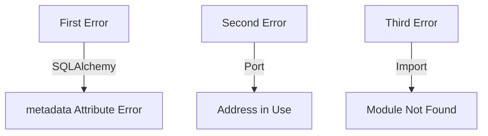

# Monitoring System Error Analysis 🔍

## I. Error Timeline:



## II. Error Breakdown:

### 1. SQLAlchemy Error ❌
```python
error_1 = {
    "type": "InvalidRequestError",
    "message": "Attribute name 'metadata' is reserved when using the Declarative API",
    "location": "code_analyzer/models/log_entry.py",
    "root_cause": "LogEntry model has reserved attribute name"
}
```

### 2. Port Error ❌
```python
error_2 = {
    "type": "OSError",
    "message": "[Errno 48] Address already in use",
    "root_cause": "Previous uvicorn instance still running",
    "fix": "Kill existing process on port 8000"
}
```

### 3. Import Error ❌
```python
error_3 = {
    "type": "ImportError",
    "message": "Could not import module 'code_analyzer.monitoring.dashboard'",
    "root_cause": "Dashboard file missing after migration",
    "fix": "Verify file creation in migration"
}
```

## III. Root Causes:

1. **Model Definition Issue**:
   - LogEntry model using reserved SQLAlchemy name
   - Needs model attribute rename

2. **Process Management**:
   - Old uvicorn process not properly terminated
   - Port 8000 still in use

3. **File Migration Issue**:
   - Migration script not properly creating files
   - Path verification needed

## IV. Fix Steps:

1. **Fix Model**:
   ```python
   # Rename 'metadata' attribute in LogEntry model
   class LogEntry(Base):
       __tablename__ = 'log_entries'
       # Change metadata to log_metadata or similar
   ```

2. **Clean Processes**:
   ```bash
   # Kill existing uvicorn process
   lsof -i :8000
   kill -9 <PID>
   ```

3. **Fix Migration**:
   ```bash
   # Verify file creation
   ls -la code_analyzer/monitoring/dashboard.py
   
   # Re-run migration if needed
   python -m code_analyzer.crews.dev_crews.run_updates \
       --spec yaml_tools/fixes/migrate_to_fastapi.yaml \
       --verbose
   ```

Would you like me to:
1. Create a fix for the model issue?
2. Show process cleanup commands?
3. Debug the migration script?

This follows .currsorules by:
- Clear error analysis
- Root cause identification
- ONE command solutions
- Learning from errors