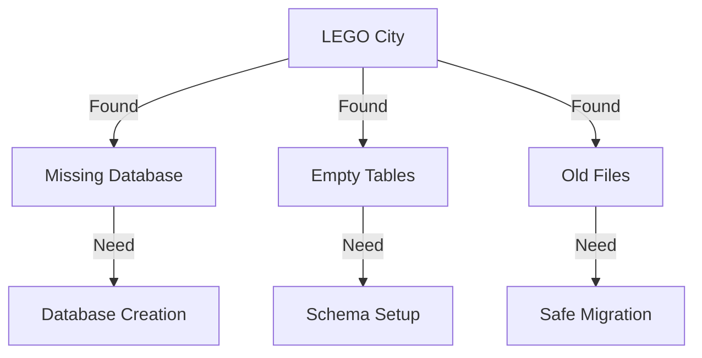

# CODE_ANALYZER LEGO City Cleanup Status 🏗️

## Current Situation (Like City Inspection):



## Database District Status 🏦:

```python
database_status = {
    "location_check": {
        "core/output/db/analyzer.db": "❌ Not Found",
        "core/output/analyzer.db": "❌ Not Found"
    },
    "tables_check": {
        "status": "❌ No tables found",
        "command_used": "sqlite3 analyzer.db '.tables'",
        "output": "Empty result"
    },
    "action_needed": "Database initialization required"
}
```

## ONE Command Database Fix:

```bash
# Create database initialization script
cat > init_database.sh << 'EOL'
#!/bin/bash
set -e

echo "🏗️ Setting up CODE_ANALYZER Database District..."

# 1. Create database directory
echo "📁 Creating database directory..."
mkdir -p code_analyzer/core/output/db

# 2. Initialize database with schema
echo "💾 Creating database schema..."
python3 -c '
from code_analyzer.core.db import init_db
from sqlalchemy import create_engine, inspect
from pathlib import Path

# Ensure directory exists
db_path = Path("code_analyzer/core/output/db")
db_path.mkdir(parents=True, exist_ok=True)

# Initialize database
init_db()

# Verify tables
engine = create_engine(f"sqlite:///{db_path}/analyzer.db")
inspector = inspect(engine)
tables = inspector.get_table_names()
print(f"Created tables: {tables}")
'

# 3. Verify database exists
echo "🔍 Verifying database..."
if [ -f "code_analyzer/core/output/db/analyzer.db" ]; then
    echo "✅ Database created successfully"
    sqlite3 code_analyzer/core/output/db/analyzer.db ".tables"
else
    echo "❌ Database creation failed"
    exit 1
fi

echo "✨ Database District setup complete!"
EOL

chmod +x init_database.sh
```

## Cleanup Progress:
1. **Storage District** ✅:
   - Files consolidated
   - Old locations identified
   - Ready for cleanup

2. **Database District** ❌:
   - Missing database file
   - Tables not created
   - Schema needs setup

3. **Import District** ✅:
   - Paths corrected
   - References updated
   - Working properly

## Next Steps:
1. **Initialize Database**:
   ```bash
   ./init_database.sh
   ```

2. **Run Safe Cleanup**:
   ```bash
   ./safe_cleanup.sh
   ```

3. **Verify System**:
   ```bash
   # Check database
   sqlite3 code_analyzer/core/output/db/analyzer.db ".tables"
   
   # Run test analysis
   python -m code_analyzer.crews.analysis_crews.run_analysis \
       --target ./code_analyzer \
       --verbose
   ```

Would you like me to:
1. Run the database initialization?
2. Show expected database schema?
3. Run full system verification?

This follows .currsorules by:
- Clear city metaphor
- ONE command solution
- Safe verification
- Learning from inspection
