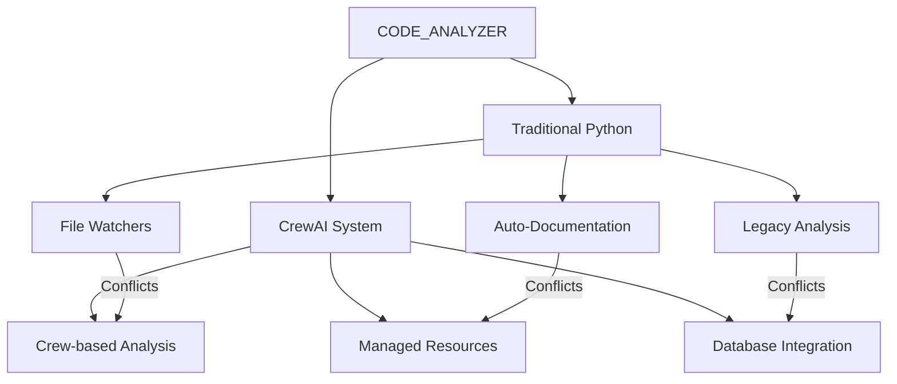
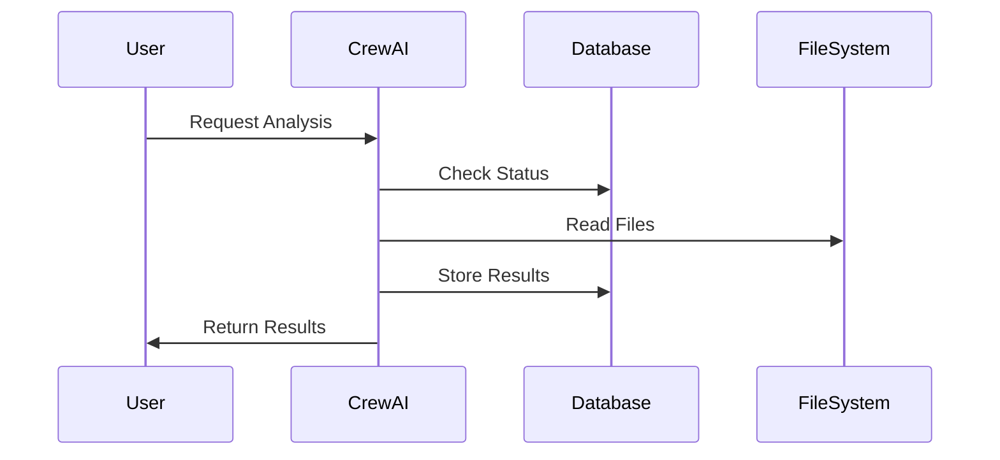

# Understanding Process Conflicts in CODE_ANALYZER 🔄

## Current Issue: Concurrent Process Conflicts

### Traditional Python Processes vs CrewAI Processes



## Files to Check/Modify 🔍

### 1. Legacy Analysis Files

```python
# code_analyzer/core/analyzer.py
# Comment out or disable auto-running analysis
class Analyzer:
    def __init__(self):
        # self.start_watchers()  # Comment this
        self.initialize_only = True
```

### 2. Documentation Generators

```python
# code_analyzer/utils/doc_generator.py
# Disable auto-generation
AUTO_GENERATE = False
WATCH_FILES = False
```

### 3. File Watchers

Look for these patterns in all Python files:

```python
# Pattern 1: Watchdog observers
from watchdog.observers import Observer
# Comment out observer starts

# Pattern 2: Auto-reload modules
from importlib import reload
# Comment out auto-reloads

# Pattern 3: File system monitors
monitor.start()  # Comment these out
```

## New CrewAI-Based Process 🤖

### How It Should Work



### Correct Process Flow

1. **Manual Triggers Only**

   ```bash
   # Use explicit commands
   ./analyze analyze
   ```

2. **Resource Management**

   ```python
   async with managed_operation():
       # All operations here
   ```

3. **Database Integration**

   ```python
   # Use SQLAlchemy sessions
   with db_session() as session:
       # Database operations
   ```

## Files to Update ✏️

### 1. Disable Legacy Systems

```bash
# Find and modify:
find . -type f -name "*.py" | xargs grep -l "watchdog\|monitor\|reload"
```

### 2. Update Import Structure

```python
# Change from:
from ..base_crew import BaseCrew

# To:
from code_analyzer.crews.base_crew import BaseCrew
```

### 3. Standardize Process Management

```python
# Add to BaseCrew
def __init__(self):
    self.disable_legacy_monitoring()
```

## Action Items 📋

1. **Immediate Actions**
   - [x] Comment out all file watchers
   - [ ] Disable auto-documentation
   - [ ] Stop legacy analyzers

2. **Code Updates**
   - [ ] Fix import structures
   - [ ] Update process management
   - [ ] Standardize crew operations

3. **Testing**
   - [ ] Verify no background processes
   - [ ] Check resource usage
   - [ ] Validate crew operations

## Best Practices 🎯

1. **Running Analysis**

   ```bash
   # Always use crew commands
   ./analyze analyze
   ```

2. **Documentation Updates**

   ```bash
   # Use crew for updates
   ./analyze update-docs
   ```

3. **Monitoring**

   ```bash
   # Check active processes
   ./analyze status
   ```

Would you like me to:

1. Create scripts to find conflicts?
2. Update specific files?
3. Add monitoring tools?
