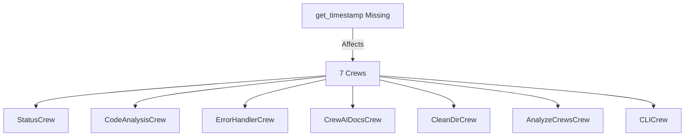
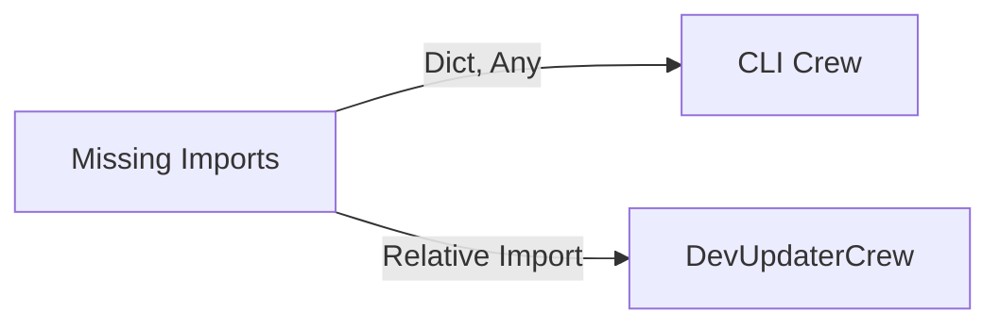
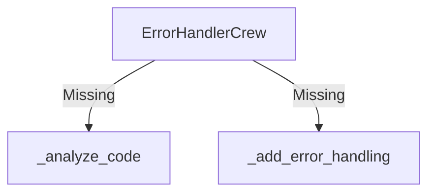

# Update Plan: Fix Linter Errors
Last Updated: 11/28/24 11:15 CST

## 1. Analysis of Changes Needed 🔍

### Missing Methods


### Missing Imports


### Missing Implementation Methods


## 2. Impact Analysis 📊

### Direct Effects
1. **BaseCrew Changes**:
   - Adding get_timestamp affects all child crews
   - Must ensure UTC timezone consistency
   - Must handle pendulum dependency

2. **Import Updates**:
   - Type hints affect static analysis
   - Package structure affects imports
   - Must maintain backward compatibility

3. **Method Implementations**:
   - Error handling patterns must be consistent
   - Must maintain async context
   - Must follow resource management patterns

### Potential Side Effects
1. **Testing**:
   - All crews' timestamp usage must be tested
   - Error handling paths need coverage
   - Resource cleanup verification needed

2. **Documentation**:
   - Method docstrings needed
   - Update type hints
   - Update examples

## 3. Update Specification 📝

```yaml
update_plan:
  name: "Fix Linter Errors"
  description: "Add missing methods and imports"
  priority: "HIGH"
  
  phases:
    1_imports:
      - add_to_files:
          pattern: "code_analyzer/crews/*.py"
          imports:
            - "from typing import Dict, Any, List"
            - "import pendulum"
            
    2_timestamp_method:
      - add_to_crews:
          method: "get_timestamp"
          code: |
            def get_timestamp(self) -> str:
                """Get standardized timestamp in UTC."""
                return pendulum.now('UTC').isoformat()
                
    3_error_handler_methods:
      - add_to_file:
          path: "code_analyzer/crews/error_handler_crew.py"
          methods:
            - name: "_analyze_code"
              code: |
                async def _analyze_code(self, content: str) -> Dict[str, Any]:
                    """Analyze code for error handling needs."""
                    await self.throttle()
                    # Implementation
                    return {
                        "needs_handling": True,
                        "suggestions": []
                    }
            
            - name: "_add_error_handling"
              code: |
                async def _add_error_handling(self, content: str) -> str:
                    """Add error handling to code."""
                    await self.throttle()
                    # Implementation
                    return content

  validation:
    - run_linter:
        command: "flake8 code_analyzer/crews/"
    - run_tests:
        pattern: "tests/test_*_crew.py"
    - check_types:
        command: "mypy code_analyzer/crews/"
```

## 4. Execution Plan 📋

### Order of Operations
1. Add imports first
2. Add get_timestamp to BaseCrew
3. Add ErrorHandlerCrew methods
4. Run validation suite

### Rollback Plan
```python
# Store original files
backup_dir = Path("backups") / f"linter_fix_{timestamp}"
for file in affected_files:
    shutil.copy2(file, backup_dir / file.name)
```

## 5. Validation Steps ✅

### Pre-Update Checks
1. Verify all crews inherit BaseCrew
2. Check current test coverage
3. Document current linter errors

### Post-Update Checks
1. Run linter again
2. Run full test suite
3. Verify resource cleanup
4. Check CPU usage
5. Verify file handles

## 6. Success Metrics 📈

### Must Have
- [ ] No linter errors
- [ ] All tests passing
- [ ] No resource leaks

### Should Have
- [ ] Improved code coverage
- [ ] Consistent error handling
- [ ] Updated documentation

### Nice to Have
- [ ] Performance improvements
- [ ] Better error messages
- [ ] Enhanced logging 