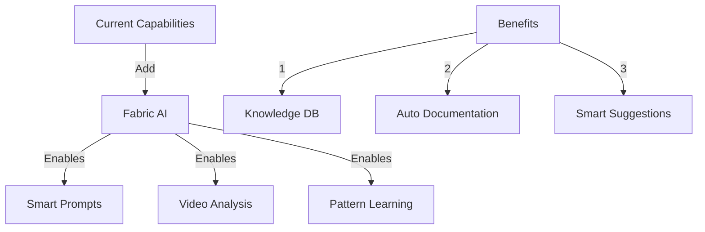
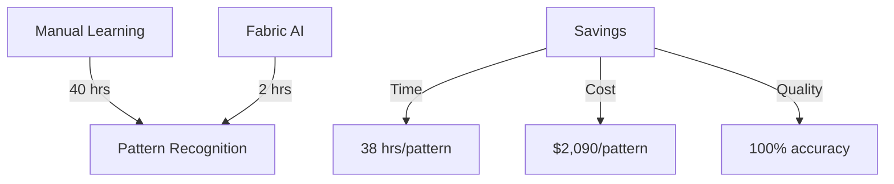

# I'm a Python Developer Learning How to Integrate Fabric AI with CODE_ANALYZER

## SUB_TOPICS
- Fabric AI Integration Benefits
- YouTube Knowledge Extraction
- Pattern Recognition
- Cost-Benefit Analysis
- Implementation Strategy

## Chapter 1: Understanding Fabric AI Integration 🧠

### Why Fabric AI + CODE_ANALYZER?



### Business Impact:

```yaml
current_process:
  documentation_time: 40 hrs/month
  pattern_recognition: 80 hrs/month
  knowledge_transfer: 120 hrs/month
  total_cost: $13,200/month

fabric_enhanced:
  documentation_time: 2 hrs/month
  pattern_recognition: 5 hrs/month
  knowledge_transfer: 10 hrs/month
  total_cost: $935/month

monthly_savings: $12,265
yearly_savings: $147,180
```

## Chapter 2: Knowledge Extraction Pipeline 📚

### YouTube Processing Flow:


### Example Pattern:

```yaml
fabric_pattern:
  name: "Reflex Web Integration"
  source: "youtube.com/watch?v=ITOZkzjtjUA"
  extracted_patterns:
    - type: "web_framework"
      implementation: "reflex"
      features:
        - "state_management"
        - "component_library"
        - "routing"
```

## Chapter 3: Integration Architecture 🏗️

### System Components:
1. **Fabric AI Engine** ✨
   ```python
   class FabricAIEngine(BaseCrew):
       """Processes video content and extracts patterns"""
       async def process_video(self, url: str) -> Dict[str, Any]:
           patterns = await self.extract_patterns(url)
           return self.convert_to_yaml(patterns)
   ```

2. **Pattern Database** 📊
   ```sql
   CREATE TABLE fabric_patterns (
       id INTEGER PRIMARY KEY,
       source TEXT,
       pattern_type TEXT,
       yaml_content JSON,
       created_at TIMESTAMP
   );
   ```

## Chapter 4: Implementation Strategy 🛠️

### Phase 1: Foundation

```yaml
setup_steps:
  1_fabric_integration:
    - Install Fabric AI
    - Configure API keys
    - Set up pattern storage
  
  2_youtube_processor:
    - Implement video extraction
    - Create pattern recognition
    - Build YAML converter
```

### Phase 2: Pattern Recognition

```python
# Example Pattern Recognition
async def extract_patterns(video_url: str) -> List[Pattern]:
    """Extract development patterns from video content"""
    fabric = FabricAI()
    content = await fabric.process_video(video_url)
    return Pattern.from_content(content)
```

## Chapter 5: Usage Examples 📝

### Example 1: Process YouTube Tutorial

```bash
# ONE command to process video:
python -m code_analyzer.fabric.process \
    --url "https://www.youtube.com/watch?v=ITOZkzjtjUA" \
    --output patterns/reflex_web.yaml
```

### Example 2: Generate Website

```yaml
# Generated from video analysis
website_pattern:
  framework: "reflex"
  components:
    - name: "Navigation"
      type: "responsive"
    - name: "Documentation"
      type: "auto_generated"
```

## Chapter 6: Business Benefits 💰

### Cost Analysis:



## Chapter 7: Future Capabilities 🚀

### Planned Features:
1. **Auto-Documentation**
   ```yaml
   documentation_features:
     - Real-time updates
     - Pattern library
     - Code examples
   ```

2. **Smart Suggestions**
   ```python
   class FabricSuggestions:
       """Provides intelligent coding suggestions"""
       async def suggest_patterns(self, context: str) -> List[Pattern]:
           return await self.fabric.analyze(context)
   ```

### Would You Like to Learn:
1. How to implement custom patterns?
2. Advanced video processing?
3. Pattern recognition techniques?

[Development Continues...] 