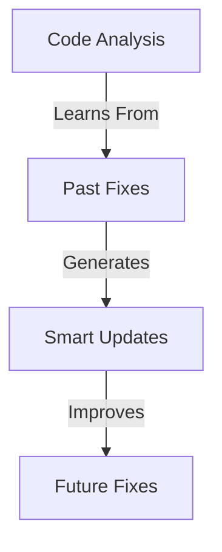
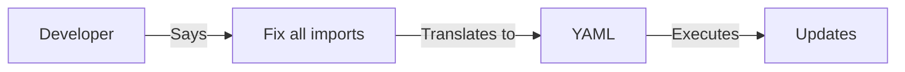
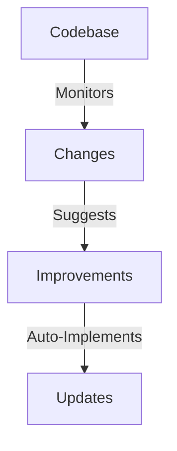

# Future Features & Abstractions 🚀

## 1. Self-Learning Updates



### Potential Features:
1. **Pattern Learning**:
   ```yaml
   # Auto-generated fix from learned patterns
   update_plan:
     name: "Learned Fix: Import Pattern"
     learn_from: "previous_fixes/*.yaml"
     apply_to: "new_issues/*.py"
   ```

2. **Predictive Updates**:
   ```python
   # Future: AI predicts needed updates
   await code_analyzer.predict_updates(
       codebase="./",
       horizon="1_month"
   )
   ```

## 2. Natural Language Code Updates



### Example:

```bash
# Future: Natural language commands
python -m code_analyzer.cli natural "Fix all import errors and update documentation"
```

## 3. Autonomous Code Evolution



### Features:
1. **Auto-Optimization**:
   ```yaml
   # Self-optimizing code
   evolution_plan:
     watch: "./src/**/*.py"
     metrics:
       - performance
       - maintainability
       - test_coverage
     auto_improve: true
   ```

2. **Smart Refactoring**:
   ```python
   # Future: AI-driven refactoring
   with CodeEvolution() as evolution:
       await evolution.suggest_improvements()
       await evolution.apply_best_practices()
   ```

[Development continues...] 