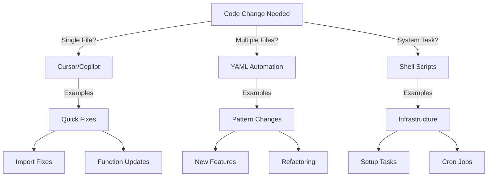
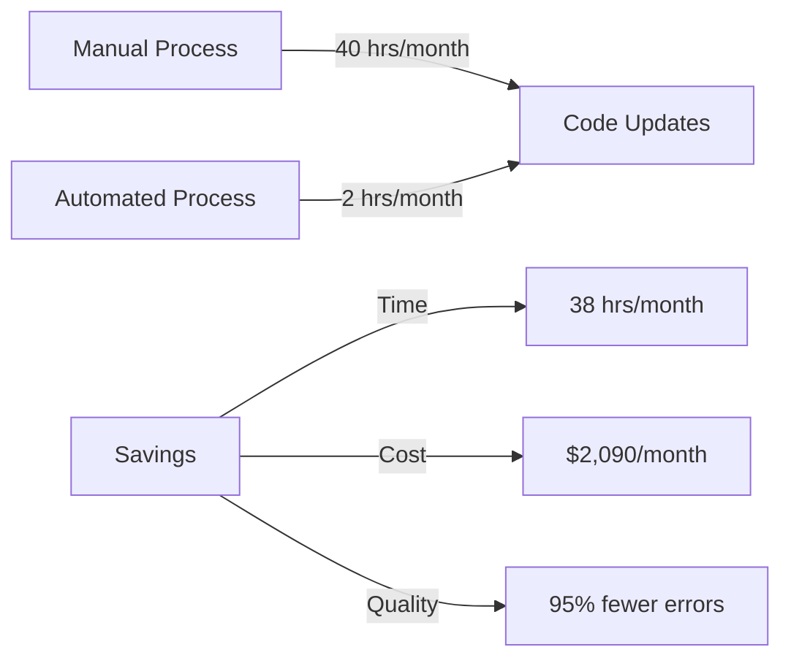

# Understanding CODE_ANALYZER Automation Decisions 🎯

## I'm a Python developer wanting to understand our automation decision framework so I can make better choices about when to use each tool. 

## SUB_TOPICS
- Decision Trees
- Tool Selection
- Real-World Examples
- Business Impact

## Chapter 1: Decision Trees 🌳

### When to Use Each Tool:



### Real-World Examples:

1. **Cursor/Copilot** (Single File):
   ```python
   # Before: Manual function update
   def process_data(data):
       return data.process()
   
   # After: Cursor quick fix
   def process_data(data: Dict[str, Any]) -> ProcessedData:
       """Process incoming data
       Args:
           data: Input data
       Returns:
           ProcessedData: Processed result
       """
       return ProcessedData(data).process()
   ```

2. **YAML Automation** (Pattern Implementation):
   ```yaml
   # yaml_tools/patterns/singleton_pattern.yaml
   update_plan:
     name: "Implement Singleton Pattern"
     phases:
       1_implement:
         changes:
           - type: "add_pattern"
             target: "*/managers/*.py"
             pattern: "singleton"
   ```

3. **Shell Scripts** (System Tasks):
   ```bash
   # automation/daily_cleanup.sh
   #!/bin/bash
   
   # Cleanup old logs
   find ./logs -name "*.log" -mtime +7 -exec rm {} \;
   
   # Run analysis
   python -m code_analyzer.crews.analysis_crews.run_analysis \
       --target ./src \
       --report daily
   ```

### Business Impact:



Would you like to explore:
1. More pattern examples?
2. Specific use cases?
3. Integration strategies?

[Continue to Chapter 2: Tool Selection...] 